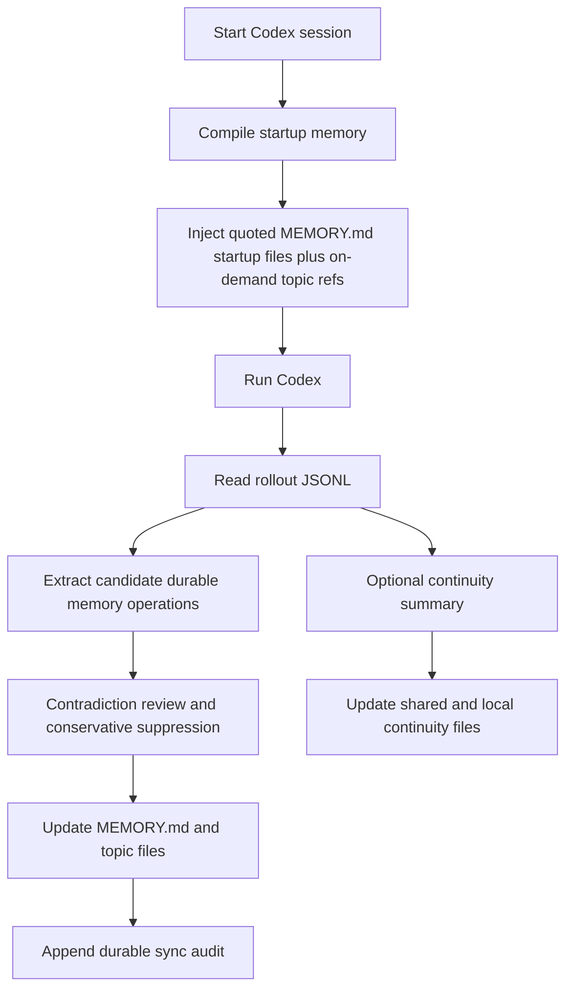

<div align="center">
  <h1>Codex Auto Memory</h1>
  <p><strong>A Markdown-first local memory runtime for Codex, evolving from a companion CLI into a hook/skill/MCP-aware hybrid workflow</strong></p>
  <p>
    <a href="./README.md">简体中文</a> |
    <a href="./README.zh-TW.md">繁體中文</a> |
    <a href="./README.en.md">English</a> |
    <a href="./README.ja.md">日本語</a>
  </p>
  <p>
    <a href="https://github.com/Boulea7/Codex-Auto-Memory/actions/workflows/ci.yml">
      
    </a>
    <a href="./LICENSE">
      
    </a>
    
    
    <a href="https://github.com/Boulea7/Codex-Auto-Memory/stargazers">
      
    </a>
    <a href="https://github.com/Boulea7/Codex-Auto-Memory/issues">
      
    </a>
  </p>
</div>

> `codex-auto-memory` is not a generic note-taking app, not a cloud memory service, and not the repository where the multi-host platform line is being built.
> It is a Markdown-first, local-first memory runtime for Codex. Today it is strongest as a Codex wrapper and companion CLI, and it is now explicitly evolving toward hook, skill, and MCP-aware integration surfaces without giving up auditable local Markdown files as the source of truth.

---

**Three things to know up front:**

1. **What it does** — It extracts future-useful knowledge from Codex sessions, keeps it as local Markdown, and brings it back into future sessions.
2. **How it stores** — Durable memory stays in local Markdown under `~/.codex-auto-memory/`, with compact indexes and topic files rather than opaque cache.
3. **Where it is going** — The repository remains Codex-first, but it is no longer documenting only a narrow companion seam. The roadmap now explicitly includes lower-friction hook, skill, and MCP-friendly paths alongside the existing wrapper flow.

---

## Contents

- [Why this project exists](#why-this-project-exists)
- [Who this is for](#who-this-is-for)
- [Current priorities](#current-priorities)
- [Core capabilities](#core-capabilities)
- [Capability matrix](#capability-matrix)
- [Quick start](#quick-start)
- [Common commands](#common-commands)
- [How it works](#how-it-works)
- [Storage layout](#storage-layout)
- [Documentation hub](#documentation-hub)
- [Current status](#current-status)
- [Roadmap](#roadmap)
- [Contributing and license](#contributing-and-license)

## Why this project exists

Claude Code publicly exposes a relatively clear memory contract:

- memory can be written automatically by the assistant
- memory is stored as local Markdown
- `MEMORY.md` acts as the compact startup entrypoint
- only the first 200 lines are loaded at startup
- details live in topic files and are read on demand
- worktrees in the same repository share project memory
- `/memory` provides audit and edit controls

Codex already exposes useful building blocks, but not yet a complete, stable, and fully documented local-memory product surface:

- `AGENTS.md`
- multi-agent workflows
- local sessions and rollout logs
- configurable MCP servers and growing skill/subagent surfaces
- local `cam doctor` / feature-output readiness signals for `memories` and `codex_hooks`

`codex-auto-memory` exists to close that gap with a Codex-first implementation that keeps memory local, inspectable, and editable. The current repository is still most mature as a wrapper-driven companion layer, but its product direction is now broader: preserve the Markdown-first contract while also making memory easier to consume through future hook, skill, and MCP-aware flows.

## Who this is for

Good fit:

- Codex users who want a Claude-style auto memory workflow today
- teams that want fully local, auditable, editable Markdown memory
- users who prefer explicit CLI control now but want more automation later
- maintainers who want a stable mental model even if Codex gains stronger native surfaces

Not a good fit:

- users looking for a generic note-taking or knowledge-base app
- teams that need account-level cloud memory
- users expecting a full Claude `/memory` clone today

## Current priorities

The repository is currently optimizing for four concrete product goals:

1. Automatically extract reusable long-term memory from conversations and tasks.
2. Automatically recall that memory in later sessions.
3. Support memory updates, deduplication, overwrite, and archive-friendly lifecycle handling.
4. Reduce the amount of manual memory-file maintenance users need to do.

These goals now take priority over documenting the project only as a narrow migration seam.

## Core capabilities

| Capability | What it means |
| :-- | :-- |
| Automatic post-session sync | extracts stable knowledge from Codex rollout JSONL and writes it back into durable Markdown memory |
| Automatic startup recall | compiles compact startup memory so durable knowledge can re-enter later sessions automatically, now with a few active-only content highlights plus on-demand topic refs |
| Markdown-first memory | `MEMORY.md` and topic files remain the product surface, not a hidden cache layer |
| Lifecycle-aware updates | supports explicit correction, dedupe, overwrite, delete, and reviewer-visible conflict suppression |
| Formal retrieval MCP surface | `cam mcp serve` exposes `search_memories`, `timeline_memories`, and `get_memory_details` as a read-only stdio retrieval plane |
| Project-scoped MCP install surface | `cam mcp install --host codex` writes the recommended Codex project-scoped host wiring for `codex_auto_memory`; lower-priority non-Codex host wiring remains documented as boundary guidance in `docs/host-surfaces.md` |
| Worktree-aware storage | shares project memory across worktrees while keeping local continuity isolated |
| Optional session continuity | separates temporary working state from durable memory |
| Integration-aware evolution | keeps the current wrapper flow while moving toward hook, skill, and MCP-friendly surfaces |
| Reviewer surfaces | exposes `cam memory`, `cam session`, `cam recall`, and `cam audit` for review and debugging |

## Capability matrix

| Capability | Claude Code | Codex today | Codex Auto Memory |
| :-- | :-- | :-- | :-- |
| Automatic memory writing | Built in | No complete public contract | Yes, via rollout-driven sync |
| Local Markdown memory | Built in | No complete public contract | Yes |
| `MEMORY.md` startup entrypoint | Built in | No | Yes |
| 200-line startup budget | Built in | No | Yes |
| Topic files on demand | Built in | No | Partial: startup exposes structured topic refs for later on-demand reads |
| Session continuity | Community patterns | No complete public contract | Yes, as a separate layer |
| Worktree-shared project memory | Built in | No public contract | Yes |
| Inspect / audit memory | `/memory` | No equivalent | `cam memory` |
| Skill / hook / MCP-aware evolution | Built in or strong host surfaces | Emerging / uneven | Now an explicit repository direction |

`cam memory` remains intentionally reviewer-oriented. It shows the quoted startup files that actually entered the startup payload, the startup budget, on-demand topic refs, edit paths, and recent sync audit entries behind `--recent [count]`.

Those recent audit entries now explicitly surface conservatively suppressed conflict candidates so contradictory rollout output does not silently merge into durable memory. Explicit updates still happen through `cam remember`, `cam forget`, or direct Markdown edits. Future lower-friction integration paths should preserve that same auditable memory contract instead of replacing it.

Duplicate writes against unchanged active memory, plus delete/archive requests that do not hit an active record, now surface as explicit `noop` reviewer results. They do not rewrite Markdown or append lifecycle history.

## Quick start

### 1. Clone and install

```bash
git clone https://github.com/Boulea7/Codex-Auto-Memory.git
cd Codex-Auto-Memory
pnpm install
```

### 2. Build and link the global command

```bash
pnpm build
pnpm link --global
```

> After this, the `cam` command works in any directory.

### 3. Initialize inside your project

```bash
cd /your/project
cam init
```

This creates `codex-auto-memory.json` in your project root (committed to Git) and `.codex-auto-memory.local.json` locally (gitignored by default).

### 4. Launch Codex through the wrapper

```bash
cam run
```

This is still the most mature end-to-end path today. After each session ends, `cam` can extract knowledge from the Codex rollout log and write it into the memory files automatically.

### 5. Inspect or correct memory

```bash
cam memory
cam memory reindex --scope all --state all
cam recall search pnpm --state auto
cam mcp serve
cam integrations install --host codex
cam integrations apply --host codex
cam integrations doctor --host codex
cam mcp install --host codex
cam mcp print-config --host codex
cam mcp apply-guidance --host codex
cam mcp doctor --host codex
cam session status
cam session refresh
cam remember "Always use pnpm instead of npm"
cam forget "old debug note"
cam forget "old debug note" --archive
cam audit
```

## Common commands

| Command | Purpose |
| :-- | :-- |
| `cam run` / `cam exec` / `cam resume` | compile startup memory and launch Codex through the wrapper |
| `cam sync` | manually sync the latest rollout into durable memory |
| `cam memory` | inspect startup files, topic refs, startup highlights, highlight-budget / section-render status, edit paths, and recent durable sync audit events plus suppressed conflict candidates; it also supports `--cwd <path>` so memory inspection can target another project root explicitly; when the durable memory layout is still uninitialized it returns an empty inspection view instead of creating `MEMORY.md`, `ARCHIVE.md`, or retrieval sidecars implicitly; `--json` now also exposes `highlightCount`, `omittedHighlightCount`, `omittedTopicFileCount`, `highlightsByScope`, `startupSectionsRendered`, `startupOmissions`, `startupOmissionCounts`, `startupOmissionCountsByTargetAndStage`, `topicFileOmissionCounts`, `topicRefCountsByScope`, and reviewer-visible `topicDiagnostics` / `layoutDiagnostics` so selection-stage, render-stage, and canonical-layout issues stay distinguishable |
| `cam memory reindex` | explicitly rebuild retrieval sidecars from canonical Markdown memory; supports `--scope`, `--state`, `--cwd`, and `--json` so missing, invalid, or stale sidecars have a low-friction repair path; when the durable memory layout is still uninitialized it returns an empty `rebuilt` set instead of initializing that layout implicitly |
| `cam dream build` / `cam dream inspect` | build and inspect the minimal `dream sidecar`; it stores continuity compaction, query-time relevant refs, and pending `promotionCandidates` in an auditable JSON sidecar without mutating `MEMORY.md` or topic files; the public `cam dream candidates` / `cam dream review` / `cam dream promote` lane still requires explicit review, but durable-memory candidates can be explicitly promoted through the existing reviewer/audit write path while instruction-like candidates remain `proposal-only` |
| `cam remember` / `cam forget` | explicitly add or remove durable memory; both commands now also support `--cwd <path>` so manual corrections can target another project root directly; when `cam remember` omits `--topic`, it now performs lightweight durable-topic inference and prefers updating an existing memory instead of appending a second active entry when there is one clearly identifiable old value; `cam forget --archive` moves matching entries into the archive layer; `forget` now also shares the same multi-term query normalization as `recall search`, so queries like `pnpm npm` can match one memory across `summary/details` instead of requiring the original substring to appear contiguously; both commands now also support `--json`, returning a structured manual-mutation reviewer payload with `mutationKind`, `matchedCount`, `appliedCount`, `noopCount`, `summary`, `primaryEntry`, `entries[]`, `followUp`, `nextRecommendedActions`, and top-level lifecycle/detail fields (`latestAppliedLifecycle`, `latestLifecycleAttempt`, `latestLifecycleAction`, `latestState`, `latestSessionId`, `latestRolloutPath`, `latestAudit`, `timelineWarningCount`, `warnings`, `entry`, `lineageSummary`, `ref/path/historyPath`) whenever at least one matched ref exists; they now also add `leadEntryRef`, `leadEntryIndex`, `detailsAvailable`, `reviewRefState`, `uniqueAuditCount`, `auditCountsDeduplicated`, and `warningsByEntryRef` so delete/archive/multi-entry reviewer payloads are less ambiguous without breaking older consumers; empty `forget --json` results stay additive and now leave `nextRecommendedActions` empty instead of emitting placeholder refs; delete flows also distinguish timeline-only review refs from details-usable refs; text mode now also prints the same project-pinned `timeline/details -> recent -> reindex` follow-up route so manual corrections drop back into the reviewer loop naturally |
| `cam recall search` / `timeline` / `details` | progressively retrieve durable memory through a search -> timeline -> details workflow; `search` now defaults to `state=auto, limit=8`, so active memory is checked before archived fallback while staying read-only, and multi-term queries now match across `id/topic/summary/details` instead of requiring every term to live in one field; the JSON surface now also exposes additive `retrievalMode`, `finalRetrievalMode`, `retrievalFallbackReason`, `stateResolution`, `executionSummary`, `searchOrder`, `totalMatchedCount`, `returnedCount`, `globalLimitApplied`, `truncatedCount`, `resultWindow`, `globalRank`, and `diagnostics.checkedPaths[].returnedCount` / `droppedCount` fields so fallback behavior, global sorting, and post-limit drops stay reviewer-visible; it now also exposes additive `querySurfacing` with `suggestedDreamRefs` and `suggestedInstructionFiles` as query-time reviewer hints without rewriting `results[]` or canonical memory; `finalRetrievalMode` is an explicit alias for the final result mode while `retrievalMode` keeps its compatibility semantics |
| `cam mcp serve` | start a read-only retrieval MCP server that exposes the same workflow through `search_memories`, `timeline_memories`, and `get_memory_details` |
| `cam integrations install --host codex` | install the recommended Codex integration stack in one explicit step by writing project-scoped MCP wiring and refreshing the hook bridge bundle plus Codex skill assets; it defaults to the runtime skill target, but also accepts `--skill-surface runtime|official-user|official-project`; stays idempotent, Codex-only, does not touch `AGENTS.md` or the Markdown memory store, and now rolls back staged MCP / hook / skill writes if installation fails mid-flight; `--json` now also returns a structured rollback failure payload; after installation it explicitly points you back to `cam integrations doctor --host codex` to confirm which retrieval route is operational in the current environment |
| `cam integrations apply --host codex` | explicitly apply the full Codex integration state: it keeps `integrations install` unchanged, but also orchestrates `cam mcp apply-guidance --host codex`; it defaults to the runtime skill target, but also accepts `--skill-surface runtime|official-user|official-project`; if the `AGENTS.md` managed block is unsafe, the command returns a preflight `blocked` result before any stack writes happen, and if a later block or staged write fails the JSON payload now reports rollback outcome plus the final effective action; after apply you should still use doctor to confirm whether MCP, the local bridge bundle, or the resolved CLI route is the operational path |
| `cam integrations doctor --host codex` | inspect the current Codex integration stack through a thin read-only aggregation surface that reports the recommended route and current route truth (`recommendedRoute`, `currentlyOperationalRoute`, `routeKind`, `routeEvidence`, `shellDependencyLevel`, `hostMutationRequired`, `preferredRouteBlockers`, `currentOperationalBlockers`), recommended preset, structured `workflowContract`, `applyReadiness`, additive `experimentalHooks` guidance, `layoutDiagnostics`, subchecks, and minimum next steps; `recommendedRoute` stays MCP-first, while the blocker fields separately explain why the preferred route is unavailable and whether the current fallback still has its own operational issues; it also surfaces skill-surface steering (`preferredSkillSurface`, `recommendedSkillInstallCommand`, `installedSkillSurfaces`, `readySkillSurfaces`) without describing skills as an executable fallback route; when doctor is anchored to another repository with `--cwd`, hook-fallback next steps now also project-pin the local bridge route via `CAM_PROJECT_ROOT=...`; when `cam` is unavailable on PATH, the direct CLI next step now prefers the resolved `node dist/cli.js recall ...` fallback instead of a broken bare `cam recall ...`; when the managed `AGENTS.md` block is unsafe, it now tells you to repair that block first instead of recommending `cam integrations apply --host codex` immediately |
| `cam mcp install --host codex` | explicitly write the recommended Codex project-scoped host config for `codex_auto_memory`; only that server entry is updated, hooks/skills stay opt-in, and non-canonical custom fields on that entry are preserved when safe; lower-priority non-Codex host wiring stays in `docs/host-surfaces.md` instead of the default product path, and some of those routes remain `manual-only` |
| `cam mcp print-config --host codex` | print a ready-to-paste Codex snippet so the read-only retrieval plane can be wired into the primary workflow with less manual setup; it also prints a recommended `AGENTS.md` snippet and includes the shared `workflowContract` plus explicit `experimentalHooks` guidance in JSON output so future Codex agents can prefer MCP, then fall back to the local `memory-recall.sh` bridge bundle, and only then fall back to the resolved CLI recall commands while still treating official hooks as Experimental; other host snippets remain boundary guidance in `docs/host-surfaces.md`, including the `manual-only` branch |
| `cam mcp apply-guidance --host codex` | create or update the Codex Auto Memory managed block inside the repository-level `AGENTS.md` through an additive, auditable, fail-closed flow; it only appends a new block or replaces the same marker block, and returns `blocked` if it cannot locate that block safely |
| `cam mcp doctor --host codex` | inspect the recommended Codex project-scoped retrieval MCP wiring, project pinning, and hook/skill fallback assets; it also adds a structured `workflowContract`, `layoutDiagnostics`, and the smallest safe retrieval-sidecar repair command, and that repair command now follows the resolved launcher fallback when `cam` is unavailable on PATH. When the inspected host selection includes Codex (`--host codex` or `all`), the JSON payload also exposes Codex-only `codexStack` route truth, `experimentalHooks`, and AGENTS guidance/apply-safety sections. When the inspected host is `claude`, `gemini`, or `generic`, the payload stays manual-only / snippet-first: host-level status now means configuration/guidance truth rather than the same operational readiness tier as Codex, `commandSurface.install` and `commandSurface.applyGuidance` are explicitly `false`, and no Codex-only writable guidance surface is implied. It also separates “hook assets are installed” from “the embedded helper launcher is operational in the current environment”; alternate global wiring is still reported separately from the recommended project-scoped path without modifying host config files |
| `cam session save` | merge / incremental save for continuity |
| `cam session refresh` | replace / clean regeneration for continuity |
| `cam session load` / `status` | inspect the continuity reviewer surface; `status --json` / `load --json` now also expose additive `resumeContext`, including the current goal, `suggestedDurableRefs`, and instruction files so resume prompts stay reviewer-visible without being promoted automatically |
| `cam hooks install` | generate and refresh the current local bridge / fallback helper bundle, including `memory-recall.sh`, `post-work-memory-review.sh`, compatibility wrappers, and `recall-bridge.md`; `post-work-memory-review.sh` chains durable-memory `sync -> recent review` into one post-work route; those user-scoped helpers now resolve the target project at runtime from `CAM_PROJECT_ROOT` or the current shell `PWD` instead of hardcoding one repository path into shared assets; it is not an official Codex hook surface, official hooks still remain a public but `Experimental` opt-in route, and the config docs still label the `codex_hooks` feature flag as `Under development` and off by default; the bundle's recommended search preset is `state=auto`, `limit=8` |
| `cam skills install` | install Codex skill assets; the default target remains the runtime surface, while `--surface runtime|official-user|official-project` enables explicit migration-prep copies on official `.agents/skills` paths; all surfaces teach the same MCP-first progressive retrieval workflow, then fall back to the local `memory-recall.sh search -> timeline -> details` bridge bundle before the resolved CLI recall commands, and keep the same recommended search preset: `state=auto`, `limit=8`; skills remain a guidance surface, not an executable fallback route, so the current operational route should still be checked through `cam mcp doctor --host codex` or `cam integrations doctor --host codex` |
| `cam audit` | run privacy and secret-hygiene checks |
| `cam doctor` | inspect local wiring and native-readiness posture; `--json` now also exposes retrieval-sidecar health, unsafe topic diagnostics, and canonical layout diagnostics while staying fully read-only |

Additional note:

- The shared `workflowContract` now also surfaces launcher constraints explicitly: `commandName=cam`, `requiresPathResolution=true`, and `hookHelpersShellOnly=true`. On top of that, hook helpers and doctor next steps now try to emit a verified fallback launcher: when `cam` is unavailable on PATH, they prefer `node <installed>/dist/cli.js`; otherwise they keep `cam` and mark it as unresolved guidance.
- `workflowContract.launcher` now also states that it applies to direct CLI usage and installed helper assets, not to the canonical MCP host snippet; host wiring continues to use the canonical `cam mcp serve` command shape.
- `workflowContract.launcher` now shares the same executable-aware truth source as doctor: a non-executable `cam` file on PATH is no longer treated as a verified launcher, and unverified branches no longer claim a "verified fallback".
- Startup highlights now deduplicate identical summaries across `project-local`, `project`, and `global` scopes so repeated low-signal notes do not consume the limited startup budget.
- Startup highlights now also skip unsafe topic files, and startup topic refs now stay limited to safe references only. In parallel, `cam memory --json` and `cam memory reindex --json` expose additive `topicDiagnostics` and `layoutDiagnostics`; `cam memory --json` also exposes `startupOmissions`, `startupOmissionCounts`, `topicFileOmissionCounts`, and `topicRefCountsByScope`, so highlight omissions, topic-ref omissions, and canonical layout anomalies all become reviewer-visible. The global highlight cap now also leaves a selection-stage omission instead of silently discarding later-scope highlights.
- Durable sync audit now also exposes additive `rejectedOperationCount`, `rejectedReasonCounts`, and lightweight `rejectedOperations` summaries, so unknown topics, sensitive content, volatile content, and operation-cap drops stop disappearing silently from the reviewer surface.
- Automatic extraction now also keeps `reference`-style durable memories for external dashboards, issue trackers, runbooks, and docs pointers, while rejecting more session-only or local-host noise such as `.agents/`, `.codex/`, `.gemini/`, `.mcp.json`, `next step`, and `resume here`.
- `cam hooks install --json` and `cam skills install --json` now also expose `postInstallReadinessCommand`, so “what should I run next to confirm the operational route” becomes machine-readable instead of staying prose-only; top-level `cam doctor --json` now also exposes additive `recommendedRoute`, `recommendedAction`, `recommendedActionCommand`, and `recommendedDoctorCommand`. In that top-level doctor payload, `recommendedRoute=companion` refers only to the companion/readiness surface and should not be confused with the MCP-first route-truth fields exposed by `cam mcp doctor` or `cam integrations doctor`.
- `cam session load --json --print-startup` now also exposes a structured continuity-startup contract: rendered `sourceFiles`, `candidateSourceFiles`, `sectionsRendered`, additive `omissions` / `omissionCounts`, `continuitySectionKinds`, `continuitySourceKinds`, `continuityProvenanceKind`, `continuityMode`, and a `futureCompactionSeam` placeholder. `sourceFiles` now stay truthful to what actually made it into the bounded startup block instead of echoing unrendered candidates.
- `cam session status --json` / `cam session load --json` now also expose additive `resumeContext`; `suggestedDurableRefs` remains a resume hint, not a durable-memory write.
- `cam recall search --json` now also exposes additive `querySurfacing`; `suggestedDreamRefs` and `suggestedInstructionFiles` are reviewer hints only and do not mutate retrieval results or trigger promote automatically.
- The dream reviewer lane is being locked down around `cam dream candidates` / `cam dream review` / `cam dream promote`; durable-memory candidates only write canonical memory through explicit promote plus the existing reviewer/audit path, while instruction-like candidates remain `proposal-only` and cannot directly write instruction files.
- `cam integrations install --json` and `cam integrations apply --json` now also expose `postInstallReadinessCommand` / `postApplyReadinessCommand`, so post-install and post-apply route confirmation can stay machine-readable instead of drifting into notes-only prose.
- `cam remember --json` and `cam forget --json` now also expose additive aggregate reviewer counts such as `entryCount`, `warningCount`, `uniqueAuditCount`, `auditCountsDeduplicated`, and `warningsByEntryRef`; `forget --json` also adds `detailsUsableEntryCount` and `timelineOnlyEntryCount`, and both payloads now expose `leadEntryRef`, `leadEntryIndex`, `detailsAvailable`, and `reviewRefState` so multi-ref delete/archive payloads are less likely to be misread as single-ref facts.
- Durable sync now fail-closes on subagent rollouts: subagent evidence stays available for continuity/reviewer analysis, but `cam sync` records a reviewer-visible `subagent-rollout` skip instead of letting child-session noise enter canonical durable memory.
- Session continuity persistence now also fail-closes on subagent rollouts: explicit `--rollout`, matching recovery markers, and matching latest audit entries no longer rehydrate child-session continuity into shared/local continuity files.
- Shared/local continuity writes are now committed atomically; when the summary-write phase fails, CAM records a `summary-write` recovery marker instead of leaving behind partially updated continuity files.
- `workflowContract` now keeps the existing top-level compatibility fields while also exposing additive `executionContract`, `modelGuidanceContract`, and `hostWiringContract` objects, so execution routing, agent guidance, and host-wiring semantics are machine-readable separately.
- Current official Codex skills discovery docs now use `.agents/skills`; this repository still supports `.codex/skills` / `CODEX_HOME` as runtime and historical compatibility surfaces, but they should not be described as the new official canonical path.
- `cam recall search --json` now keeps unsafe or malformed topic sources reviewer-visible through `diagnostics.topicDiagnostics` whenever they fall inside the requested scope/state, even if the sidecar stays healthy and the search results themselves continue to fail closed.
- `cam remember --json` / `cam forget --json` now also expose top-level `reviewerSummary` and `nextRecommendedActions`, making the post-correction `timeline/details review -> recent review -> reindex` loop machine-readable.
- `cam remember` / `cam forget` text mode now also prints the same follow-up loop directly, so human reviewers do not have to reconstruct the next inspection steps after a manual correction.
- `cam integrations apply --json` now also exposes `rollbackReport` alongside `rollbackApplied`, `rollbackSucceeded`, `rollbackErrors`, and `rollbackPathCount`, plus per-subaction final-state fields such as `effectiveAction` and `rolledBack`, so rollback outcomes are explicit per path instead of only summarized as booleans.
- Lifecycle reviewer output now also distinguishes `restore`, `semantic-overwrite`, and `metadata-only`, so reviewers can separate semantic corrections from provenance-only updates.
- `cam integrations apply --host codex` now rolls back project-scoped MCP wiring, hook assets, and skill assets if AGENTS guidance blocks late or another staged write fails, reducing half-applied integration states.

## How it works

### Design principles

- `local-first and auditable`
- `Markdown files are the product surface`
- `Codex-first hybrid runtime`
- `durable memory and session continuity remain separate`
- `wrapper-first today, integration-aware tomorrow`

### Runtime flow



### Why the project does not switch to a native-first path yet

- public Codex docs still do not define a complete native memory contract that can replace the current implementation
- local `cam doctor --json` still exposes `memories` / `codex_hooks` more as readiness signals than as a stable primary implementation path, but it now also splits `Native memory/hooks readiness` from `Host/UI signals` while adding the current app-server signal plus read-only retrieval-sidecar, unsafe-topic, and canonical-layout diagnostics
- the repository therefore continues to treat the wrapper flow as the strongest current implementation

The difference is product direction: this repository is no longer documenting hooks, skills, and MCP as mere distant future ideas. They are now part of the planned integration surface, provided they keep the same Markdown-first and auditable behavior contract.

## Storage layout

Durable memory:

```text
~/.codex-auto-memory/
├── global/
│   └── MEMORY.md
└── projects/<project-id>/
    ├── project/
    │   ├── MEMORY.md
    │   └── commands.md
    └── locals/<worktree-id>/
        ├── MEMORY.md
        └── workflow.md
```

Session continuity:

```text
~/.codex-auto-memory/projects/<project-id>/continuity/project/active.md
<project-root>/.codex-auto-memory/sessions/active.md
```

If retrieval indexes are added later:

- Markdown remains canonical.
- `cam recall` and `cam mcp serve` both stay read-only retrieval planes, not a second source of truth.
- `cam mcp serve` stays a read-only retrieval plane, not a second source of truth.
- SQLite / FTS / vector / graph layers remain sidecars only.

See the architecture docs for the full boundary breakdown.

## Documentation hub

### Entry points

- [文档首页（中文）](docs/README.md)
- [Documentation Hub (English)](docs/README.en.md)

### Core design docs

- [Architecture (中文)](docs/architecture.md) | [English](docs/architecture.en.md)
- [Integration strategy (中文)](docs/integration-strategy.md)
- [Host surfaces (中文)](docs/host-surfaces.md)
- [Native migration strategy (中文)](docs/native-migration.md) | [English](docs/native-migration.en.md)

### Maintainer and reviewer docs

- [Session continuity design](docs/session-continuity.md)
- [Release checklist](docs/release-checklist.md)
- [Contributing](CONTRIBUTING.md)

## Current status

Current public-ready status:

- durable memory path: available
- startup recall path: available
- reviewer audit surfaces: available
- session continuity layer: available
- wrapper-driven Codex flow: available
- hook / skill / MCP-aware evolution: now part of the documented direction, but not yet the primary end-user path
- native memory / native hooks primary path: not enabled and not trusted as the main implementation path

## Roadmap

### v0.1

- companion CLI
- Markdown memory store
- 200-line startup compiler
- worktree-aware project identity
- initial maintainer and reviewer docs

### v0.2

- complete the issue-level memory goals, including the first shipped archive path through `cam forget --archive`
- clearer `cam memory`, `cam session`, and `cam recall` reviewer UX
- stronger contradiction handling and explicit memory lifecycle documentation
- define and document hook, skill, and MCP-friendly integration surfaces without replacing the current Markdown-first contract
- ship the first progressive-disclosure retrieval surface through `cam recall search / timeline / details`

### v0.3+

- expand the Codex-first hybrid path on top of the new recall and archive-ready foundation
- evaluate which integration pieces should stay in this repo versus move into a host-adaptable shared runtime later
- optional GUI or TUI browser
- stronger cross-session diagnostics and confidence surfaces

## Contributing and license

- Contribution guide: [CONTRIBUTING.md](./CONTRIBUTING.md)
- License: [Apache-2.0](./LICENSE)

If you find a mismatch between the README, official docs, and local runtime observations, prefer:

1. official product documentation
2. verified local behavior
3. explicit uncertainty

over confident but weakly supported claims.
