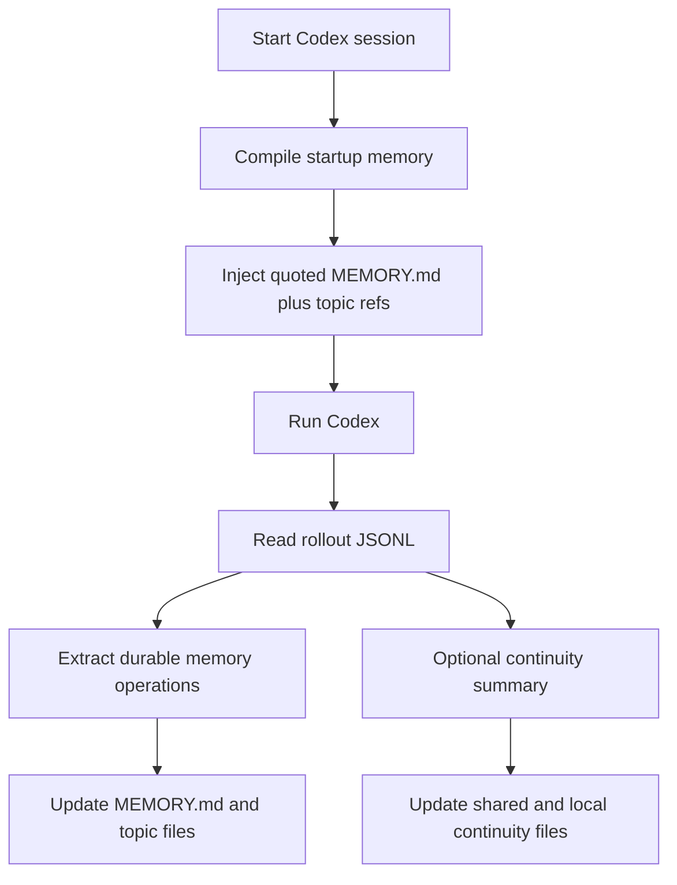

<div align="center">
  <h1>Codex Auto Memory</h1>
  <p><strong>A local-first companion CLI that brings Claude-style auto memory workflows to Codex</strong></p>
  <p>
    <a href="./README.md">简体中文</a> |
    <a href="./README.en.md">English</a>
  </p>
  <p>
    <a href="https://github.com/Boulea7/Codex-Auto-Memory/actions/workflows/ci.yml">
      
    </a>
    <a href="./LICENSE">
      
    </a>
    
    
    <a href="https://github.com/Boulea7/Codex-Auto-Memory/stargazers">
      
    </a>
    <a href="https://github.com/Boulea7/Codex-Auto-Memory/issues">
      
    </a>
  </p>
</div>

> `codex-auto-memory` is not a generic note-taking app and not a cloud memory service.  
> Its job is to recreate the observable Claude Code auto memory contract for today's Codex runtime with local Markdown files, compact startup injection, topic-file lookup on demand, and a clean migration seam toward future native memory features.

## Contents

- [Why this project exists](#why-this-project-exists)
- [Who this is for](#who-this-is-for)
- [Core capabilities](#core-capabilities)
- [Capability matrix](#capability-matrix)
- [Quick start](#quick-start)
- [Common commands](#common-commands)
- [How it works](#how-it-works)
- [Storage layout](#storage-layout)
- [Documentation hub](#documentation-hub)
- [Current status](#current-status)
- [Roadmap](#roadmap)
- [Contributing and license](#contributing-and-license)

## Why this project exists

Claude Code already exposes a fairly clear public auto memory contract:

- memory is written automatically by the assistant
- memory is stored as local Markdown
- `MEMORY.md` is the compact startup entrypoint
- only the first 200 lines are loaded at startup
- detail lives in topic files and is read on demand
- worktrees in the same repository share project memory
- `/memory` provides audit and edit controls

Codex already has strong primitives, but not the same complete public memory surface:

- `AGENTS.md`
- persistent sessions and rollout logs
- multi-agent workflows
- experimental `memories`
- experimental `codex_hooks`

`codex-auto-memory` fills that gap with a companion-first design instead of pretending native Codex memory is already ready for daily use.

## Who this is for

Good fit:

- Codex users who want a Claude-style auto memory workflow today
- teams that want fully local, auditable, editable Markdown memory
- maintainers who need worktree-shared project memory with worktree-local continuity
- projects that want a future native migration path without changing the user mental model

Not a good fit:

- users looking for a general note-taking or knowledge-base app
- teams that need account-level cloud memory
- users expecting full Claude `/memory` interaction depth today

## Core capabilities

| Capability | What it means |
| :-- | :-- |
| Automatic post-session sync | extracts stable knowledge from Codex rollout JSONL and writes it back into Markdown memory |
| Markdown-first memory | `MEMORY.md` and topic files are the product surface, not hidden cache |
| Compact startup injection | injects quoted `MEMORY.md` indexes plus topic refs instead of eager topic loading |
| Worktree-aware storage | shares project memory across worktrees while keeping local continuity isolated |
| Optional session continuity | separates temporary working state from durable memory |
| Reviewer surfaces | exposes `cam memory`, `cam session`, and `cam audit` for review and debugging |

## Capability matrix

| Capability | Claude Code | Codex today | Codex Auto Memory |
| :-- | :-- | :-- | :-- |
| Automatic memory writing | Built in | No complete public contract | Yes, via companion sync flow |
| Local Markdown memory | Built in | No complete public contract | Yes |
| `MEMORY.md` startup entrypoint | Built in | No | Yes |
| 200-line startup budget | Built in | No | Yes |
| Topic files on demand | Built in | No | Partial: startup injects structured topic refs and reads details on demand |
| Session continuity | Community patterns | No complete public contract | Yes, as a separate companion layer |
| Worktree-shared project memory | Built in | No public contract | Yes |
| Inspect / audit memory | `/memory` | No equivalent | `cam memory` |
| Native hooks / memory integration | Built in | Experimental / under development | Planned compatibility seam |

`cam memory` is intentionally an inspection and audit surface. It exposes active files, startup budget, topic refs, and edit paths. Explicit updates still happen through `cam remember`, `cam forget`, or direct Markdown edits rather than a `/memory`-style in-command editor.

## Quick start

### 1. Install dependencies

```bash
pnpm install
```

### 2. Build the CLI

```bash
pnpm build
```

### 3. Initialize the current project

```bash
pnpm exec tsx src/cli.ts init
```

This creates the tracked project config `codex-auto-memory.json` and documents how `.codex-auto-memory.local.json` overrides work.

### 4. Launch Codex through the wrapper

```bash
pnpm exec tsx src/cli.ts run
```

If you already linked the CLI globally, you can also use:

```bash
cam run
```

### 5. Inspect memory and continuity

```bash
cam memory
cam session status
cam session load --print-startup
cam remember "Always use pnpm instead of npm"
cam forget "old debug note"
cam audit
```

## Common commands

| Command | Purpose |
| :-- | :-- |
| `cam run` / `cam exec` / `cam resume` | compile startup memory and launch Codex through the wrapper |
| `cam sync` | manually sync the latest rollout into durable memory |
| `cam memory` | inspect startup-loaded files, topic refs, startup budget, and edit paths |
| `cam remember` / `cam forget` | explicitly add or remove durable memory |
| `cam session save` / `load` / `status` / `clear` | manage the separate session continuity layer |
| `cam audit` | run privacy and secret-hygiene checks against the repository |
| `cam doctor` | inspect local companion wiring and native-readiness posture |

## How it works

### Design principles

- `local-first and auditable`
- `Markdown files are the product surface`
- `companion-first today, native migration seam tomorrow`
- `session continuity` stays separate from durable memory

### Runtime flow



### Why the project does not switch to native memory yet

- public Codex docs still place `memories` and `codex_hooks` in an experimental / under-development posture
- local source inspection is useful for migration planning, but not a stable product contract
- the repository therefore stays companion-first until public docs, runtime behavior, and CI-verifiable stability all improve together

## Storage layout

Durable memory:

```text
~/.codex-auto-memory/
├── global/
│   └── MEMORY.md
└── projects/<project-id>/
    ├── project/
    │   ├── MEMORY.md
    │   └── commands.md
    └── locals/<worktree-id>/
        ├── MEMORY.md
        └── workflow.md
```

Session continuity:

```text
~/.codex-auto-memory/projects/<project-id>/continuity/project/active.md
<project-root>/.codex-auto-memory/sessions/active.md
```

See the architecture docs for the full storage and boundary breakdown.

## Documentation hub

### Entry points

- [文档首页（中文）](docs/README.md)
- [Documentation Hub (English)](docs/README.en.md)

### Core design docs

- [Claude reference contract (中文)](docs/claude-reference.md) | [English](docs/claude-reference.en.md)
- [Architecture (中文)](docs/architecture.md) | [English](docs/architecture.en.md)
- [Native migration strategy (中文)](docs/native-migration.md) | [English](docs/native-migration.en.md)

### Maintainer and reviewer docs

- [Session continuity design](docs/session-continuity.md)
- [Progress log](docs/progress-log.md)
- [Review guide](docs/review-guide.md)
- [Reviewer handoff](docs/reviewer-handoff.md)
- [Release checklist](docs/release-checklist.md)
- [Contributing](CONTRIBUTING.md)

## Current status

Current public-ready status:

- durable memory companion path: available
- topic-aware startup lookup: available
- session continuity companion layer: available
- reviewer audit surfaces: available
- native memory / native hooks primary path: not enabled and not trusted as the main implementation path

## Roadmap

### v0.1

- companion CLI
- Markdown memory store
- 200-line startup compiler
- worktree-aware project identity
- initial maintainer and reviewer docs

### v0.2

- stronger contradiction handling
- richer `cam memory` and `cam session` reviewer surfaces
- better continuity diagnostics and reviewer packets
- seam-preserving bridge work for future hook support

### v0.3+

- native adapter once official Codex memory and hooks stabilize
- optional GUI or TUI browser
- stronger cross-session diagnostics and confidence surfaces

## Contributing and license

- Contribution guide: [CONTRIBUTING.md](./CONTRIBUTING.md)
- Changelog: [CHANGELOG.md](./CHANGELOG.md)
- License: [Apache-2.0](./LICENSE)

If you ever find a mismatch between the README, official docs, and local runtime observations, prefer:

1. official product documentation
2. verified local behavior
3. explicit uncertainty

over confident but weakly supported claims.
