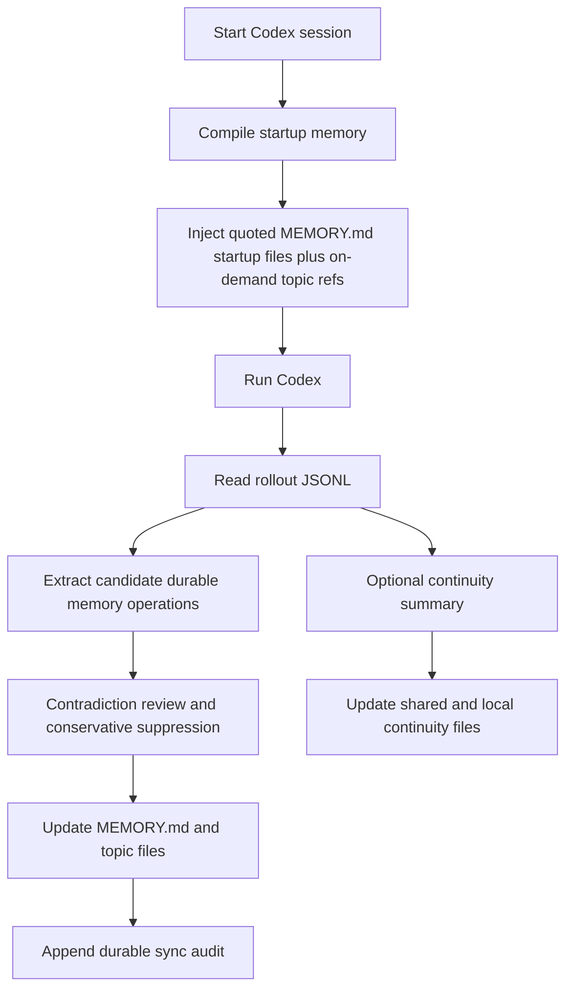

<div align="center">
  <h1>Codex Auto Memory</h1>
  <p><strong>A Markdown-first local memory runtime for Codex, evolving from a companion CLI into a hook/skill/MCP-aware hybrid workflow</strong></p>
  <p>
    <a href="./README.md">简体中文</a> |
    <a href="./README.zh-TW.md">繁體中文</a> |
    <a href="./README.en.md">English</a> |
    <a href="./README.ja.md">日本語</a>
  </p>
  <p>
    <a href="https://github.com/Boulea7/Codex-Auto-Memory/actions/workflows/ci.yml">
      
    </a>
    <a href="./LICENSE">
      
    </a>
    
    
    <a href="https://github.com/Boulea7/Codex-Auto-Memory/stargazers">
      
    </a>
    <a href="https://github.com/Boulea7/Codex-Auto-Memory/issues">
      
    </a>
  </p>
</div>

> `codex-auto-memory` is not a generic note-taking app and not a cloud memory service.
> It is a Markdown-first, local-first memory runtime for Codex. Today it is strongest as a Codex wrapper and companion CLI, and it is now explicitly evolving toward hook, skill, and MCP-aware integration surfaces without giving up auditable local Markdown files as the source of truth.

---

**Three things to know up front:**

1. **What it does** — It extracts future-useful knowledge from Codex sessions, keeps it as local Markdown, and brings it back into future sessions.
2. **How it stores** — Durable memory stays in local Markdown under `~/.codex-auto-memory/`, with compact indexes and topic files rather than opaque cache.
3. **Where it is going** — The repository remains Codex-first, but it is no longer documenting only a narrow companion seam. The roadmap now explicitly includes lower-friction hook, skill, and MCP-friendly paths alongside the existing wrapper flow.

---

## Contents

- [Why this project exists](#why-this-project-exists)
- [Who this is for](#who-this-is-for)
- [Current priorities](#current-priorities)
- [Core capabilities](#core-capabilities)
- [Capability matrix](#capability-matrix)
- [Quick start](#quick-start)
- [Common commands](#common-commands)
- [How it works](#how-it-works)
- [Storage layout](#storage-layout)
- [Documentation hub](#documentation-hub)
- [Current status](#current-status)
- [Roadmap](#roadmap)
- [Contributing and license](#contributing-and-license)

## Why this project exists

Claude Code publicly exposes a relatively clear memory contract:

- memory can be written automatically by the assistant
- memory is stored as local Markdown
- `MEMORY.md` acts as the compact startup entrypoint
- only the first 200 lines are loaded at startup
- details live in topic files and are read on demand
- worktrees in the same repository share project memory
- `/memory` provides audit and edit controls

Codex already exposes useful building blocks, but not the same complete public memory surface:

- `AGENTS.md`
- multi-agent workflows
- local sessions and rollout logs
- configurable MCP servers and growing skill/subagent surfaces
- local `cam doctor` / feature-output readiness signals for `memories` and `codex_hooks`

`codex-auto-memory` exists to close that gap with a Codex-first implementation that keeps memory local, inspectable, and editable. The current repository is still most mature as a wrapper-driven companion layer, but its product direction is now broader: preserve the Markdown-first contract while also making memory easier to consume through future hook, skill, and MCP-aware flows.

## Who this is for

Good fit:

- Codex users who want a Claude-style auto memory workflow today
- teams that want fully local, auditable, editable Markdown memory
- users who prefer explicit CLI control now but want more automation later
- maintainers who want a stable mental model even if Codex gains stronger native surfaces

Not a good fit:

- users looking for a generic note-taking or knowledge-base app
- teams that need account-level cloud memory
- users expecting a full Claude `/memory` clone today

## Current priorities

The repository is currently optimizing for four concrete product goals:

1. Automatically extract reusable long-term memory from conversations and tasks.
2. Automatically recall that memory in later sessions.
3. Support memory updates, deduplication, overwrite, and archive-friendly lifecycle handling.
4. Reduce the amount of manual memory-file maintenance users need to do.

These goals now take priority over documenting the project only as a narrow migration seam.

## Core capabilities

| Capability | What it means |
| :-- | :-- |
| Automatic post-session sync | extracts stable knowledge from Codex rollout JSONL and writes it back into durable Markdown memory |
| Automatic startup recall | compiles compact startup memory so durable knowledge can re-enter later sessions automatically |
| Markdown-first memory | `MEMORY.md` and topic files remain the product surface, not a hidden cache layer |
| Lifecycle-aware updates | supports explicit correction, dedupe, overwrite, delete, and reviewer-visible conflict suppression |
| Formal retrieval MCP surface | `cam mcp serve` exposes `search_memories`, `timeline_memories`, and `get_memory_details` as a read-only stdio retrieval plane |
| Project-scoped MCP install surface | `cam mcp install --host <codex|claude|gemini>` writes the recommended project-scoped host wiring for `codex_auto_memory` without changing the retrieval contract itself |
| Worktree-aware storage | shares project memory across worktrees while keeping local continuity isolated |
| Optional session continuity | separates temporary working state from durable memory |
| Integration-aware evolution | keeps the current wrapper flow while moving toward hook, skill, and MCP-friendly surfaces |
| Reviewer surfaces | exposes `cam memory`, `cam session`, `cam recall`, and `cam audit` for review and debugging |

## Capability matrix

| Capability | Claude Code | Codex today | Codex Auto Memory |
| :-- | :-- | :-- | :-- |
| Automatic memory writing | Built in | No complete public contract | Yes, via rollout-driven sync |
| Local Markdown memory | Built in | No complete public contract | Yes |
| `MEMORY.md` startup entrypoint | Built in | No | Yes |
| 200-line startup budget | Built in | No | Yes |
| Topic files on demand | Built in | No | Partial: startup exposes structured topic refs for later on-demand reads |
| Session continuity | Community patterns | No complete public contract | Yes, as a separate layer |
| Worktree-shared project memory | Built in | No public contract | Yes |
| Inspect / audit memory | `/memory` | No equivalent | `cam memory` |
| Skill / hook / MCP-aware evolution | Built in or strong host surfaces | Emerging / uneven | Now an explicit repository direction |

`cam memory` remains intentionally reviewer-oriented. It shows the quoted startup files that actually entered the startup payload, the startup budget, on-demand topic refs, edit paths, and recent sync audit entries behind `--recent [count]`.

Those recent audit entries now explicitly surface conservatively suppressed conflict candidates so contradictory rollout output does not silently merge into durable memory. Explicit updates still happen through `cam remember`, `cam forget`, or direct Markdown edits. Future lower-friction integration paths should preserve that same auditable memory contract instead of replacing it.

Duplicate writes against unchanged active memory, plus delete/archive requests that do not hit an active record, now surface as explicit `noop` reviewer results. They do not rewrite Markdown or append lifecycle history.

## Quick start

### 1. Clone and install

```bash
git clone https://github.com/Boulea7/Codex-Auto-Memory.git
cd Codex-Auto-Memory
pnpm install
```

### 2. Build and link the global command

```bash
pnpm build
pnpm link --global
```

> After this, the `cam` command works in any directory.

### 3. Initialize inside your project

```bash
cd /your/project
cam init
```

This creates `codex-auto-memory.json` in your project root (committed to Git) and `.codex-auto-memory.local.json` locally (gitignored by default).

### 4. Launch Codex through the wrapper

```bash
cam run
```

This is still the most mature end-to-end path today. After each session ends, `cam` can extract knowledge from the Codex rollout log and write it into the memory files automatically.

### 5. Inspect or correct memory

```bash
cam memory
cam recall search pnpm --state auto
cam mcp serve
cam integrations install --host codex
cam integrations apply --host codex
cam integrations doctor --host codex
cam mcp install --host codex
cam mcp print-config --host codex
cam mcp apply-guidance --host codex
cam mcp doctor
cam session status
cam session refresh
cam remember "Always use pnpm instead of npm"
cam forget "old debug note"
cam forget "old debug note" --archive
cam audit
```

## Common commands

| Command | Purpose |
| :-- | :-- |
| `cam run` / `cam exec` / `cam resume` | compile startup memory and launch Codex through the wrapper |
| `cam sync` | manually sync the latest rollout into durable memory |
| `cam memory` | inspect startup files, topic refs, startup budget, edit paths, and recent durable sync audit events plus suppressed conflict candidates |
| `cam remember` / `cam forget` | explicitly add or remove durable memory; `cam forget --archive` moves matching entries into the archive layer |
| `cam recall search` / `timeline` / `details` | progressively retrieve durable memory through a search -> timeline -> details workflow; `search` now defaults to `state=auto, limit=8`, so active memory is checked before archived fallback while staying read-only |
| `cam mcp serve` | start a read-only retrieval MCP server that exposes the same workflow through `search_memories`, `timeline_memories`, and `get_memory_details` |
| `cam integrations install --host codex` | install the recommended Codex integration stack in one explicit step by writing project-scoped MCP wiring and refreshing the hook bridge bundle plus Codex skill assets; it defaults to the runtime skill target, but also accepts `--skill-surface runtime|official-user|official-project`; stays idempotent, Codex-only, and does not touch the Markdown memory store |
| `cam integrations apply --host codex` | explicitly apply the full Codex integration state: it keeps `integrations install` unchanged, but also orchestrates `cam mcp apply-guidance --host codex`; it defaults to the runtime skill target, but also accepts `--skill-surface runtime|official-user|official-project`; if `AGENTS.md` cannot be updated safely, the command returns `blocked` and preserves the additive fail-closed boundary |
| `cam integrations doctor --host codex` | inspect the current Codex integration stack through a thin read-only aggregation surface that reports the recommended route, recommended preset, subchecks, and minimum next steps; it now recommends `cam integrations apply --host codex` when multiple Codex stack surfaces are still missing, and keeps `cam mcp apply-guidance --host codex` as the precise next step when only the managed `AGENTS.md` block is missing or outdated |
| `cam mcp install --host <codex|claude|gemini>` | explicitly write the recommended project-scoped host config for `codex_auto_memory`; only that server entry is replaced, hooks/skills stay opt-in, and `generic` remains manual-only |
| `cam mcp print-config --host <codex|claude|gemini|generic>` | print a ready-to-paste host snippet so the read-only retrieval plane can be wired into an existing MCP client with less manual setup; for `--host codex`, it also prints a recommended `AGENTS.md` snippet that teaches future Codex agents to prefer MCP and fall back to `cam recall` only when needed |
| `cam mcp apply-guidance --host codex` | create or update the Codex Auto Memory managed block inside the repository-level `AGENTS.md` through an additive, auditable, fail-closed flow; it only appends a new block or replaces the same marker block, and returns `blocked` if it cannot locate that block safely |
| `cam mcp doctor` | inspect the recommended project-scoped retrieval MCP wiring, project pinning, and hook/skill fallback assets; it now also adds a `codexStack` readiness summary for the recommended route, executable bits, shared asset version, and workflow consistency without modifying host config files |
| `cam session save` | merge / incremental save for continuity |
| `cam session refresh` | replace / clean regeneration for continuity |
| `cam session load` / `status` | inspect the continuity reviewer surface |
| `cam hooks` | manage the current local bridge / fallback recall bundle, including `memory-recall.sh`, compatibility wrappers, and `recall-bridge.md`; it is not an official Codex hook surface, and the bundle's recommended search preset is `state=auto`, `limit=8` |
| `cam skills` | install Codex skill assets with `cam skills install`; the default target remains the runtime surface, while `--surface runtime|official-user|official-project` enables explicit migration-prep copies on official `.agents/skills` paths; all surfaces teach the same MCP-first, CLI-fallback progressive durable-memory retrieval workflow and the same recommended search preset: `state=auto`, `limit=8` |
| `cam audit` | run privacy and secret-hygiene checks |
| `cam doctor` | inspect local wiring and native-readiness posture |

## How it works

### Design principles

- `local-first and auditable`
- `Markdown files are the product surface`
- `Codex-first hybrid runtime`
- `durable memory and session continuity remain separate`
- `wrapper-first today, integration-aware tomorrow`

### Runtime flow



### Why the project does not switch to a native-first path yet

- public Codex docs still do not define a Claude-equivalent native memory contract
- local `cam doctor --json` still exposes `memories` / `codex_hooks` more as readiness signals than as a stable primary implementation path
- the repository therefore continues to treat the wrapper flow as the strongest current implementation

The difference is product direction: this repository is no longer documenting hooks, skills, and MCP as mere distant future ideas. They are now part of the planned integration surface, provided they keep the same Markdown-first and auditable behavior contract.

## Storage layout

Durable memory:

```text
~/.codex-auto-memory/
├── global/
│   └── MEMORY.md
└── projects/<project-id>/
    ├── project/
    │   ├── MEMORY.md
    │   └── commands.md
    └── locals/<worktree-id>/
        ├── MEMORY.md
        └── workflow.md
```

Session continuity:

```text
~/.codex-auto-memory/projects/<project-id>/continuity/project/active.md
<project-root>/.codex-auto-memory/sessions/active.md
```

If retrieval indexes are added later:

- Markdown remains canonical.
- `cam recall` and `cam mcp serve` both stay read-only retrieval planes, not a second source of truth.
- `cam mcp serve` stays a read-only retrieval plane, not a second source of truth.
- SQLite / FTS / vector / graph layers remain sidecars only.

See the architecture docs for the full boundary breakdown.

## Documentation hub

### Entry points

- [文档首页（中文）](docs/README.md)
- [Documentation Hub (English)](docs/README.en.md)

### Core design docs

- [Claude reference contract (中文)](docs/claude-reference.md) | [English](docs/claude-reference.en.md)
- [Architecture (中文)](docs/architecture.md) | [English](docs/architecture.en.md)
- [Integration strategy (中文)](docs/integration-strategy.md)
- [Host surfaces (中文)](docs/host-surfaces.md)
- [Native migration strategy (中文)](docs/native-migration.md) | [English](docs/native-migration.en.md)

### Maintainer and reviewer docs

- [Session continuity design](docs/session-continuity.md)
- [Release checklist](docs/release-checklist.md)
- [Contributing](CONTRIBUTING.md)

## Current status

Current public-ready status:

- durable memory path: available
- startup recall path: available
- reviewer audit surfaces: available
- session continuity layer: available
- wrapper-driven Codex flow: available
- hook / skill / MCP-aware evolution: now part of the documented direction, but not yet the primary end-user path
- native memory / native hooks primary path: not enabled and not trusted as the main implementation path

## Roadmap

### v0.1

- companion CLI
- Markdown memory store
- 200-line startup compiler
- worktree-aware project identity
- initial maintainer and reviewer docs

### v0.2

- complete the issue-level memory goals, including the first shipped archive path through `cam forget --archive`
- clearer `cam memory` and `cam session` reviewer UX
- stronger contradiction handling and explicit memory lifecycle documentation
- define and document hook, skill, and MCP-friendly integration surfaces without replacing the current Markdown-first contract
- ship the first progressive-disclosure retrieval surface through `cam recall search / timeline / details`

### v0.3+

- expand the Codex-first hybrid path on top of the new recall and archive-ready foundation
- evaluate which integration pieces should stay in this repo versus move into a host-adaptable shared runtime later
- optional GUI or TUI browser
- stronger cross-session diagnostics and confidence surfaces

## Contributing and license

- Contribution guide: [CONTRIBUTING.md](./CONTRIBUTING.md)
- License: [Apache-2.0](./LICENSE)

If you find a mismatch between the README, official docs, and local runtime observations, prefer:

1. official product documentation
2. verified local behavior
3. explicit uncertainty

over confident but weakly supported claims.
