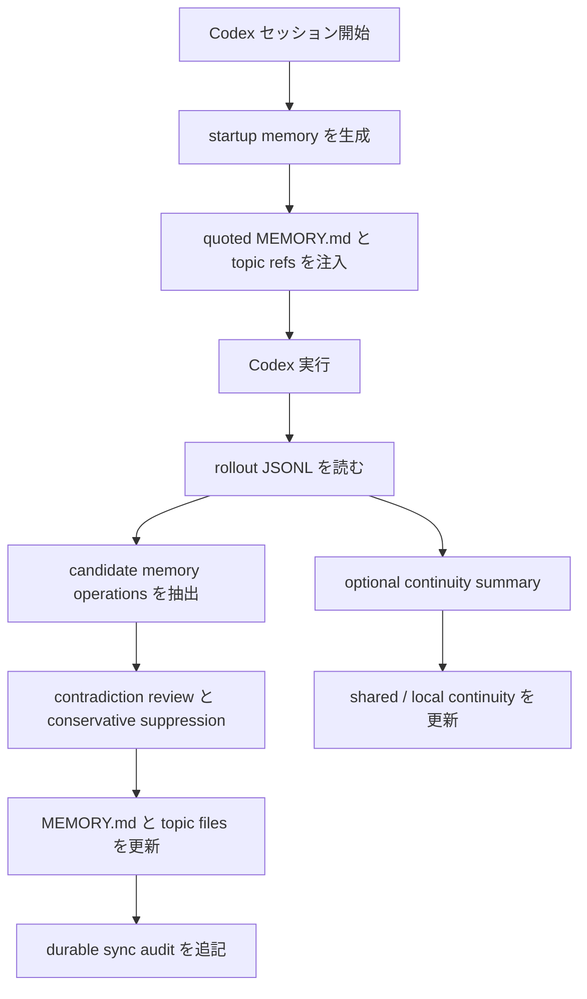

<div align="center">
  <h1>Codex Auto Memory</h1>
  <p><strong>Markdown-first のローカル memory runtime。Codex を主軸に、companion CLI から hook / skill / MCP-aware なハイブリッド運用へ進化中</strong></p>
  <p>
    <a href="./README.md">简体中文</a> |
    <a href="./README.zh-TW.md">繁體中文</a> |
    <a href="./README.en.md">English</a> |
    <a href="./README.ja.md">日本語</a>
  </p>
  <p>
    <a href="https://github.com/Boulea7/Codex-Auto-Memory/actions/workflows/ci.yml">
      
    </a>
    <a href="./LICENSE">
      
    </a>
    
    
    <a href="https://github.com/Boulea7/Codex-Auto-Memory/stargazers">
      
    </a>
    <a href="https://github.com/Boulea7/Codex-Auto-Memory/issues">
      
    </a>
  </p>
</div>

> `codex-auto-memory` は汎用ノートアプリでもクラウド記憶サービスでもありません。  
> これは Markdown-first / local-first の Codex 向け memory runtime です。現時点で最も成熟している入口は wrapper と CLI ですが、今後は hook・skill・MCP を取り込んだ低摩擦な統合面へ正式に進化していきます。

---

**最初に知っておくべき 3 点**

1. **何をするか**: Codex セッションから将来も使える知識を抽出し、ローカル Markdown に保存し、次回以降の会話で再利用します。
2. **どう保存するか**: `MEMORY.md` と topic files を中心とした Markdown が主表面であり、隠れた DB やキャッシュを主真相にはしません。
3. **どこへ向かうか**: 現在も Codex-first ですが、今後は companion CLI に閉じず、hook / skill / MCP-aware なハイブリッド運用を正式な方向として扱います。

---

## 目次

- [なぜこのプロジェクトがあるのか](#なぜこのプロジェクトがあるのか)
- [誰に向いているか](#誰に向いているか)
- [現在の優先目標](#現在の優先目標)
- [コア機能](#コア機能)
- [機能比較](#機能比較)
- [クイックスタート](#クイックスタート)
- [主要コマンド](#主要コマンド)
- [動作の仕組み](#動作の仕組み)
- [保存レイアウト](#保存レイアウト)
- [ドキュメント案内](#ドキュメント案内)
- [現在の状態](#現在の状態)
- [ロードマップ](#ロードマップ)
- [コントリビュートとライセンス](#コントリビュートとライセンス)

## なぜこのプロジェクトがあるのか

Claude Code はすでに比較的はっきりした auto memory 契約を公開しています。

- AI が memory を自動で書く
- memory はローカル Markdown に保存される
- `MEMORY.md` が起動時のエントリポイントになる
- 起動時は先頭 200 行だけ読む
- 詳細は topic files に分けて必要時に読む
- 同じリポジトリの worktree 間で project memory を共有する
- `/memory` で監査と編集ができる

一方、Codex は有用な基礎能力を持ちながらも、同等の memory product surface をまだ公開していません。

- `AGENTS.md`
- multi-agent workflows
- local sessions と rollout logs
- 拡張されつつある MCP / skills / subagents 面
- `cam doctor` や feature output に見える `memories` / `codex_hooks` signal

`codex-auto-memory` はそのギャップを埋めるために存在します。Codex-first の現実に合わせて、ローカルで監査可能・編集可能な Markdown memory を主契約として維持しつつ、将来的には hook・skill・MCP などの統合面でも同じ記憶契約を使えるように進化させていく、という立ち位置です。

## 誰に向いているか

向いている人:

- Codex で Claude-style auto memory に近い体験を今すぐ使いたい人
- 記憶を完全にローカル・監査可能・編集可能な Markdown で管理したいチーム
- いまは CLI/workflow を使い、将来はもっと自動化された統合面も使いたい人
- 公式 surface が変わってもユーザーの心象を大きく変えたくない保守者

向いていない人:

- 汎用ナレッジベースやノートアプリを探している人
- アカウント単位のクラウド記憶が必要な人
- 今日の時点で Claude `/memory` と同等の完全な対話面を期待する人

## 現在の優先目標

今の最重要目標は、以下の 4 つを製品として明確に満たすことです。

1. 対話やタスクから再利用可能な長期記憶を自動で抽出すること
2. その記憶を後続セッションで自動的に呼び戻すこと
3. 更新・重複排除・上書き・アーカイブを含む記憶ライフサイクルを持つこと
4. 手動で memory ファイルを保守する負担を減らすこと

## コア機能

| 機能 | 説明 |
| :-- | :-- |
| 自動 post-session sync | Codex rollout JSONL から安定した知識を抽出し durable Markdown memory に書き戻す |
| 自動 startup recall | 緊凑な startup memory を組み立て、後続セッションへ durable knowledge を戻す |
| Markdown-first | `MEMORY.md` と topic files が主表面であり、二次的な導出物ではない |
| 記憶ライフサイクル | 明示的な訂正、重複排除、上書き、削除、reviewer 可視の conflict suppression に対応 |
| formal retrieval MCP surface | `cam mcp serve` が `search_memories` / `timeline_memories` / `get_memory_details` を read-only な stdio MCP surface として公開する |
| project-scoped MCP install surface | `cam mcp install --host <codex|claude|gemini>` が推奨される project-scoped 宿主設定を書き込み、MCP 配線の摩擦を下げる |
| worktree-aware | 同一 git リポジトリ内の worktree で project memory を共有しつつ local continuity は分離する |
| session continuity | 一時的な working state と durable memory を分離して扱う |
| integration-aware evolution | wrapper 主導の現在地を保ちつつ、hook / skill / MCP 統合へ正式に進む |
| reviewer surface | `cam memory` / `cam session` / `cam recall` / `cam audit` による監査入口を提供する |

## 機能比較

| 機能 | Claude Code | Codex today | Codex Auto Memory |
| :-- | :-- | :-- | :-- |
| 自動 memory 書き込み | Built in | 完全な公開契約なし | rollout-driven sync で対応 |
| ローカル Markdown memory | Built in | 完全な公開契約なし | 対応 |
| `MEMORY.md` 起動エントリ | Built in | なし | 対応 |
| 200 行起動予算 | Built in | なし | 対応 |
| topic files の遅延読込 | Built in | なし | 一部対応。起動時に refs を公開し、後で必要時に読む |
| session continuity | Community patterns | 完全な公開契約なし | 独立 layer として対応 |
| worktree 共有 project memory | Built in | 公開契約なし | 対応 |
| inspect / audit memory | `/memory` | 同等コマンドなし | `cam memory` |
| hook / skill / MCP-aware evolution | Built in または宿主能力が強い | 新興で不均一 | 公式方向として採用済み |

`cam memory` は今後も reviewer-oriented な surface のままです。実際に startup payload に入った quoted startup files、startup budget、topic refs、edit paths、さらに `--recent [count]` で durable sync audit を見せます。

audit では保守的に suppress された conflict candidates も明示され、矛盾する rollout 出力が durable memory に静かに混ざらないようにします。将来 hook / skill / MCP の経路が増えても、同じ Markdown-first かつ監査可能な memory 契約を保つ前提です。

## クイックスタート

### 1. Clone と install

```bash
git clone https://github.com/Boulea7/Codex-Auto-Memory.git
cd Codex-Auto-Memory
pnpm install
```

### 2. ビルドしてグローバルコマンドをリンク

```bash
pnpm build
pnpm link --global
```

### 3. プロジェクトで初期化

```bash
cd /your/project
cam init
```

`codex-auto-memory.json` がプロジェクトに作成され、ローカル用に `.codex-auto-memory.local.json` が作られます。

### 4. wrapper 経由で Codex を起動

```bash
cam run
```

これが現在もっとも成熟しているエンドツーエンド経路です。セッション終了後、`cam` は rollout ログから知識を抽出して memory に反映します。

### 5. memory を確認・修正

```bash
cam memory
cam memory reindex --scope all --state all
cam recall search pnpm --state auto
cam mcp serve
cam integrations install --host codex
cam integrations apply --host codex
cam integrations doctor --host codex
cam mcp install --host codex
cam mcp print-config --host codex
cam mcp apply-guidance --host codex
cam mcp doctor
cam session status
cam session refresh
cam remember "Always use pnpm instead of npm"
cam forget "old debug note"
cam forget "old debug note" --archive
cam audit
```

## 主要コマンド

| コマンド | 役割 |
| :-- | :-- |
| `cam run` / `cam exec` / `cam resume` | startup memory を生成して wrapper 経由で Codex を起動 |
| `cam sync` | 最新 rollout を durable memory に手動同期 |
| `cam memory` | startup files、topic refs、startup budget、edit paths、recent sync audit を確認 |
| `cam memory reindex` | canonical Markdown から retrieval sidecar を明示的に再構築する。`--scope`、`--state`、`--cwd`、`--json` をサポートし、sidecar が missing / invalid / stale のときの低摩擦な repair path を提供する |
| `cam remember` / `cam forget` | durable memory の明示的な追加・削除。`cam forget --archive` は一致した項目をアーカイブ層へ移動する |
| `cam recall search` / `timeline` / `details` | `search -> timeline -> details` の progressive disclosure workflow で durable memory を段階的に取得する。`search` は `state=auto, limit=8` を既定値として使い、active を先に調べてヒットしなければ archived にフォールバックしつつ read-only を保つ |
| `cam mcp serve` | `search_memories` / `timeline_memories` / `get_memory_details` を通じて同じ retrieval contract を公開する read-only MCP server を起動する |
| `cam integrations install --host codex` | 推奨される Codex integration stack を一度に導入し、project-scoped MCP wiring を書き込みつつ、hook bridge bundle と Codex skill assets を更新する。skills は runtime target が既定だが、`--skill-surface runtime|official-user|official-project` も指定できる。明示的・冪等・Codex-only を保ち、Markdown memory store には触れない |
| `cam integrations apply --host codex` | 明示的・冪等・Codex-only のまま完全な integration state を適用する。`integrations install` の既存境界は変えず、その上で `cam mcp apply-guidance --host codex` も編成する。skills は runtime target が既定だが、`--skill-surface runtime|official-user|official-project` も指定できる。`AGENTS.md` managed block が unsafe な場合は、stack への書き込み前に preflight `blocked` を返す |
| `cam integrations doctor --host codex` | 現在の Codex integration stack を薄い read-only 集約面として点検し、推奨ルート、推奨 preset、構造化された `workflowContract`、`applyReadiness`、サブチェック結果、次の最小アクションを返す。`AGENTS.md` managed block が unsafe な場合は、まずその修復を案内し、すぐに `cam integrations apply --host codex` を勧めない |
| `cam mcp install --host <codex|claude|gemini>` | 推奨される project-scoped 宿主設定を明示的に書き込み、`codex_auto_memory` の項目だけを更新する。hooks/skills は自動導入せず、その entry に non-canonical なカスタム項目がある場合は安全な範囲で保持する。`generic` は引き続き manual-only |
| `cam mcp print-config --host <codex|claude|gemini|generic>` | ready-to-paste な接続スニペットを出力し、read-only retrieval plane を既存の MCP client に低摩擦で接続できるようにする。`--host codex` の場合は、将来の Codex エージェントに MCP 優先・`cam recall` フォールバックを教えるための推奨 `AGENTS.md` snippet に加えて、JSON payload に共有 `workflowContract` も含める |
| `cam mcp apply-guidance --host codex` | repo ルートの `AGENTS.md` 内にある Codex Auto Memory 管理 block を additive・監査可能・fail-closed に作成または更新する。同じ marker block の追加または置換だけを行い、安全に特定できない場合は書き換えず `blocked` を返す |
| `cam mcp doctor` | 推奨される project-scoped retrieval MCP の配線、project pinning、hook/skill fallback assets を read-only で点検し、さらに `codexStack` readiness と構造化された `workflowContract` によって推奨ルート、executable bit、共有 asset version、workflow consistency を要約する。alternate global wiring が見つかった場合も、推奨される project-scoped ルートとは分けて報告し、ホスト設定は書き換えない |
| `cam session save` | continuity の merge / incremental save |
| `cam session refresh` | continuity の replace / clean regeneration |
| `cam session load` / `status` | continuity reviewer surface を確認 |
| `cam hooks install` | 現在の local bridge / fallback helper bundle を生成・更新し、`memory-recall.sh`、`post-work-memory-review.sh`、互換 wrapper、`recall-bridge.md` を通じて今後の hook / skill / MCP-aware retrieval に備える。`post-work-memory-review.sh` は `cam sync` と `cam memory --recent` をまとめた収束 review helper である。これは公式な Codex hook surface ではなく、推奨検索 preset は `state=auto`、`limit=8` |
| `cam skills` | `cam skills install` で Codex skill を導入する。既定 target は runtime のままだが、`--surface runtime|official-user|official-project` を使えば公式 `.agents/skills` 経路向けの明示的な互換コピーも置ける。どの surface でも、MCP-first / CLI-fallback の段階的 durable memory retrieval workflow と推奨検索 preset `state=auto`, `limit=8` を共有する |
| `cam audit` | プライバシーと secret hygiene を監査 |
| `cam doctor` | ローカル wiring と native-readiness を確認 |

補足:

- `cam skills install` の公開 surface は `runtime`、`official-user`、`official-project` に固定された。runtime が既定 target のままで、公式 `.agents/skills` 経路は明示的な opt-in install として扱う。
- 主要な `--help` 文言も release-facing public contract の一部として扱う。特に `integrations install/apply/doctor`、`mcp install/print-config/apply-guidance`、`skills install` は README、アーキテクチャ文書、dist/tarball smoke と同じ境界説明を維持する必要がある。

## 動作の仕組み

### 設計原則

- `local-first and auditable`
- `Markdown files are the product surface`
- `Codex-first hybrid runtime`
- `durable memory` と `session continuity` を分離
- `wrapper-first today, integration-aware tomorrow`

### 実行フロー



### なぜまだ native-first ではないのか

- 公開された Codex ドキュメントは Claude Code 相当の完全な native memory 契約をまだ定義していません
- `cam doctor --json` に見える `memories` / `codex_hooks` も、今は readiness signal の性格が強いです
- そのため現在もっとも信頼できるのは wrapper-first の主線です

ただし方向性は変わりました。hooks、skills、MCP は「いつかの案」ではなく、Markdown-first 契約を壊さない範囲で正式に取り込んでいく統合面として扱います。

## 保存レイアウト

Durable memory:

```text
~/.codex-auto-memory/
├── global/
│   └── MEMORY.md
└── projects/<project-id>/
    ├── project/
    │   ├── MEMORY.md
    │   └── commands.md
    └── locals/<worktree-id>/
        ├── MEMORY.md
        └── workflow.md
```

Session continuity:

```text
~/.codex-auto-memory/projects/<project-id>/continuity/project/active.md
<project-root>/.codex-auto-memory/sessions/active.md
```

詳細は architecture doc を参照してください。

## ドキュメント案内

- [文档首页（中文）](docs/README.md)
- [Documentation Hub (English)](docs/README.en.md)
- [Claude reference contract (中文)](docs/claude-reference.md) | [English](docs/claude-reference.en.md)
- [Architecture (中文)](docs/architecture.md) | [English](docs/architecture.en.md)
- [集成演进策略（中文）](docs/integration-strategy.md)
- [宿主能力面（中文）](docs/host-surfaces.md)
- [Native migration strategy (中文)](docs/native-migration.md) | [English](docs/native-migration.en.md)
- [Session continuity design](docs/session-continuity.md)
- [Release checklist](docs/release-checklist.md)
- [Contributing](CONTRIBUTING.md)

## 現在の状態

- durable memory path: available
- startup recall path: available
- reviewer audit surfaces: available
- session continuity layer: available
- wrapper-driven Codex flow: available
- hook / skill / MCP-aware evolution: 方向性として明文化済み。ただし最も成熟した利用経路ではまだない
- native memory / native hooks primary path: not enabled and not trusted as the main implementation path

## ロードマップ

### v0.1

- companion CLI
- Markdown memory store
- 200-line startup compiler
- worktree-aware project identity
- 初期の maintainer / reviewer docs

### v0.2

- issue のコア要求を満たす: 自動抽出、自動再呼び出し、更新/重複排除/上書き/アーカイブのライフサイクル、手動保守負担の削減
- `cam memory` / `cam session` / `cam recall` の reviewer UX 改善
- contradiction handling と memory lifecycle の強化
- Markdown-first 契約を崩さずに hook / skill / MCP-friendly integration surfaces を定義・公開

### v0.3+

- Codex-first hybrid 路線をさらに進め、retrieval・skill・hook integration を強化
- どの統合能力をこのリポジトリに残し、どれを将来の共有 runtime に抽出すべきか再評価する
- optional GUI / TUI browser
- より強い cross-session diagnostics と confidence surface

## コントリビュートとライセンス

- Contribution guide: [CONTRIBUTING.md](./CONTRIBUTING.md)
- License: [Apache-2.0](./LICENSE)

README、公式ドキュメント、ローカル実行結果にズレがある場合は、次の順で信頼してください。

1. 公式プロダクトドキュメント
2. 再現可能なローカル挙動
3. 不確実性を明示した記述

根拠の弱い断定より、検証可能な事実を優先してください。
