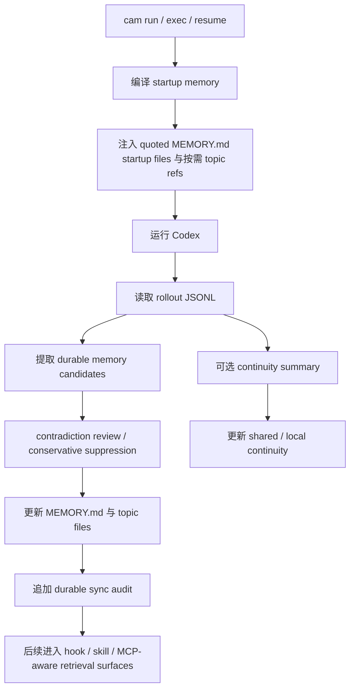

<div align="center">
  <h1>Codex Auto Memory</h1>
  <p><strong>面向 Codex 的 Markdown-first 本地记忆运行层，正在从 companion CLI 演进为 Codex-first Hybrid memory system</strong></p>
  <p>
    <a href="./README.md">简体中文</a> |
    <a href="./README.zh-TW.md">繁體中文</a> |
    <a href="./README.en.md">English</a> |
    <a href="./README.ja.md">日本語</a>
  </p>
  <p>
    <a href="https://github.com/Boulea7/Codex-Auto-Memory/actions/workflows/ci.yml">
      
    </a>
    <a href="./LICENSE">
      
    </a>
    
    
    <a href="https://github.com/Boulea7/Codex-Auto-Memory/stargazers">
      
    </a>
    <a href="https://github.com/Boulea7/Codex-Auto-Memory/issues">
      
    </a>
  </p>
</div>

> `codex-auto-memory` 不是通用笔记软件，也不是云端记忆服务，更不是多宿主统一平台主仓。  
> 它的目标是：在今天的 Codex CLI 上，以本地 Markdown 为主存储表面，先用 companion-first 的方式提供可靠记忆能力，再逐步补齐 hooks、skills、MCP 等更自动化的 integration surfaces。

---

**三个要点，快速定位：**

1. **它做什么** — 为 Codex 提供 durable memory、session continuity、startup recall，以及面向 hooks / skills / MCP 的演进式记忆基础设施。
2. **它怎么存** — memory 的 canonical source of truth 仍然是本地 Markdown，而不是数据库或云端缓存。
3. **它现在处于什么阶段** — 当前最稳的主入口仍是 `cam run` / wrapper；同时产品方向已经正式转向 `Codex-first Hybrid`，不再把 hook / skill / MCP 仅视为 future bridge。

---

## 目录

- [为什么这个项目存在](#为什么这个项目存在)
- [当前定位](#当前定位)
- [当前主任务](#当前主任务)
- [核心能力](#核心能力)
- [集成方向](#集成方向)
- [快速开始](#快速开始)
- [常用命令](#常用命令)
- [工作方式](#工作方式)
- [存储布局](#存储布局)
- [文档导航](#文档导航)
- [当前状态](#当前状态)
- [路线图](#路线图)
- [贡献与许可](#贡献与许可)

## 为什么这个项目存在

Claude Code 已经公开了一套相对清晰的 auto memory 产品契约：

- AI 会自动写 memory
- memory 以本地 Markdown 保存
- `MEMORY.md` 是启动入口
- 启动时只读取前 200 行
- 细节写入 topic files，按需读取
- 同一仓库的不同 worktree 共享 project memory
- `/memory` 用来审查和编辑 memory

而今天的 Codex CLI 已经具备不少可利用的基础能力，但仍没有一套完整、稳定、可验证的本地记忆产品面：

- `AGENTS.md`
- multi-agent workflows
- 本地 persistent sessions / rollout logs
- 本地 `cam doctor` / feature output 里可见的 `memories`、`codex_hooks` signal
- MCP、skills、rules 等可扩展能力

`codex-auto-memory` 的价值，不再只是“做一个 CLI companion”，而是先以当前最稳的 `companion-first` 路线提供可靠的 Codex 记忆体验，再把它演进成一个 **Codex-first Hybrid memory system**：既服务于喜欢显式 `cam` 命令的用户，也服务于希望通过 hooks、skills、MCP 等方式让代理自动使用记忆能力的用户。

## 当前定位

当前仓库的公开定位应理解为：

- **Codex-first**：当前主宿主仍是 Codex，而不是多宿主统一平台
- **Markdown-first**：`MEMORY.md` 与 topic files 仍是产品表面与主真相
- **Hybrid**：主入口仍是 wrapper + CLI，但 hooks / skills / MCP-aware integration 已经进入正式演进方向
- **companion-first implementation, integration-aware roadmap**：现阶段最稳实现依旧是 companion runtime，但产品不再把 hooks / skills / MCP 只写成远期灵感

这意味着：

- 当前仓库不会直接重写成 `claude-mem` 式 DB-first / worker-first 系统
- 当前仓库会继续优先把 Codex 场景跑通
- 后续实现可以同时覆盖 `cam` 命令用户与“希望让代理自己使用记忆”的用户

## 当前主任务

接下来这个仓库的主任务，按 issue 的要求正式收敛为 4 件事：

1. **自动从对话或任务过程中提取可复用的长期记忆**
2. **在后续会话中自动召回这些记忆**
3. **支持记忆更新、去重、覆盖或归档**
4. **尽量减少手动维护 memory 文件的成本**

这 4 件事是当前仓库的产品优先级，不再只是零散增强项。

## 核心能力

| 能力 | 当前状态 | 说明 |
| :-- | :-- | :-- |
| 自动 durable memory sync | 已有主路径 | 会话结束后从 Codex rollout JSONL 中提取稳定、未来有用的信息并写回 Markdown memory |
| Markdown-first canonical store | 已有主路径 | `MEMORY.md` 与 topic files 就是产品表面，而不是内部缓存 |
| 紧凑 startup recall | 已有主路径 | 启动时注入真正进入 payload 的 quoted `MEMORY.md` startup files，附带少量 active-only content highlights，并保留按需 topic refs |
| worktree-aware project identity | 已有主路径 | 同一 git 仓库的 worktree 共享 project memory，project-local 仍保持隔离 |
| session continuity | 已有主路径 | 临时 working state 与 durable memory 分层存储、分层加载 |
| conflict review / conservative suppression | 已有主路径 | 冲突 candidate 不静默 merge，而是显式 suppress 并暴露 reviewer 信息 |
| explicit correction | 已有主路径 | 支持 `cam remember` / `cam forget` 与显式更正带来的 replace/delete 语义 |
| archive lifecycle | 已有首批实现 | 支持 `cam forget --archive` 将长期但不再活跃的信息转入可检索归档层，而不是只能 delete |
| search / timeline / detail retrieval | 已有首批实现 | 提供 `cam recall search` / `timeline` / `details`，以 progressive disclosure 方式检索记忆 |
| formal retrieval MCP surface | 本轮新增 | 提供 `cam mcp serve`，通过 `search_memories` / `timeline_memories` / `get_memory_details` 暴露只读 retrieval plane |
| project-scoped MCP install surface | 本轮新增 | 提供 `cam mcp install --host codex`，显式写入推荐的 Codex project-scoped 宿主配置；非 Codex 宿主 wiring 仍属于边界化接线能力，集中记录在 `docs/host-surfaces.md` |
| noop-aware lifecycle audit | 已有首批实现 | 相同 active memory 的重复写入、以及缺失 active 目标的 delete/archive，会显式记为 `noop` reviewer 结果，而不再静默重写 Markdown |
| hook / skill / MCP-aware integration | 已进入代码主线 | `cam hooks install` 现在会生成 recall bridge bundle（`memory-recall.sh`、`post-work-memory-review.sh`、兼容 wrapper 与 `recall-bridge.md`），供后续 hook / skill / MCP bridge 复用 |
| Codex skill install surface | 已有首批实现 | `cam skills install` 默认安装 runtime 目标，并支持显式 `--surface runtime|official-user|official-project`；无论装到哪个 surface，都沿用同一套 `MCP -> local bridge -> resolved CLI` 的 `search -> timeline -> details` durable memory 工作流 |

## 集成方向

这个仓库接下来的方向不是“改造成万能平台”，而是：

- 在 **当前仓库内部**，补齐面向 Codex 的 `hook bridge`、`skills`、`MCP-friendly retrieval` 能力
- 继续保持 `cam run` / `cam sync` / `cam memory` / `cam session` 这条最稳的主路径
- 让不喜欢显式 CLI 的用户，也能通过更自动化的 integration surfaces 获得同样的 durable memory 能力

当前方向的边界：

- 当前仓库仍以 **Codex** 为主宿主
- 仍坚持 **Markdown-first**
- 检索索引、SQLite、向量库、图谱等如果以后引入，也应是 **sidecar index**，不能取代 Markdown canonical store
- 多宿主统一平台会在后续独立仓库中探索，而不是强行塞进当前主仓

详细方向见：

- [Integration Strategy](./docs/integration-strategy.md)
- [Host Surfaces](./docs/host-surfaces.md)

## 快速开始

### 1. 克隆并安装

```bash
git clone https://github.com/Boulea7/Codex-Auto-Memory.git
cd Codex-Auto-Memory
pnpm install
```

### 2. 构建并链接全局命令

```bash
pnpm build
pnpm link --global
```

> 链接之后，`cam` 命令就可以在任意目录使用了。

### 3. 在你的项目里初始化

```bash
cd /你的项目目录
cam init
```

这会在项目根目录生成 `codex-auto-memory.json`（跟踪到 Git），并在本地创建 `.codex-auto-memory.local.json`（默认 gitignored）。

### 4. 通过 wrapper 启动 Codex

```bash
cam run
```

当前最稳的自动记忆主路径仍然是 wrapper：会话结束后，`cam` 会自动从 Codex rollout 日志里提取信息并写入 memory 文件。

### 5. 查看状态与审计面

```bash
cam memory
cam memory reindex --scope all --state all
cam memory --recent 5
cam recall search pnpm --state auto
cam mcp serve
cam integrations install --host codex
cam integrations apply --host codex
cam integrations doctor --host codex
cam mcp install --host codex
cam mcp print-config --host codex
cam mcp apply-guidance --host codex
cam mcp doctor --host codex
cam session status
cam session refresh
cam remember "Always use pnpm instead of npm"
cam forget "old debug note"
cam forget "old debug note" --archive
cam audit
```

## 常用命令

| 命令 | 作用 |
| :-- | :-- |
| `cam run` / `cam exec` / `cam resume` | 编译 startup memory 并通过 wrapper 启动 Codex |
| `cam sync` | 手动把最近 rollout 同步进 durable memory |
| `cam memory` | 查看 startup payload、topic refs、startup highlights、highlight budget / section 渲染情况、edit paths、durable sync audit 与 suppressed conflict candidates；支持 `--cwd <path>` 跨目录锚定目标项目；若 durable memory layout 尚未初始化，会返回空的 inspect 视图而不是隐式创建 `MEMORY.md` / `ARCHIVE.md` / sidecar；`--json` 还会额外暴露 `highlightCount`、`omittedHighlightCount`、`omittedTopicFileCount`、`highlightsByScope`、`startupSectionsRendered`、`startupOmissions`、`startupOmissionCounts`、`startupOmissionCountsByTargetAndStage`、`topicFileOmissionCounts`、`topicRefCountsByScope`，以及 reviewer-visible `topicDiagnostics` / `layoutDiagnostics`，帮助区分 selection-stage、render-stage、global highlight cap trimming 与 canonical layout 异常 |
| `cam memory reindex` | 显式从 canonical Markdown 重建 retrieval sidecar；支持 `--scope`、`--state`、`--cwd`、`--json`，用于 sidecar 缺失、损坏或 stale 时的低心智修复路径；若 durable memory layout 尚未初始化，会返回空的 `rebuilt` 结果而不是隐式创建 layout |
| `cam dream build` / `cam dream inspect` | 构建并审查最小可用 `dream sidecar`；它会把 continuity compaction、query-time relevant refs 和 pending `promotionCandidates` 写进可审计的 JSON sidecar，但不会直接改 `MEMORY.md` 或 topic files；后续公开的 `cam dream candidates` / `cam dream review` / `cam dream promote` 仍然走显式 review lane：durable-memory candidate 只能在显式 promote 后通过现有 reviewer/audit 链路写入 canonical memory，而 instruction-like candidate 继续保持 `proposal-only` |
| `cam remember` / `cam forget` | 显式新增、删除或修正 memory；两者现在也支持 `--cwd <path>` 用于跨目录锚定目标项目；`cam remember` 在省略 `--topic` 时会做轻量 durable topic 推断，并在“唯一旧值可识别”时优先更新现有 memory，而不是无脑追加第二条 active entry；`cam forget --archive` 会把匹配条目移入归档层；`forget` 现在还会和 `recall search` 共用多词 query 归一化语义，允许像 `pnpm npm` 这样的 query 跨 `summary/details` 命中同一条 memory，而不是要求整段原始 substring 连续出现；两者现在都支持 `--json`，返回 manual mutation 的 reviewer payload，包括 `mutationKind`、`matchedCount`、`appliedCount`、`noopCount`、`summary`、`primaryEntry`、`entries[]`、`followUp`、`nextRecommendedActions`，以及在至少命中一个 ref 时额外暴露的顶层 lifecycle/detail 字段（`latestAppliedLifecycle`、`latestLifecycleAttempt`、`latestLifecycleAction`、`latestState`、`latestSessionId`、`latestRolloutPath`、`latestAudit`、`timelineWarningCount`、`warnings`、`entry`、`lineageSummary`、`ref/path/historyPath`）；现在还会额外暴露 `leadEntryRef`、`leadEntryIndex`、`detailsAvailable`、`reviewRefState`、`uniqueAuditCount`、`auditCountsDeduplicated` 与 `warningsByEntryRef`，让 delete / archive / multi-entry forget 的 lead-entry 与聚合 reviewer 语义更显式；空的 `forget --json` 结果现在保持 additive，并会返回空的 `nextRecommendedActions`，不再给出占位式 `"<ref>"` 提示；delete 分支还会显式区分 timeline-only 与 details-usable review routes；文本模式现在也会直接给出 project-pinned 的 `timeline/details -> recent -> reindex` follow-up，帮助手工修正后自然回到 reviewer 闭环 |
| `cam recall search` / `timeline` / `details` | 以 `search -> timeline -> details` 的 progressive disclosure 检索 durable memory；`search` 默认采用 `state=auto`、`limit=8`，先查 active，未命中再回退 archived，且保持只读 retrieval；多词查询现在会跨 `id/topic/summary/details` 聚合命中，而不是要求所有 term 落在同一个字段；JSON 输出现在还会额外暴露 `retrievalMode`、`finalRetrievalMode`、`retrievalFallbackReason`、`stateResolution`、`executionSummary`、`searchOrder`、`totalMatchedCount`、`returnedCount`、`globalLimitApplied`、`truncatedCount`、`resultWindow`、`globalRank`，以及 `diagnostics.checkedPaths[].returnedCount` / `droppedCount`，把 auto-state、global sort、fallback 与 post-limit 行为说清楚；同时还会通过 additive `querySurfacing` 给出 `suggestedDreamRefs` 与 `suggestedInstructionFiles`，作为 query-time reviewer hints，而不是直接改动 search 结果或 canonical memory；其中 `finalRetrievalMode` 只是对最终结果面的显式别名，`retrievalMode` 继续保留兼容语义 |
| `cam mcp serve` | 启动只读 retrieval MCP server，通过 `search_memories` / `timeline_memories` / `get_memory_details` 暴露同一套渐进式检索契约 |
| `cam integrations install --host codex` | 一次性安装推荐的 Codex integration stack：写入 project-scoped MCP wiring，并刷新 hook bridge bundle 与 Codex skill 资产；默认使用 runtime skills target，也支持显式 `--skill-surface runtime|official-user|official-project`；保持显式、幂等、Codex-only，不触碰 `AGENTS.md` 或 Markdown memory store；如果 staged install 中途失败，现在也会回滚已写入的 MCP / hooks / skills 文件，避免留下半成功状态；`--json` 还会返回结构化 rollback payload；安装完成后会明确提醒再跑 `cam integrations doctor --host codex` 确认当前环境里真正 operational 的 retrieval route |
| `cam integrations apply --host codex` | 以显式、幂等、Codex-only 的方式应用完整 integration state：在保留 `integrations install` 旧语义不变的前提下，额外编排 `cam mcp apply-guidance --host codex`；默认使用 runtime skills target，也支持显式 `--skill-surface runtime|official-user|official-project`；若 `AGENTS.md` managed block 不安全，会在任何 stack 写入之前 preflight `blocked`，保持 additive / fail-closed；若 late-block 或 staged write 失败，JSON payload 现在也会显式暴露 rollback outcome 与最终 effective action，避免把“尝试写过”误读成“最终已安装”；apply 完成后同样需要再用 doctor 判断当前环境里是 MCP、local bridge 还是 resolved CLI 在实际生效 |
| `cam integrations doctor --host codex` | 以 Codex-only、只读、薄聚合的方式汇总当前 integration stack readiness，直接给出推荐路由、当前 operational route truth（`recommendedRoute`、`currentlyOperationalRoute`、`routeKind`、`routeEvidence`、`shellDependencyLevel`、`hostMutationRequired`、`preferredRouteBlockers`、`currentOperationalBlockers`）、推荐 preset、结构化 `workflowContract`、`applyReadiness`、`experimentalHooks`、`layoutDiagnostics`、子检查结果与下一步最小动作；其中 `recommendedRoute` 继续表示 MCP-first 的首选路径，而 blocker 字段会分开说明“为什么首选路由没跑起来”和“当前 fallback 自己是否还有问题”；还会额外暴露 skill-surface steering（`preferredSkillSurface`、`recommendedSkillInstallCommand`、`installedSkillSurfaces`、`readySkillSurfaces`），帮助后续安装 guidance surface，但不把 skills 误写成 executable fallback route；当通过 `--cwd` 检查另一个项目时，hooks fallback 的 next steps 现在也会通过 `CAM_PROJECT_ROOT=...` 把 local bridge route project-pin 到目标仓库；当 `cam` 当前不可解析时，direct CLI next step 也会优先给出 resolved `node dist/cli.js recall ...` fallback，而不是先给出会失败的裸 `cam recall ...`；当 AGENTS guidance 处于 unsafe managed-block 状态时，会先提示修复 `AGENTS.md`，而不是直接推荐 `cam integrations apply --host codex` |
| `cam mcp install --host codex` | 显式写入推荐的 Codex project-scoped 宿主 MCP 配置；只更新 `codex_auto_memory` 这一项，不会自动安装 hooks/skills；若该 entry 已带有非 canonical 自定义字段，会在安全前提下保留它们；更低优先级的非 Codex host wiring 细节继续收口到 `docs/host-surfaces.md`，不作为默认产品路径，其中一部分仍保持 `manual-only` |
| `cam mcp print-config --host codex` | 打印 ready-to-paste 的 Codex 接入片段，降低把 read-only retrieval plane 接进当前主工作流的摩擦；还会额外打印推荐的 `AGENTS.md` snippet，并在 JSON payload 中附带共享 `workflowContract` 与显式 `experimentalHooks` guidance，帮助未来 Codex 代理优先走 MCP，再 fallback 到本地 `memory-recall.sh` bridge bundle，最后再退到 resolved CLI recall，同时把官方 hooks 继续标为 Experimental；其他 host snippet 仍属于边界化 wiring 参考，放在 `docs/host-surfaces.md` 中说明，其中保留 `manual-only` 分支 |
| `cam mcp apply-guidance --host codex` | 以 additive、可审计、fail-closed 的方式创建或更新仓库根 `AGENTS.md` 中由 Codex Auto Memory 自己管理的 guidance block；只会 append 新 block 或替换同一 marker block，无法安全定位时返回 `blocked` 而不会冒险改写 |
| `cam mcp doctor --host codex` | 只读检查当前项目的推荐 Codex retrieval MCP 接入状态、project pinning 与 hook/skill fallback 资产；同时追加结构化 `workflowContract`、`layoutDiagnostics` 与最小粒度的 retrieval sidecar repair command；当 `cam` 不在 PATH 上时，这条 repair command 也会跟随 resolved launcher fallback。若 `--host codex`（或 `all` 中包含 Codex），JSON 还会额外暴露 `codexStack` route truth、`experimentalHooks` 与 AGENTS guidance/apply safety；若检查的是 `claude`、`gemini`、`generic` 这类 manual-only / snippet-first 宿主，则 host 级状态只表示“片段/配置是否存在且形状正确”，不会把它们抬到和 Codex operational route 同一 readiness 层级；`commandSurface.install/applyGuidance` 也会显式为 `false`，不会冒充 Codex-only 的可写 guidance surface。doctor 现在也会把“hook assets 已安装”与“helper 内嵌 launcher 现在是否真能跑起来”区分开来，并把 app-server signal 与 `memories` / `codex_hooks` 分开表达；若检测到 alternate global wiring，也会与推荐的 project-scoped 路径明确区分，不会改写任何宿主配置 |
| `cam session save` | merge / incremental save；从 rollout 增量写入 continuity |
| `cam session refresh` | replace / clean regeneration；从选定 provenance 重建 continuity |
| `cam session load` / `status` | 查看 continuity reviewer surface 与 diagnostics；`status --json` / `load --json` 现在还会额外暴露 additive `resumeContext`，包括当前 goal、`suggestedDurableRefs` 与 instruction files，帮助下一轮会话理解“从哪继续”；`load --json --print-startup` 现在会额外暴露 continuity startup contract，包括实际渲染的 `sourceFiles`、候选 `candidateSourceFiles`、`sectionsRendered`、`omissions` / `omissionCounts`、`continuitySectionKinds`、`continuitySourceKinds`、`continuityProvenanceKind`、`continuityMode` 与 `futureCompactionSeam`，让 temporary continuity startup payload 也具备接近 durable startup 的可解释性 |
| `cam hooks install` | 生成本仓自带的 local bridge / fallback helper bundle，包括 `memory-recall.sh`、`post-work-memory-review.sh`、兼容 helper wrappers 与 `recall-bridge.md`；其中 `post-work-memory-review.sh` 会把 durable memory 的 `sync -> recent review` 串成同一套收尾动作；这些 user-scoped helper 现在优先在运行时通过 `CAM_PROJECT_ROOT` 或当前 shell `PWD` 解析目标项目，避免把某个项目根硬编码进共享资产；它不是官方 Codex hook surface，官方 hooks 目前仍只作为公开但 `Experimental` 的 opt-in 轨道，而 config 文档里的 `codex_hooks` feature flag 仍标为 `Under development`，且该 bundle 的推荐检索 preset 为 `state=auto`、`limit=8` |
| `cam skills install` | 默认安装 runtime Codex skill 资产，并支持显式 `--surface runtime|official-user|official-project`；让代理优先通过 retrieval MCP，未接线时先 fallback 到本地 `memory-recall.sh search -> timeline -> details` bridge bundle，再退到 resolved CLI recall，并沿用同一套推荐检索 preset：`state=auto`、`limit=8`；skills 仍是 guidance surface，不等于 executable fallback route，真正当前 operational 的 route 仍应回到 `cam mcp doctor --host codex` / `cam integrations doctor --host codex` 判断 |
| `cam audit` | 仓库级 privacy / secret hygiene 审查 |
| `cam doctor` | 检查当前 companion wiring、Codex feature posture 与 future integration readiness；`--json` 现在还会显式暴露 retrieval sidecar 健康度、unsafe topic diagnostics 与 canonical layout diagnostics，继续保持只读检查，不隐式创建 durable memory layout |

补充：

- 共享 `workflowContract` 现在也会显式暴露 launcher 前提：`commandName=cam`、`requiresPathResolution=true`、`hookHelpersShellOnly=true`。在此基础上，helper bundle 与 doctor next steps 也会在 `cam` 不可解析时优先给出 `node <installed>/dist/cli.js` 这条 verified fallback。
- `workflowContract.launcher` 现在还会显式说明它适用于 direct CLI 与已安装 helper 资产，不等于 canonical MCP host snippet；canonical host wiring 仍保持 `cam mcp serve` 这条配置语义。
- `workflowContract.launcher` 现在和 doctor 共用同一套 executable-aware truth source：PATH 上如果只是出现一个不可执行的 `cam` 文件，不会再被误判成 verified launcher。未验证的分支也不再宣称 “verified fallback”，而是明确标成 unverified direct command。
- startup highlights 现在会跨 `project-local` / `project` / `global` 去重相同 summary，避免重复低信号条目挤占有限的 startup budget。
- startup highlights 现在还会跳过 unsafe topic files；startup topic refs 也默认只保留 safe references。同一时间，`cam memory --json` 与 `cam memory reindex --json` 会显式暴露 `topicDiagnostics` 与 `layoutDiagnostics`，而 `cam memory --json` 还会额外给出 `startupOmissions`、`startupOmissionCounts`、`topicFileOmissionCounts` 与 `topicRefCountsByScope`，把 highlight omission、topic ref omission 与 canonical layout 异常都变成 reviewer-visible 信号；此外，全局 highlight cap 现在也会留下 selection-stage omission，而不再静默丢掉后续 scope 的合格 highlight。
- durable sync audit 现在还会显式暴露 `rejectedOperationCount`、`rejectedReasonCounts` 与轻量 `rejectedOperations` 摘要，让 unknown topic、sensitive content、volatile content、operation cap 这类被拒绝写入的原因进入 reviewer surface，而不是静默消失。
- 自动提取现在还会更自然地保留 `reference` 类 durable memory，例如 dashboard、issue tracker、runbook、docs pointer 这类外部定位信息；同时会更积极拒绝 `.agents/`、`.codex/`、`.gemini/`、`.mcp.json`、`next step`、`resume here` 之类 session-only / local-host 噪音进入 durable memory。
- `cam hooks install --json` / `cam skills install --json` 现在会额外返回 `postInstallReadinessCommand`，把“安装后应回哪条 doctor 命令确认当前 operational route”提升成 machine-readable contract；顶层 `cam doctor --json` 也会额外返回 `recommendedRoute`、`recommendedAction`、`recommendedActionCommand` 与 `recommendedDoctorCommand`。其中这里的 `recommendedRoute=companion` 只表达顶层 companion / readiness surface 的推荐入口，不等于 `cam mcp doctor` / `cam integrations doctor` 里那组 MCP-first route truth。
- `cam integrations install --json` / `cam integrations apply --json` 现在也会额外暴露 `postInstallReadinessCommand` / `postApplyReadinessCommand`，把 install / apply 之后该回哪条 doctor 命令确认 route 继续保持为 machine-readable contract，而不是只留在 notes prose。
- `cam remember --json` / `cam forget --json` 现在还会额外暴露 `entryCount`、`warningCount`、`uniqueAuditCount`、`auditCountsDeduplicated` 与 `warningsByEntryRef`，而 `forget --json` 也会补上 `detailsUsableEntryCount` 与 `timelineOnlyEntryCount`；同时还会额外暴露 `leadEntryRef`、`leadEntryIndex`、`detailsAvailable` 与 `reviewRefState`，降低多 ref mutation 时只盯 primary entry 顶层字段的误读。
- Durable sync 现在会对 subagent rollout fail-closed：子线程 rollout 仍可进入 continuity / reviewer 分析，但 `cam sync` 会留下 reviewer-visible 的 `subagent-rollout` skip，而不会让 child-session 噪音进入 canonical durable memory。
- Session continuity 持久化现在也会对 subagent rollout fail-closed：显式 `--rollout`、matching recovery marker 与 matching latest audit entry 如果指向 child-session rollout，会直接失败，而不是把子线程 continuity 回灌到 shared/local continuity 文件。
- Session continuity shared/local 双写现在会以原子方式提交；若 summary 写入阶段失败，会写入 `summary-write` recovery marker，而不是留下半成功 continuity。
- `workflowContract` 现在在保留兼容顶层字段的同时，额外拆出 `executionContract`、`modelGuidanceContract` 与 `hostWiringContract`，把执行路线、模型指导与宿主接线的 machine-readable contract 分开表达。
- 当前官方 skills discovery 文档已经以 `.agents/skills` 为准；本仓 runtime 仍兼容 `.codex/skills` / `CODEX_HOME`，但它们应继续被视为 runtime / historical compatibility surface，而不是新的官方 canonical path。
- `cam recall search --json` 现在会把请求范围内命中的 unsafe / malformed topic source 通过 `diagnostics.topicDiagnostics` 持续做成 reviewer-visible 摘要；即使 sidecar 仍然健康、搜索结果本身继续 fail-closed 过滤 unsafe topic，也不需要等到 `details` 阶段才看到 warning。
- `cam session status --json` / `cam session load --json` 现在会额外暴露 `resumeContext`，其中 `suggestedDurableRefs` 只作为 additive resume hints；它不会替代 shared/local continuity，也不会把 dream candidate 直接升级成 durable memory。
- `cam recall search --json` 现在会额外暴露 `querySurfacing`，其中 `suggestedDreamRefs` / `suggestedInstructionFiles` 只作为检索时的 reviewer hints；它们不会改变 `results[]` 的排序与过滤，更不会直接触发 promote。
- dream reviewer lane 正在继续收口为 `cam dream candidates` / `cam dream review` / `cam dream promote` 这组三段式公开面；其中 durable-memory candidate 的 `promote` 会走现有 reviewer/audit 链路显式落入 canonical memory，而 instruction-like candidate 继续保持 `proposal-only`，不会直接写 instruction files。
- `cam remember --json` / `cam forget --json` 现在会额外暴露顶层 `reviewerSummary` 与 `nextRecommendedActions`，让手工修正后的 `timeline/details review -> recent review -> reindex` 闭环变成 machine-readable reviewer contract。
- `cam remember` / `cam forget` 的文本模式现在也会直接附带同一套 follow-up，避免人工修正后还要自己回想下一步该看 `timeline`、`details`、`memory --recent` 还是 `memory reindex`。
- `cam integrations apply --json` 现在在 `rollbackApplied` / `rollbackSucceeded` / `rollbackErrors` / `rollbackPathCount` 之外，还会显式返回 `rollbackReport`，并补充 per-subaction `effectiveAction` / `rolledBack` 等最终状态字段，逐路径说明是恢复旧文件、删除新文件，还是回滚时报错。
- lifecycle reviewer 现在会把 `updateKind` 继续细分为 `restore`、`semantic-overwrite`、`metadata-only`，帮助 reviewer 区分“恢复归档”“语义修正”和“仅来源/理由变化”。
- `cam integrations apply --host codex` 现在会在 AGENTS apply late-block 或中途写入失败时回滚已写入的 project-scoped MCP wiring、hook bundle 与 skill 资产，尽量避免半成功状态。

## 工作方式

### 设计原则

- `local-first and auditable`
- `Markdown files are the product surface`
- `companion-first implementation, hybrid product direction`
- `Codex-first, but formally integration-aware`
- `session continuity` 与 `durable memory` 明确分离
- `instruction memory` 与 `learned durable memory` 现在也明确分离
- `MEMORY.md` 现在继续收紧为 `index-only`，startup highlights 与 dream sidecar 不再通过 latest summary preview 回写进 index
- `dream sidecar` 是 additive、可关闭、non-canonical 的 reviewer surface，而不是第二真相层

### 运行流



### 为什么不是直接上 native memory

- 官方公开文档尚未给出完整、稳定、可直接替代当前实现的 native memory 契约
- 本地 `cam doctor --json` 仍把 `memories` / `codex_hooks` 视为 readiness signal，而不是 trusted primary path；与此同时它现在也会把 `Native memory/hooks readiness` 与 `Host/UI signals` 分段表达，并继续补充 app-server signal、retrieval sidecar、unsafe topic 与 canonical layout 的只读诊断
- 因此当前实现仍然保持 `companion-first`
- 但产品方向已经明确：当 hooks、skills、MCP 与 retrieval surfaces 能以不破坏 Markdown-first 契约的方式进入主线时，会正式纳入，而不是永远停留在 bridge status

## 存储布局

Durable memory：

```text
~/.codex-auto-memory/
├── global/
│   └── MEMORY.md
└── projects/<project-id>/
    ├── project/
    │   ├── MEMORY.md
    │   └── commands.md
    └── locals/<worktree-id>/
        ├── MEMORY.md
        └── workflow.md
```

Session continuity：

```text
~/.codex-auto-memory/projects/<project-id>/continuity/project/active.md
<project-root>/.codex-auto-memory/sessions/active.md
```

未来若引入检索索引：

- Markdown 仍是 canonical store
- `cam recall` 与 `cam mcp serve` 都只提供 read-only retrieval plane，不承担 canonical truth
- `cam mcp serve` 只提供 read-only retrieval plane，不承担 canonical truth
- SQLite / FTS / vector / graph 只能作为 sidecar index
- 归档层应保持可审计、可 diff、可回放 provenance

## 文档导航

### 入口

- [文档首页（中文）](docs/README.md)
- [Documentation Hub (English)](docs/README.en.md)

### 核心设计文档

- [架构设计（中文）](docs/architecture.md) | [English](docs/architecture.en.md)
- [集成演进策略（中文）](docs/integration-strategy.md)
- [宿主能力面（中文）](docs/host-surfaces.md)
- [Native migration 策略（中文）](docs/native-migration.md) | [English](docs/native-migration.en.md)

### 维护与审查文档

- [Session continuity 设计](docs/session-continuity.md)
- [Release checklist](docs/release-checklist.md)
- [Contributing](CONTRIBUTING.md)

## 当前状态

当前公开可依赖的项目状态：

- durable memory companion path：可用
- topic-aware startup lookup：可用
- session continuity companion layer：可用
- reviewer audit surfaces：可用
- hooks / skills / MCP-aware integration：已进入正式方向，但当前仍以 bridge 与后续实现为主
- native memory / native hooks primary path：未启用，仍非 trusted implementation path

## 路线图

### v0.1

- companion CLI
- Markdown memory store
- 200-line startup compiler
- worktree-aware project identity
- 初始 reviewer / maintainer 文档体系

### v0.2

- 把 issue 提到的 4 个能力收敛为正式主任务
- 更稳的 contradiction handling
- 更清晰的 `cam memory` / `cam session` 审查 UX
- 落下 archive lifecycle 的第一批实现：`cam forget --archive`
- 引入 integration strategy 与 host surfaces 文档
- 继续收紧 release-facing 验证与 reviewer contract

### v0.3

- 在当前仓库内继续补 skill / hook bridge / MCP-friendly retrieval surfaces
- 在 `cam recall search / timeline / details` 基础上继续扩 retrieval contract
- 降低手动维护 Markdown memory 的成本，但保持 Markdown-first 契约
- 不把数据库升级为 source of truth

### v0.4+

- 继续跟踪官方 Codex memory / hooks surfaces，不预设主路径变更
- 视实现情况补可选 GUI / TUI browser
- 与独立的新仓 memory runtime 在 core contract 层做设计对齐

## 贡献与许可

- 贡献指南：[CONTRIBUTING.md](./CONTRIBUTING.md)
- License：[Apache-2.0](./LICENSE)

如果你在 README、官方文档和本地运行时观察之间发现冲突，请优先相信：

1. 官方产品文档
2. 可复现的本地行为
3. 对不确定性的明确说明

而不是更自信但证据不足的表述。
