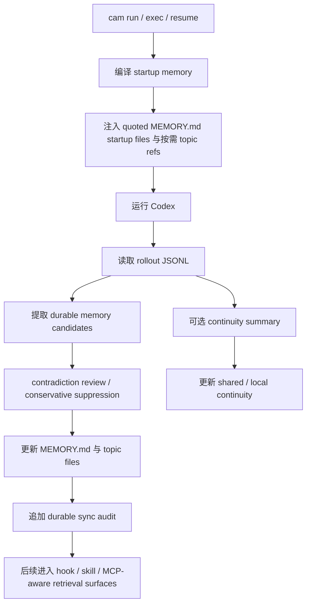

<div align="center">
  <h1>Codex Auto Memory</h1>
  <p><strong>面向 Codex 的 Markdown-first 本地记忆运行层，正在从 companion CLI 演进为 Codex-first Hybrid memory system</strong></p>
  <p>
    <a href="./README.md">简体中文</a> |
    <a href="./README.zh-TW.md">繁體中文</a> |
    <a href="./README.en.md">English</a>
    <a href="./README.ja.md">日本語</a>
  </p>
  <p>
    <a href="https://github.com/Boulea7/Codex-Auto-Memory/actions/workflows/ci.yml">
      
    </a>
    <a href="./LICENSE">
      
    </a>
    
    
    <a href="https://github.com/Boulea7/Codex-Auto-Memory/stargazers">
      
    </a>
    <a href="https://github.com/Boulea7/Codex-Auto-Memory/issues">
      
    </a>
  </p>
</div>

> `codex-auto-memory` 不是通用笔记软件，也不是云端记忆服务。  
> 它的目标是：在今天的 Codex CLI 上，以本地 Markdown 为主存储表面，先用 companion-first 的方式提供可靠记忆能力，再逐步补齐 hooks、skills、MCP 等更自动化的 integration surfaces。

---

**三个要点，快速定位：**

1. **它做什么** — 为 Codex 提供 durable memory、session continuity、startup recall，以及面向 hooks / skills / MCP 的演进式记忆基础设施。
2. **它怎么存** — memory 的 canonical source of truth 仍然是本地 Markdown，而不是数据库或云端缓存。
3. **它现在处于什么阶段** — 当前最稳的主入口仍是 `cam run` / wrapper；同时产品方向已经正式转向 `Codex-first Hybrid`，不再把 hook / skill / MCP 仅视为 future bridge。

---

## 目录

- [为什么这个项目存在](#为什么这个项目存在)
- [当前定位](#当前定位)
- [当前主任务](#当前主任务)
- [核心能力](#核心能力)
- [集成方向](#集成方向)
- [快速开始](#快速开始)
- [常用命令](#常用命令)
- [工作方式](#工作方式)
- [存储布局](#存储布局)
- [文档导航](#文档导航)
- [当前状态](#当前状态)
- [路线图](#路线图)
- [贡献与许可](#贡献与许可)

## 为什么这个项目存在

Claude Code 已经公开了一套相对清晰的 auto memory 产品契约：

- AI 会自动写 memory
- memory 以本地 Markdown 保存
- `MEMORY.md` 是启动入口
- 启动时只读取前 200 行
- 细节写入 topic files，按需读取
- 同一仓库的不同 worktree 共享 project memory
- `/memory` 用来审查和编辑 memory

而今天的 Codex CLI 已经具备很多可利用的基础能力，但仍没有公开同等完整、稳定、可验证的 memory 产品面：

- `AGENTS.md`
- multi-agent workflows
- 本地 persistent sessions / rollout logs
- 本地 `cam doctor` / feature output 里可见的 `memories`、`codex_hooks` signal
- MCP、skills、rules 等可扩展能力

`codex-auto-memory` 的价值，不再只是“做一个 CLI companion”，而是先以当前最稳的 `companion-first` 路线提供可靠的 Codex 记忆体验，再把它演进成一个 **Codex-first Hybrid memory system**：既服务于喜欢显式 `cam` 命令的用户，也服务于希望通过 hooks、skills、MCP 等方式让代理自动使用记忆能力的用户。

## 当前定位

当前仓库的公开定位应理解为：

- **Codex-first**：当前主宿主仍是 Codex，而不是多宿主统一平台
- **Markdown-first**：`MEMORY.md` 与 topic files 仍是产品表面与主真相
- **Hybrid**：主入口仍是 wrapper + CLI，但 hooks / skills / MCP-aware integration 已经进入正式演进方向
- **companion-first implementation, integration-aware roadmap**：现阶段最稳实现依旧是 companion runtime，但产品不再把 hooks / skills / MCP 只写成远期灵感

这意味着：

- 当前仓库不会直接重写成 `claude-mem` 式 DB-first / worker-first 系统
- 当前仓库会继续优先把 Codex 场景跑通
- 后续实现可以同时覆盖 `cam` 命令用户与“希望让代理自己使用记忆”的用户

## 当前主任务

接下来这个仓库的主任务，按 issue 的要求正式收敛为 4 件事：

1. **自动从对话或任务过程中提取可复用的长期记忆**
2. **在后续会话中自动召回这些记忆**
3. **支持记忆更新、去重、覆盖或归档**
4. **尽量减少手动维护 memory 文件的成本**

这 4 件事是当前仓库的产品优先级，不再只是零散增强项。

## 核心能力

| 能力 | 当前状态 | 说明 |
| :-- | :-- | :-- |
| 自动 durable memory sync | 已有主路径 | 会话结束后从 Codex rollout JSONL 中提取稳定、未来有用的信息并写回 Markdown memory |
| Markdown-first canonical store | 已有主路径 | `MEMORY.md` 与 topic files 就是产品表面，而不是内部缓存 |
| 紧凑 startup recall | 已有主路径 | 启动时注入真正进入 payload 的 quoted `MEMORY.md` startup files，并附带按需 topic refs |
| worktree-aware project identity | 已有主路径 | 同一 git 仓库的 worktree 共享 project memory，project-local 仍保持隔离 |
| session continuity | 已有主路径 | 临时 working state 与 durable memory 分层存储、分层加载 |
| conflict review / conservative suppression | 已有主路径 | 冲突 candidate 不静默 merge，而是显式 suppress 并暴露 reviewer 信息 |
| explicit correction | 已有主路径 | 支持 `cam remember` / `cam forget` 与显式更正带来的 replace/delete 语义 |
| archive lifecycle | 已有首批实现 | 支持 `cam forget --archive` 将长期但不再活跃的信息转入可检索归档层，而不是只能 delete |
| search / timeline / detail retrieval | 已有首批实现 | 提供 `cam recall search` / `timeline` / `details`，以 progressive disclosure 方式检索记忆 |
| formal retrieval MCP surface | 本轮新增 | 提供 `cam mcp serve`，通过 `search_memories` / `timeline_memories` / `get_memory_details` 暴露只读 retrieval plane |
| project-scoped MCP install surface | 本轮新增 | 提供 `cam mcp install --host <codex|claude|gemini>`，显式写入推荐的 project-scoped 宿主配置，降低 MCP 接线摩擦 |
| noop-aware lifecycle audit | 已有首批实现 | 相同 active memory 的重复写入、以及缺失 active 目标的 delete/archive，会显式记为 `noop` reviewer 结果，而不再静默重写 Markdown |
| hook / skill / MCP-aware integration | 已进入代码主线 | `cam hooks install` 现在会生成 recall bridge bundle（`memory-recall.sh`、`post-work-memory-review.sh`、兼容 wrapper 与 `recall-bridge.md`），供后续 hook / skill / MCP bridge 复用 |
| Codex skill install surface | 已有首批实现 | `cam skills install` 默认安装 runtime 目标，并支持显式 `--surface runtime|official-user|official-project`；无论装到哪个 surface，都沿用同一套 MCP-first、CLI-fallback 的 `search -> timeline -> details` durable memory 工作流 |

## 集成方向

这个仓库接下来的方向不是“改造成万能平台”，而是：

- 在 **当前仓库内部**，补齐面向 Codex 的 `hook bridge`、`skills`、`MCP-friendly retrieval` 能力
- 继续保持 `cam run` / `cam sync` / `cam memory` / `cam session` 这条最稳的主路径
- 让不喜欢显式 CLI 的用户，也能通过更自动化的 integration surfaces 获得同样的 durable memory 能力

当前方向的边界：

- 当前仓库仍以 **Codex** 为主宿主
- 仍坚持 **Markdown-first**
- 检索索引、SQLite、向量库、图谱等如果以后引入，也应是 **sidecar index**，不能取代 Markdown canonical store
- 多宿主统一平台会在后续独立仓库中探索，而不是强行塞进当前主仓

详细方向见：

- [Integration Strategy](./docs/integration-strategy.md)
- [Host Surfaces](./docs/host-surfaces.md)

## 快速开始

### 1. 克隆并安装

```bash
git clone https://github.com/Boulea7/Codex-Auto-Memory.git
cd Codex-Auto-Memory
pnpm install
```

### 2. 构建并链接全局命令

```bash
pnpm build
pnpm link --global
```

> 链接之后，`cam` 命令就可以在任意目录使用了。

### 3. 在你的项目里初始化

```bash
cd /你的项目目录
cam init
```

这会在项目根目录生成 `codex-auto-memory.json`（跟踪到 Git），并在本地创建 `.codex-auto-memory.local.json`（默认 gitignored）。

### 4. 通过 wrapper 启动 Codex

```bash
cam run
```

当前最稳的自动记忆主路径仍然是 wrapper：会话结束后，`cam` 会自动从 Codex rollout 日志里提取信息并写入 memory 文件。

### 5. 查看状态与审计面

```bash
cam memory
cam memory --recent 5
cam recall search pnpm --state auto
cam mcp serve
cam integrations install --host codex
cam integrations apply --host codex
cam integrations doctor --host codex
cam mcp install --host codex
cam mcp print-config --host codex
cam mcp apply-guidance --host codex
cam mcp doctor
cam session status
cam session refresh
cam remember "Always use pnpm instead of npm"
cam forget "old debug note"
cam forget "old debug note" --archive
cam audit
```

## 常用命令

| 命令 | 作用 |
| :-- | :-- |
| `cam run` / `cam exec` / `cam resume` | 编译 startup memory 并通过 wrapper 启动 Codex |
| `cam sync` | 手动把最近 rollout 同步进 durable memory |
| `cam memory` | 查看 startup payload、topic refs、edit paths、durable sync audit 与 suppressed conflict candidates |
| `cam remember` / `cam forget` | 显式新增、删除或修正 memory；`cam forget --archive` 会把匹配条目移入归档层 |
| `cam recall search` / `timeline` / `details` | 以 `search -> timeline -> details` 的 progressive disclosure 检索 durable memory；`search` 默认采用 `state=auto`、`limit=8`，先查 active，未命中再回退 archived，且保持只读 retrieval |
| `cam mcp serve` | 启动只读 retrieval MCP server，通过 `search_memories` / `timeline_memories` / `get_memory_details` 暴露同一套渐进式检索契约 |
| `cam integrations install --host codex` | 一次性安装推荐的 Codex integration stack：写入 project-scoped MCP wiring，并刷新 hook bridge bundle 与 Codex skill 资产；默认使用 runtime skills target，也支持显式 `--skill-surface runtime|official-user|official-project`；保持显式、幂等、Codex-only，且不触碰 Markdown memory store |
| `cam integrations apply --host codex` | 以显式、幂等、Codex-only 的方式应用完整 integration state：在保留 `integrations install` 旧语义不变的前提下，额外编排 `cam mcp apply-guidance --host codex`；默认使用 runtime skills target，也支持显式 `--skill-surface runtime|official-user|official-project`；若 `AGENTS.md` managed block 不安全，会在任何 stack 写入之前 preflight `blocked`，保持 additive / fail-closed |
| `cam integrations doctor --host codex` | 以 Codex-only、只读、薄聚合的方式汇总当前 integration stack readiness，直接给出推荐路由、推荐 preset、结构化 `workflowContract`、`applyReadiness`、子检查结果与下一步最小动作；当 AGENTS guidance 处于 unsafe managed-block 状态时，会先提示修复 `AGENTS.md`，而不是直接推荐 `cam integrations apply --host codex` |
| `cam mcp install --host <codex|claude|gemini>` | 显式写入推荐的 project-scoped 宿主 MCP 配置；只更新 `codex_auto_memory` 这一项，不会自动安装 hooks/skills；若该 entry 已带有非 canonical 自定义字段，会在安全前提下保留它们；`generic` 继续保持 manual-only |
| `cam mcp print-config --host <codex|claude|gemini|generic>` | 打印 ready-to-paste 的宿主接入片段，降低把 read-only retrieval plane 接进现有工作流的摩擦；其中 `--host codex` 还会额外打印推荐的 `AGENTS.md` snippet，并在 JSON payload 中附带共享 `workflowContract`，帮助未来 Codex 代理优先走 MCP、必要时再 fallback 到 `cam recall` |
| `cam mcp apply-guidance --host codex` | 以 additive、可审计、fail-closed 的方式创建或更新仓库根 `AGENTS.md` 中由 Codex Auto Memory 自己管理的 guidance block；只会 append 新 block 或替换同一 marker block，无法安全定位时返回 `blocked` 而不会冒险改写 |
| `cam mcp doctor` | 只读检查当前项目的 retrieval MCP 接入状态、project pinning 与 hook/skill fallback 资产；同时追加 `codexStack` readiness 视图与结构化 `workflowContract`，用于汇总推荐路由、executable bit、共享资产版本与 workflow consistency；若检测到 alternate global wiring，也会与推荐的 project-scoped 路径明确区分，不会改写任何宿主配置 |
| `cam session save` | merge / incremental save；从 rollout 增量写入 continuity |
| `cam session refresh` | replace / clean regeneration；从选定 provenance 重建 continuity |
| `cam session load` / `status` | 查看 continuity reviewer surface 与 diagnostics |
| `cam hooks install` | 生成本仓自带的 local bridge / fallback helper bundle，包括 `memory-recall.sh`、`post-work-memory-review.sh`、兼容 helper wrappers 与 `recall-bridge.md`；其中 `post-work-memory-review.sh` 会把 `cam sync` 与 `cam memory --recent` 串成同一套收尾 review 动作；它不是官方 Codex hook surface，且该 bundle 的推荐检索 preset 为 `state=auto`、`limit=8` |
| `cam skills install` | 默认安装 runtime Codex skill 资产，并支持显式 `--surface runtime|official-user|official-project`；让代理优先通过 retrieval MCP，未接线时再 fallback 到 `cam recall`，并沿用同一套推荐检索 preset：`state=auto`、`limit=8` |
| `cam audit` | 仓库级 privacy / secret hygiene 审查 |
| `cam doctor` | 检查当前 companion wiring、Codex feature posture 与 future integration readiness |

## 工作方式

### 设计原则

- `local-first and auditable`
- `Markdown files are the product surface`
- `companion-first implementation, hybrid product direction`
- `Codex-first, but formally integration-aware`
- `session continuity` 与 `durable memory` 明确分离

### 运行流



### 为什么不是直接上 native memory

- 官方公开文档尚未给出完整、稳定、等价于 Claude Code 的 native memory 契约
- 本地 `cam doctor --json` 仍把 `memories` / `codex_hooks` 视为 readiness signal，而不是 trusted primary path
- 因此当前实现仍然保持 `companion-first`
- 但产品方向已经明确：当 hooks、skills、MCP 与 retrieval surfaces 能以不破坏 Markdown-first 契约的方式进入主线时，会正式纳入，而不是永远停留在 bridge status

## 存储布局

Durable memory：

```text
~/.codex-auto-memory/
├── global/
│   └── MEMORY.md
└── projects/<project-id>/
    ├── project/
    │   ├── MEMORY.md
    │   └── commands.md
    └── locals/<worktree-id>/
        ├── MEMORY.md
        └── workflow.md
```

Session continuity：

```text
~/.codex-auto-memory/projects/<project-id>/continuity/project/active.md
<project-root>/.codex-auto-memory/sessions/active.md
```

未来若引入检索索引：

- Markdown 仍是 canonical store
- `cam recall` 与 `cam mcp serve` 都只提供 read-only retrieval plane，不承担 canonical truth
- `cam mcp serve` 只提供 read-only retrieval plane，不承担 canonical truth
- SQLite / FTS / vector / graph 只能作为 sidecar index
- 归档层应保持可审计、可 diff、可回放 provenance

## 文档导航

### 入口

- [文档首页（中文）](docs/README.md)
- [Documentation Hub (English)](docs/README.en.md)

### 核心设计文档

- [Claude Code 参考契约（中文）](docs/claude-reference.md) | [English](docs/claude-reference.en.md)
- [架构设计（中文）](docs/architecture.md) | [English](docs/architecture.en.md)
- [集成演进策略（中文）](docs/integration-strategy.md)
- [宿主能力面（中文）](docs/host-surfaces.md)
- [Native migration 策略（中文）](docs/native-migration.md) | [English](docs/native-migration.en.md)

### 维护与审查文档

- [Session continuity 设计](docs/session-continuity.md)
- [Release checklist](docs/release-checklist.md)
- [Contributing](CONTRIBUTING.md)

## 当前状态

当前公开可依赖的项目状态：

- durable memory companion path：可用
- topic-aware startup lookup：可用
- session continuity companion layer：可用
- reviewer audit surfaces：可用
- hooks / skills / MCP-aware integration：已进入正式方向，但当前仍以 bridge 与后续实现为主
- native memory / native hooks primary path：未启用，仍非 trusted implementation path

## 路线图

### v0.1

- companion CLI
- Markdown memory store
- 200-line startup compiler
- worktree-aware project identity
- 初始 reviewer / maintainer 文档体系

### v0.2

- 把 issue 提到的 4 个能力收敛为正式主任务
- 更稳的 contradiction handling
- 更清晰的 `cam memory` / `cam session` 审查 UX
- 落下 archive lifecycle 的第一批实现：`cam forget --archive`
- 引入 integration strategy 与 host surfaces 文档
- 继续收紧 release-facing 验证与 reviewer contract

### v0.3

- 在当前仓库内继续补 skill / hook bridge / MCP-friendly retrieval surfaces
- 在 `cam recall search / timeline / details` 基础上继续扩 retrieval contract
- 降低手动维护 Markdown memory 的成本，但保持 Markdown-first 契约
- 不把数据库升级为 source of truth

### v0.4+

- 继续跟踪官方 Codex memory / hooks surfaces，不预设主路径变更
- 视实现情况补可选 GUI / TUI browser
- 与独立的新仓 memory runtime 在 core contract 层做设计对齐

## 贡献与许可

- 贡献指南：[CONTRIBUTING.md](./CONTRIBUTING.md)
- License：[Apache-2.0](./LICENSE)

如果你在 README、官方文档和本地运行时观察之间发现冲突，请优先相信：

1. 官方产品文档
2. 可复现的本地行为
3. 对不确定性的明确说明

而不是更自信但证据不足的表述。
