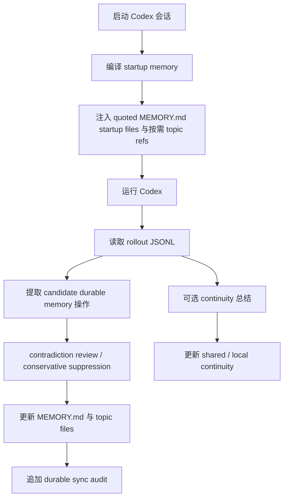

<div align="center">
  <h1>Codex Auto Memory</h1>
  <p><strong>为 Codex 复现 Claude-style auto memory 工作流的 local-first companion CLI</strong></p>
  <p>
    <a href="./README.md">简体中文</a> |
    <a href="./README.en.md">English</a>
  </p>
  <p>
    <a href="https://github.com/Boulea7/Codex-Auto-Memory/actions/workflows/ci.yml">
      
    </a>
    <a href="./LICENSE">
      
    </a>
    
    
    <a href="https://github.com/Boulea7/Codex-Auto-Memory/stargazers">
      
    </a>
    <a href="https://github.com/Boulea7/Codex-Auto-Memory/issues">
      
    </a>
  </p>
</div>

> `codex-auto-memory` 不是通用笔记软件，也不是云端记忆服务。
> 它的目标是：在今天的 Codex CLI 上，用本地 Markdown、紧凑 startup injection、按需 topic file 读取与 companion runtime，尽可能复现 Claude Code auto memory 的可观察产品契约。

---

**三个要点，快速定位：**

1. **它做什么** — 每次 Codex 会话结束后，自动把有用的信息提取出来，写进本地 Markdown 文件，下次启动时注入给 Codex，让它"记得"你的项目。
2. **它怎么存** — 全部是本地 Markdown 文件，放在 `~/.codex-auto-memory/`，你随时可以查看、编辑、纳入 Git 审查。
3. **它和 Claude 的关系** — 这是一个 companion CLI，目标是在 Codex 上复现 Claude Code auto memory 的工作方式。不是 Claude 官方产品，不涉及云端。

---

## 目录

- [为什么这个项目存在](#为什么这个项目存在)
- [这个项目适合谁](#这个项目适合谁)
- [核心能力](#核心能力)
- [能力对照](#能力对照)
- [快速开始](#快速开始)
- [常用命令](#常用命令)
- [工作方式](#工作方式)
- [存储布局](#存储布局)
- [文档导航](#文档导航)
- [当前状态](#当前状态)
- [路线图](#路线图)
- [贡献与许可](#贡献与许可)

## 为什么这个项目存在

Claude Code 已经公开了一套相对清晰的 auto memory 产品契约：

- AI 会自动写 memory
- memory 以本地 Markdown 保存
- `MEMORY.md` 是启动入口
- 启动时只读取前 200 行
- 细节写入 topic files，按需读取
- 同一仓库的不同 worktree 共享 project memory
- `/memory` 用来审查和编辑 memory

而今天的 Codex CLI 已经有不少有价值的基础能力，但还没有公开同等完整的 memory product surface：

- `AGENTS.md`
- multi-agent workflows
- 本地 persistent sessions / rollout logs
- 本地 `cam doctor` / feature output 里可见的 `memories`、`codex_hooks` signal

`codex-auto-memory` 的价值，就是在官方 native memory 还没有稳定公开之前，先提供一条干净、可审计的 companion-first 路线，并只保留一条窄 compatibility seam。当前 UX 规划重点是继续收紧 `cam memory` / `cam session` 的 reviewer 体验。

## 这个项目适合谁

适合：

- 想在 Codex 中获得更接近 Claude-style auto memory 工作流的用户
- 希望 memory 完全本地、完全可编辑、可以直接放进 Git 审查语境里的团队
- 需要在多个 worktree 之间共享 project memory，同时保留 worktree-local continuity 的工程流
- 希望未来即使官方 surface 变化，也不需要重建用户心智模型的维护者

不适合：

- 想把它当通用知识库、笔记软件或云端同步服务的人
- 期待现阶段直接替代 Claude `/memory` 全部交互能力的人
- 需要账号级个性化记忆或跨设备云端记忆的人

## 核心能力

| 能力 | 说明 |
| :-- | :-- |
| 自动 memory 同步 | 会话结束后从 Codex rollout JSONL 中提取稳定、未来有用的信息并写回 Markdown memory |
| Markdown-first | `MEMORY.md` 与 topic files 就是产品表面，而不是内部缓存 |
| 紧凑启动注入 | 启动时只注入真正进入 payload 的 quoted `MEMORY.md` startup files，并附带按需 topic refs，不做 eager topic loading |
| worktree-aware | project memory 在同一 git 仓库的 worktree 间共享，project-local 仍保持隔离 |
| session continuity | 临时 working state 与 durable memory 分层存储、分层加载 |
| reviewer surface | `cam memory` / `cam session` / `cam audit` 为维护者和 reviewer 提供可核查的审查入口 |

## 能力对照

| 能力 | Claude Code | Codex today | Codex Auto Memory |
| :-- | :-- | :-- | :-- |
| 自动写 memory | Built in | 没有完整公开契约 | 通过 companion sync flow 提供 |
| 本地 Markdown memory | Built in | 没有完整公开契约 | 支持 |
| `MEMORY.md` 启动入口 | Built in | 没有 | 支持 |
| 200 行启动预算 | Built in | 没有 | 支持 |
| topic files 按需读取 | Built in | 没有 | 部分支持，启动时暴露 topic refs，供后续按需读取 |
| 跨会话 continuity | 社区方案较多 | 没有完整公开契约 | 作为独立 companion layer 支持 |
| worktree 共享 project memory | Built in | 没有公开契约 | 支持 |
| inspect / audit memory | `/memory` | 无等价命令 | `cam memory` |
| native hooks / memory | Built in | Experimental / under development | 当前只保留 compatibility seam |

`cam memory` 当前是 inspection / audit surface：它会暴露真正进入 startup payload 的 quoted startup files（当前是各 scope 的 `MEMORY.md` / index 内容）、startup budget、按需 topic refs、edit paths，以及 `--recent [count]` 下的 recent durable sync audit。这里的 topic refs 只是按需定位信息，不表示 topic body 已在启动阶段 eager 读取。
recent durable sync audit 现在也会显式暴露被保守 suppress 的 conflict candidates，避免在同一 rollout 或与现有 durable memory 冲突时发生静默 merge。
这些 recent sync events 来自 `~/.codex-auto-memory/projects/<project-id>/audit/sync-log.jsonl`，只覆盖 sync flow 的 `applied` / `no-op` / `skipped` 事件，不包含 manual `cam remember` / `cam forget`。
如果主 memory 文件已经写入，但 reviewer sidecar（audit / processed-state）没有完整落盘，`cam memory` 会尽力暴露一个 pending sync recovery marker，帮助 reviewer 识别 partial-success 状态；该 marker 只会在同一 rollout/session 后续成功补齐时清理，不会被不相关的成功 sync 顺手抹掉。
显式更新仍通过 `cam remember`、`cam forget` 或直接编辑 Markdown 文件完成，而不是提供 `/memory` 风格的命令内编辑器。

## 快速开始

### 1. 克隆并安装

```bash
git clone https://github.com/Boulea7/Codex-Auto-Memory.git
cd Codex-Auto-Memory
pnpm install
```

### 2. 构建并链接全局命令

```bash
pnpm build
pnpm link --global
```

> 链接之后，`cam` 命令就可以在任意目录使用了。

### 3. 在你的项目里初始化

```bash
cd /你的项目目录
cam init
```

这会在项目根目录生成 `codex-auto-memory.json`（跟踪到 Git），并在本地创建 `.codex-auto-memory.local.json`（默认 gitignored）。

### 4. 通过 wrapper 启动 Codex（自动记忆开始工作）

```bash
cam run
```

每次会话结束，`cam` 会自动从 Codex 的 rollout 日志里提取信息并写入 memory 文件。

### 5. 查看 memory 状态

```bash
cam memory          # 查看当前 memory 文件和 startup budget
cam session status  # 查看 session continuity 状态
cam session refresh # 从选定 provenance 重新生成并覆盖 continuity
cam remember "Always use pnpm instead of npm"   # 手动记录偏好
cam forget "old debug note"                     # 删除过时记录
cam audit           # 检查仓库有没有意外的敏感内容
```

## 常用命令

| 命令 | 作用 |
| :-- | :-- |
| `cam run` / `cam exec` / `cam resume` | 编译 startup memory 并通过 wrapper 启动 Codex |
| `cam sync` | 手动把最近 rollout 同步进 durable memory |
| `cam memory` | 查看真正进入 startup payload 的 quoted startup files、按需 topic refs、startup budget、edit paths，以及 `--recent [count]` 下的 durable sync audit 与 suppressed conflict candidates |
| `cam remember` / `cam forget` | 显式新增或删除 memory |
| `cam session save` | merge / incremental save；从 rollout 增量写入 continuity，不主动清掉已有污染状态 |
| `cam session refresh` | replace / clean regeneration；从选定 provenance 重新生成 continuity 并覆盖所选 scope |
| `cam session load` / `status` | continuity reviewer surface；显示 latest continuity diagnostics（含 `confidence` / warnings）、latest audit drill-down、compact prior preview，以及 pending continuity recovery marker |
| `cam session clear` / `open` | 清理当前 active continuity，或打开 local continuity 目录 |
| `cam audit` | 做仓库级隐私 / secret hygiene 审查 |
| `cam doctor` | 检查当前 companion wiring 与 native readiness posture |

## 审计面地图

- `cam audit`: 仓库级的 privacy / secret hygiene 审计。
- `cam memory --recent [count]`: durable sync audit，查看 recent `applied` / `no-op` / `skipped` sync 事件，不混入 manual `remember` / `forget`；当本轮提取结果因冲突而被保守 suppress 时，也会在 reviewer surface 中显式暴露。
- `cam session save`: continuity audit surface 的 merge 路径，记录最新 continuity diagnostics、latest rollout 与 latest audit drill-down；它是 incremental save，不会立刻把已有污染状态“洗干净”。
- `cam session refresh`: continuity audit surface 的 replace 路径，从选定 provenance 重新生成 continuity，并覆盖所选 scope；`--json` 会额外暴露 `action`、`writeMode` 与 `rolloutSelection`。
- `cam session load|status`: reviewer surface，继续展示 latest continuity diagnostics、latest rollout、latest audit drill-down，以及 compact prior audit preview（来自 continuity audit log，排除 latest，并收敛连续重复项，不是完整 prior history 回放）；最新 diagnostics 现在也会显式带出 `confidence` 与 warnings，帮助 reviewer 区分稳定事实、临时状态与需二次核实的冲突/噪音。
- continuity reviewer warnings 仍属于 audit / reviewer surface，而不是 continuity body；当前实现会对明显的 reviewer warning prose 做最小 deterministic scrub，避免它们被模型原样写回 continuity Markdown。
- `pending continuity recovery marker`: continuity Markdown 已写入但 audit sidecar 失败时的可见警告；它不等于 `cam session refresh` 会自动修复一切，只会在逻辑身份匹配的后续成功写入后被清理。

## 工作方式

### 设计原则

- `local-first and auditable`
- `Markdown files are the product surface`
- `companion-first, with a narrow compatibility seam`
- `session continuity` 与 `durable memory` 明确分离

### 运行流



### 为什么不是直接上 native memory

- 官方公开文档尚未给出完整、稳定、等价于 Claude Code 的 native memory 契约；本地 `cam doctor --json` 也仍把 `memories` / `codex_hooks` 视为未进入 trusted primary path 的 signal
- 本地观察与 source inspection 可以作为重评 compatibility seam 的线索，但不能直接升级成稳定产品契约
- 因此项目默认仍然坚持 companion-first，直到官方文档、运行时稳定性和 CI 可验证性都足够强

## 存储布局

Durable memory：

```text
~/.codex-auto-memory/
├── global/
│   └── MEMORY.md
└── projects/<project-id>/
    ├── project/
    │   ├── MEMORY.md
    │   └── commands.md
    └── locals/<worktree-id>/
        ├── MEMORY.md
        └── workflow.md
```

Session continuity：

```text
~/.codex-auto-memory/projects/<project-id>/continuity/project/active.md
<project-root>/.codex-auto-memory/sessions/active.md
```

更完整的结构与边界说明，请看架构文档。

## 文档导航

### 入口

- [文档首页（中文）](docs/README.md)
- [Documentation Hub (English)](docs/README.en.md)

### 核心设计文档

- [Claude Code 参考契约（中文）](docs/claude-reference.md) | [English](docs/claude-reference.en.md)
- [架构设计（中文）](docs/architecture.md) | [English](docs/architecture.en.md)
- [Native migration 策略（中文）](docs/native-migration.md) | [English](docs/native-migration.en.md)

### 维护与审查文档

- [Session continuity 设计](docs/session-continuity.md)
- [Release checklist](docs/release-checklist.md)
- [Contributing](CONTRIBUTING.md)

## 当前状态

当前公开可依赖的项目状态：

- durable memory companion path：可用
- topic-aware startup lookup：可用
- session continuity companion layer：可用
- reviewer audit surfaces：可用
- tagged GitHub Releases：可用，提供 tarball artifact；npm publish 仍保持手动流程
- native memory / native hooks primary path：未启用，仍非 trusted implementation path

## 路线图

### v0.1

- companion CLI
- Markdown memory store
- 200-line startup compiler
- worktree-aware project identity
- 初始 reviewer / maintainer 文档体系

### v0.2

- 更稳的 contradiction handling
- 更清晰的 `cam memory` / `cam session` 审查 UX
- continuity diagnostics 与 reviewer packet 继续收紧信息层次，并显式暴露 confidence / warnings
- 继续保留对未来 hook surface 的 compatibility seam

### v0.3+

- 继续跟踪官方 Codex memory / hooks surfaces，不预设主路径变更
- 可选 GUI / TUI browser
- 更强的跨会话 diagnostics 与 confidence surfaces

## 贡献与许可

- 贡献指南：[CONTRIBUTING.md](./CONTRIBUTING.md)
- License：[Apache-2.0](./LICENSE)

如果你在 README、官方文档和本地运行时观察之间发现冲突，请优先相信：

1. 官方产品文档
2. 可复现的本地行为
3. 对不确定性的明确说明

而不是更自信但证据不足的表述。
