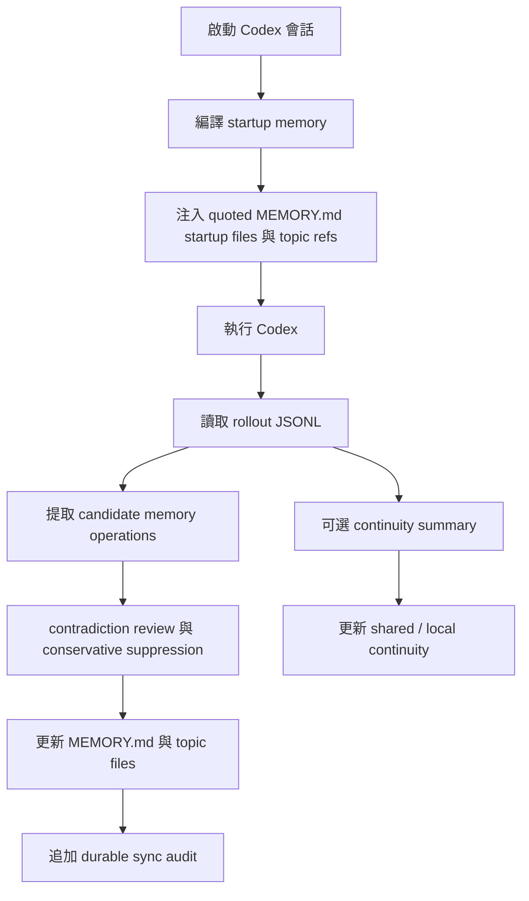

<div align="center">
  <h1>Codex Auto Memory</h1>
  <p><strong>一個以 Markdown 為核心、面向 Codex 的本地記憶運行層，正從 companion CLI 演進為 hook / skill / MCP-aware 的混合工作流</strong></p>
  <p>
    <a href="./README.md">简体中文</a> |
    <a href="./README.zh-TW.md">繁體中文</a> |
    <a href="./README.en.md">English</a> |
    <a href="./README.ja.md">日本語</a>
  </p>
  <p>
    <a href="https://github.com/Boulea7/Codex-Auto-Memory/actions/workflows/ci.yml">
      
    </a>
    <a href="./LICENSE">
      
    </a>
    
    
    <a href="https://github.com/Boulea7/Codex-Auto-Memory/stargazers">
      
    </a>
    <a href="https://github.com/Boulea7/Codex-Auto-Memory/issues">
      
    </a>
  </p>
</div>

> `codex-auto-memory` 不是通用筆記軟體，也不是雲端記憶服務。<br />
> 它是一個以 Markdown 為主表面、以本地為前提的 Codex 記憶運行層。當前最成熟的入口仍是 Codex wrapper / CLI，但專案方向已明確擴展到 hook、skill、MCP 等整合能力，同時維持可審計、可編輯的 Markdown 記憶契約。

---

**先看三個重點：**

1. **它做什麼**：從 Codex 會話中提取未來仍然有用的知識，保存為本地 Markdown，並在後續會話中自動帶回。
2. **它怎麼存**：Durable memory 仍以 `MEMORY.md` + topic files 為核心，不以資料庫或隱藏快取作為主真相。
3. **它往哪裡走**：專案仍以 Codex 為主宿主，但不再只把自己定義成窄化的 companion seam，而是明確朝 hook / skill / MCP-aware 的混合工作流演進。

---

## 目錄

- [為什麼這個專案存在](#為什麼這個專案存在)
- [這個專案適合誰](#這個專案適合誰)
- [目前優先目標](#目前優先目標)
- [核心能力](#核心能力)
- [能力對照](#能力對照)
- [快速開始](#快速開始)
- [常用命令](#常用命令)
- [工作方式](#工作方式)
- [儲存布局](#儲存布局)
- [文件導航](#文件導航)
- [目前狀態](#目前狀態)
- [路線圖](#路線圖)
- [貢獻與授權](#貢獻與授權)

## 為什麼這個專案存在

Claude Code 已經公開了一套相對清晰的 auto memory 產品契約：

- AI 會自動寫 memory
- memory 以本地 Markdown 保存
- `MEMORY.md` 是啟動入口
- 啟動時只讀前 200 行
- 細節寫入 topic files，按需讀取
- 同一個倉庫的不同 worktree 共享 project memory
- `/memory` 可用來審查與編輯 memory

Codex 已經具備不少有價值的基礎能力，但仍未公開等價且完整的 memory product surface：

- `AGENTS.md`
- multi-agent workflows
- 本地 sessions 與 rollout logs
- MCP、skills、subagents 等逐步成形的能力面
- 本地 `cam doctor` / feature output 中可見的 `memories`、`codex_hooks` signal

`codex-auto-memory` 的價值，是以 Codex-first 的方式把這條缺口補起來：既保持本地、可審計、可編輯的 Markdown 記憶契約，也逐步把低摩擦的 hook / skill / MCP 整合能力納入正式方向，而不是只把它們當作遙遠的 future bridge。

## 這個專案適合誰

適合：

- 想在 Codex 中獲得更接近 Claude-style auto memory 工作流的使用者
- 希望 memory 完全本地、完全可編輯、可以直接放進 Git 審查語境的團隊
- 希望現在能用 CLI/workflow，未來又能接更自動化整合入口的使用者
- 不希望未來因官方 surface 變化就被迫重建心智模型的維護者

不適合：

- 想把它當作通用知識庫、筆記軟體或雲端同步服務的人
- 需要帳號級個人化雲端記憶的人
- 期待今天就完整複製 Claude `/memory` 深度互動的人

## 目前優先目標

目前最重要的公開產品目標，就是完整落地這四件事：

1. 自動從對話或任務過程中提取可重用的長期記憶。
2. 在後續會話中自動召回這些記憶。
3. 支援記憶更新、去重、覆蓋與歸檔友好的生命週期。
4. 盡量降低手動維護 memory 檔案的成本。

## 核心能力

| 能力 | 說明 |
| :-- | :-- |
| 自動 post-session sync | 從 Codex rollout JSONL 中提取穩定、未來有用的資訊並寫回 durable Markdown memory |
| 自動 startup recall | 編譯緊湊 startup memory，讓 durable knowledge 自動回到後續會話 |
| Markdown-first | `MEMORY.md` 與 topic files 仍是產品主表面，而不是次級導出物 |
| 記憶生命週期 | 支援更正、去重、覆蓋、刪除，以及 reviewer 可見的 conflict suppression |
| formal retrieval MCP surface | `cam mcp serve` 會以只讀 stdio MCP 形式暴露 `search_memories` / `timeline_memories` / `get_memory_details` |
| project-scoped MCP install surface | `cam mcp install --host <codex|claude|gemini>` 會顯式寫入推薦的 project-scoped 宿主配置，降低 MCP 接線摩擦 |
| worktree-aware | project memory 在同一個 git 倉庫的 worktree 間共享，project-local 仍保持隔離 |
| session continuity | 臨時 working state 與 durable memory 分層儲存、分層載入 |
| integration-aware evolution | 保留目前 wrapper 主路徑，同時正式朝 hook / skill / MCP 方向演進 |
| reviewer surface | `cam memory` / `cam session` / `cam audit` 提供可核查的審查入口 |

## 能力對照

| 能力 | Claude Code | Codex today | Codex Auto Memory |
| :-- | :-- | :-- | :-- |
| 自動寫 memory | Built in | 沒有完整公開契約 | 透過 rollout-driven sync 提供 |
| 本地 Markdown memory | Built in | 沒有完整公開契約 | 支援 |
| `MEMORY.md` 啟動入口 | Built in | 沒有 | 支援 |
| 200 行啟動預算 | Built in | 沒有 | 支援 |
| topic files 按需讀取 | Built in | 沒有 | 部分支援，啟動時暴露 topic refs，供後續按需讀取 |
| 跨會話 continuity | 社群方案較多 | 沒有完整公開契約 | 作為獨立 layer 支援 |
| worktree 共享 project memory | Built in | 沒有公開契約 | 支援 |
| inspect / audit memory | `/memory` | 無等價命令 | `cam memory` |
| hook / skill / MCP-aware 演進 | Built in 或宿主能力強 | 新興且不均衡 | 已成為公開方向 |

`cam memory` 仍然是刻意設計成 reviewer-oriented 的 surface。它會暴露真正進入 startup payload 的 quoted startup files、startup budget、按需 topic refs、edit paths，以及透過 `--recent [count]` 取得的 durable sync audit。

這些 audit 事件也會顯式暴露被保守 suppress 的 conflict candidates，避免矛盾的 rollout 輸出靜默合併進 durable memory。未來更低摩擦的 hook、skill、MCP 路徑，也必須保持同一份可審計的 Markdown memory 契約，而不是取代它。

## 快速開始

### 1. Clone 並安裝

```bash
git clone https://github.com/Boulea7/Codex-Auto-Memory.git
cd Codex-Auto-Memory
pnpm install
```

### 2. 建構並連結全域命令

```bash
pnpm build
pnpm link --global
```

> 連結之後，`cam` 命令就可以在任何目錄使用。

### 3. 在你的專案裡初始化

```bash
cd /你的專案目錄
cam init
```

這會在專案根目錄產生 `codex-auto-memory.json`（追蹤到 Git），並在本地建立 `.codex-auto-memory.local.json`（預設 gitignored）。

### 4. 透過 wrapper 啟動 Codex

```bash
cam run
```

這仍是目前最成熟的端到端入口。每次會話結束後，`cam` 會從 Codex rollout 日誌中提取資訊並寫入 memory 檔案。

### 5. 檢視或修正 memory

```bash
cam memory
cam recall search pnpm --state auto
cam mcp serve
cam integrations install --host codex
cam integrations apply --host codex
cam integrations doctor --host codex
cam mcp install --host codex
cam mcp print-config --host codex
cam mcp apply-guidance --host codex
cam mcp doctor
cam session status
cam session refresh
cam remember "Always use pnpm instead of npm"
cam forget "old debug note"
cam forget "old debug note" --archive
cam audit
```

## 常用命令

| 命令 | 作用 |
| :-- | :-- |
| `cam run` / `cam exec` / `cam resume` | 編譯 startup memory 並透過 wrapper 啟動 Codex |
| `cam sync` | 手動把最近 rollout 同步進 durable memory |
| `cam memory` | 檢視 startup files、topic refs、startup budget、edit paths，以及 recent sync audit 與 suppressed conflict candidates |
| `cam remember` / `cam forget` | 顯式新增或刪除 durable memory；`cam forget --archive` 會把匹配條目移入歸檔層 |
| `cam recall search` / `timeline` / `details` | 以 `search -> timeline -> details` 的 progressive disclosure 工作流檢索 durable memory；`search` 現在預設採用 `state=auto`、`limit=8`，會先查 active，未命中再回退 archived，且保持只讀 retrieval |
| `cam mcp serve` | 啟動只讀 retrieval MCP server，以 `search_memories` / `timeline_memories` / `get_memory_details` 暴露同一套漸進式檢索契約 |
| `cam integrations install --host codex` | 一次性安裝推薦的 Codex integration stack：寫入 project-scoped MCP wiring，並刷新 hook bridge bundle 與 Codex skill 資產；預設使用 runtime skills target，也支援顯式 `--skill-surface runtime|official-user|official-project`；保持顯式、幂等、Codex-only，且不碰 Markdown memory store |
| `cam integrations apply --host codex` | 以顯式、幂等、Codex-only 的方式套用完整 integration state：在保留 `integrations install` 舊語義不變的前提下，額外編排 `cam mcp apply-guidance --host codex`；預設使用 runtime skills target，也支援顯式 `--skill-surface runtime|official-user|official-project`；若 `AGENTS.md` 無法安全更新，會回傳 `blocked` 並維持 additive / fail-closed 邊界 |
| `cam integrations doctor --host codex` | 以 Codex-only、只讀、薄聚合的方式彙總目前 integration stack readiness，直接給出推薦路由、推薦 preset、子檢查結果與下一步最小動作；當缺多個子檢查時會優先推薦 `cam integrations apply --host codex`，若只缺 AGENTS guidance 則繼續精準指向 `cam mcp apply-guidance --host codex`，不會改寫宿主設定或 Markdown memory store |
| `cam mcp install --host <codex|claude|gemini>` | 顯式寫入推薦的 project-scoped 宿主 MCP 配置；只更新 `codex_auto_memory` 這一項，不會自動安裝 hooks/skills；`generic` 仍維持 manual-only |
| `cam mcp print-config --host <codex|claude|gemini|generic>` | 列印 ready-to-paste 的宿主接入片段，降低把 read-only retrieval plane 接進既有 MCP workflow 的手動成本；其中 `--host codex` 還會額外列印推薦的 `AGENTS.md` snippet，幫助未來 Codex 代理優先走 MCP、必要時再 fallback 到 `cam recall` |
| `cam mcp apply-guidance --host codex` | 以 additive、可審計、fail-closed 的方式建立或更新 repo 根 `AGENTS.md` 中由 Codex Auto Memory 自己管理的 guidance block；只會 append 新 block 或替換同一 marker block，若無法安全定位則回傳 `blocked` 而不會冒險改寫 |
| `cam mcp doctor` | 只讀檢查目前專案的 retrieval MCP 接線、project pinning 與 hook/skill fallback assets；現在也會追加 `codexStack` readiness 視圖，用來彙總推薦路由、executable bit、共享資產版本與 workflow consistency，不會改寫任何宿主設定 |
| `cam session save` | merge / incremental save；增量寫入 continuity |
| `cam session refresh` | replace / clean regeneration；重建 continuity |
| `cam session load` / `status` | continuity reviewer surface |
| `cam hooks` | 管理目前的 local bridge / fallback recall bundle，包括 `memory-recall.sh`、相容 helper wrappers 與 `recall-bridge.md`；它不是官方 Codex hook surface，且該 bundle 的推薦檢索 preset 為 `state=auto`、`limit=8` |
| `cam skills` | 以 `cam skills install` 安裝 Codex skill；預設 target 仍是 runtime，也支援顯式 `--surface runtime|official-user|official-project` 為官方 `.agents/skills` 路徑準備相容副本；所有 surface 都沿用同一套 MCP-first、CLI-fallback 漸進式 durable memory 檢索工作流與推薦 preset：`state=auto`、`limit=8` |
| `cam audit` | 做隱私與 secret-hygiene 檢查 |
| `cam doctor` | 檢視本地 wiring 與 native-readiness posture |

## 工作方式

### 設計原則

- `local-first and auditable`
- `Markdown files are the product surface`
- `Codex-first hybrid runtime`
- `durable memory` 與 `session continuity` 明確分層
- `wrapper-first today, integration-aware tomorrow`

### 執行流



### 為什麼現在還不是 native-first

- 公開的 Codex 文件仍未定義等價於 Claude Code 的完整 native memory 契約
- 本地 `cam doctor --json` 仍把 `memories` / `codex_hooks` 更像視為 readiness signal，而不是穩定主路徑
- 因此目前最可靠的仍是 wrapper-first 主線

但方向上的差異是：本倉庫不再把 hooks、skills、MCP 只寫成遙遠 future idea，而是把它們納入正式的整合演進方向，前提是它們仍遵守同一套 Markdown-first、可審計的記憶契約。

## 儲存布局

Durable memory:

```text
~/.codex-auto-memory/
├── global/
│   └── MEMORY.md
└── projects/<project-id>/
    ├── project/
    │   ├── MEMORY.md
    │   └── commands.md
    └── locals/<worktree-id>/
        ├── MEMORY.md
        └── workflow.md
```

Session continuity:

```text
~/.codex-auto-memory/projects/<project-id>/continuity/project/active.md
<project-root>/.codex-auto-memory/sessions/active.md
```

完整邊界說明請見 architecture doc。

## 文件導航

- [文档首页（中文）](docs/README.md)
- [Documentation Hub (English)](docs/README.en.md)
- [Claude reference contract (中文)](docs/claude-reference.md) | [English](docs/claude-reference.en.md)
- [Architecture (中文)](docs/architecture.md) | [English](docs/architecture.en.md)
- [集成演进策略（中文）](docs/integration-strategy.md)
- [宿主能力面（中文）](docs/host-surfaces.md)
- [Native migration strategy (中文)](docs/native-migration.md) | [English](docs/native-migration.en.md)
- [Session continuity design](docs/session-continuity.md)
- [Release checklist](docs/release-checklist.md)
- [Contributing](CONTRIBUTING.md)

## 目前狀態

- durable memory path: available
- startup recall path: available
- reviewer audit surfaces: available
- session continuity layer: available
- wrapper-driven Codex flow: available
- hook / skill / MCP-aware evolution: 已納入公開方向，但還不是目前最成熟的終端使用路徑
- native memory / native hooks primary path: 未啟用，仍非 trusted implementation path

## 路線圖

### v0.1

- companion CLI
- Markdown memory store
- 200-line startup compiler
- worktree-aware project identity
- 初始 maintainer / reviewer docs

### v0.2

- 完成 issue 中的核心能力：更好的自動提取、自動召回、更新/去重/覆蓋/歸檔生命週期、降低手動維護成本
- 更清晰的 `cam memory` / `cam session` reviewer UX
- 更強的 contradiction handling 與記憶生命週期文檔化
- 定義並公開 hook / skill / MCP-friendly integration surfaces，同時不放棄 Markdown-first 契約

### v0.3+

- 擴展 Codex-first hybrid 路線，補足更強的 retrieval、skill、hook integration
- 重新評估哪些整合能力適合留在本倉庫，哪些應抽入更通用的共享 runtime
- optional GUI / TUI browser
- 更強的 cross-session diagnostics 與 confidence surfaces

## 貢獻與授權

- Contribution guide: [CONTRIBUTING.md](./CONTRIBUTING.md)
- License: [Apache-2.0](./LICENSE)

如果 README、官方文檔與本地執行結果之間出現衝突，請優先相信：

1. 官方產品文檔
2. 可重現的本地行為
3. 對不確定性的明確說明

而不是根據不足的證據做過度自信的敘述。
