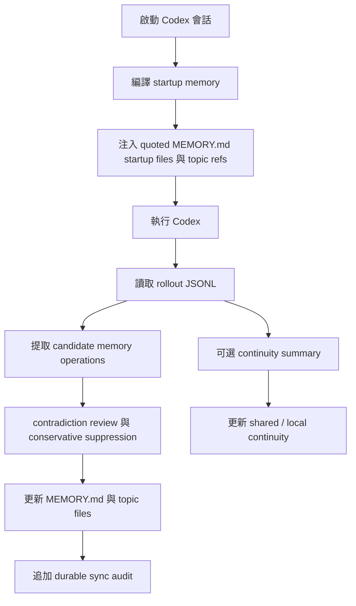

<div align="center">
  <h1>Codex Auto Memory</h1>
  <p><strong>一個面向 Codex 的 Markdown-first 本地記憶運行層，正從 companion CLI 演進為 Codex-first Hybrid memory system</strong></p>
  <p>
    <a href="./README.md">简体中文</a> |
    <a href="./README.zh-TW.md">繁體中文</a> |
    <a href="./README.en.md">English</a> |
    <a href="./README.ja.md">日本語</a>
  </p>
  <p>
    <a href="https://github.com/Boulea7/Codex-Auto-Memory/actions/workflows/ci.yml">
      
    </a>
    <a href="./LICENSE">
      
    </a>
    
    
    <a href="https://github.com/Boulea7/Codex-Auto-Memory/stargazers">
      
    </a>
    <a href="https://github.com/Boulea7/Codex-Auto-Memory/issues">
      
    </a>
  </p>
</div>

> `codex-auto-memory` 不是通用筆記軟體，也不是雲端記憶服務。<br />
> 它是一個以 Markdown 為主表面、以本地為前提的 Codex 記憶運行層。當前最成熟的入口仍是 Codex wrapper / CLI，但專案方向已明確擴展到 hook、skill、MCP 等整合能力，同時維持可審計、可編輯的 Markdown 記憶契約。

---

**先看三個重點：**

1. **它做什麼**：從 Codex 會話中提取未來仍然有用的知識，保存為本地 Markdown，並在後續會話中自動帶回。
2. **它怎麼存**：Durable memory 仍以 `MEMORY.md` + topic files 為核心，不以資料庫或隱藏快取作為主真相。
3. **它往哪裡走**：專案仍以 Codex 為主宿主，但不再只把自己定義成窄化的 companion seam，而是明確朝 **Codex-first Hybrid memory system** 演進。

---

## 目錄

- [為什麼這個專案存在](#為什麼這個專案存在)
- [這個專案適合誰](#這個專案適合誰)
- [目前優先目標](#目前優先目標)
- [核心能力](#核心能力)
- [能力對照](#能力對照)
- [快速開始](#快速開始)
- [常用命令](#常用命令)
- [工作方式](#工作方式)
- [儲存布局](#儲存布局)
- [文件導航](#文件導航)
- [目前狀態](#目前狀態)
- [路線圖](#路線圖)
- [貢獻與授權](#貢獻與授權)

## 為什麼這個專案存在

Claude Code 已經公開了一套相對清晰的 auto memory 產品契約：

- AI 會自動寫 memory
- memory 以本地 Markdown 保存
- `MEMORY.md` 是啟動入口
- 啟動時只讀前 200 行
- 細節寫入 topic files，按需讀取
- 同一個倉庫的不同 worktree 共享 project memory
- `/memory` 可用來審查與編輯 memory

Codex 已經具備不少有價值的基礎能力，但仍未公開一套完整、穩定、可驗證的本地記憶 product surface：

- `AGENTS.md`
- multi-agent workflows
- 本地 sessions 與 rollout logs
- MCP、skills、subagents 等逐步成形的能力面
- 本地 `cam doctor` / feature output 中可見的 `memories`、`codex_hooks` signal

`codex-auto-memory` 的價值，是以 Codex-first 的方式把這條缺口補起來：既保持本地、可審計、可編輯的 Markdown 記憶契約，也逐步把低摩擦的 hook / skill / MCP 整合能力納入正式方向，而不是只把它們當作遙遠的 future bridge。

## 這個專案適合誰

適合：

- 想在 Codex 中獲得更接近 Claude-style auto memory 工作流的使用者
- 希望 memory 完全本地、完全可編輯、可以直接放進 Git 審查語境的團隊
- 希望現在能用 CLI/workflow，未來又能接更自動化整合入口的使用者
- 不希望未來因官方 surface 變化就被迫重建心智模型的維護者

不適合：

- 想把它當作通用知識庫、筆記軟體或雲端同步服務的人
- 需要帳號級個人化雲端記憶的人
- 期待今天就完整複製 Claude `/memory` 深度互動的人

## 目前優先目標

目前最重要的公開產品目標，就是完整落地這四件事：

1. 自動從對話或任務過程中提取可重用的長期記憶。
2. 在後續會話中自動召回這些記憶。
3. 支援記憶更新、去重、覆蓋與歸檔友好的生命週期。
4. 盡量降低手動維護 memory 檔案的成本。

## 核心能力

| 能力 | 說明 |
| :-- | :-- |
| 自動 post-session sync | 從 Codex rollout JSONL 中提取穩定、未來有用的資訊並寫回 durable Markdown memory |
| 自動 startup recall | 編譯緊湊 startup memory，讓 durable knowledge 自動回到後續會話，現在也會附帶少量 active-only content highlights 與按需 topic refs |
| Markdown-first | `MEMORY.md` 與 topic files 仍是產品主表面，而不是次級導出物 |
| 記憶生命週期 | 支援更正、去重、覆蓋、刪除，以及 reviewer 可見的 conflict suppression |
| formal retrieval MCP surface | `cam mcp serve` 會以只讀 stdio MCP 形式暴露 `search_memories` / `timeline_memories` / `get_memory_details` |
| project-scoped MCP install surface | `cam mcp install --host codex` 會顯式寫入推薦的 Codex project-scoped 宿主配置；非 Codex 宿主 wiring 仍屬於邊界化接線能力，集中記錄在 `docs/host-surfaces.md` |
| worktree-aware | project memory 在同一個 git 倉庫的 worktree 間共享，project-local 仍保持隔離 |
| session continuity | 臨時 working state 與 durable memory 分層儲存、分層載入 |
| integration-aware evolution | 保留目前 wrapper 主路徑，同時正式朝 hook / skill / MCP 方向演進 |
| reviewer surface | `cam memory` / `cam session` / `cam recall` / `cam audit` 提供可核查的審查入口 |

## 能力對照

| 能力 | Claude Code | Codex today | Codex Auto Memory |
| :-- | :-- | :-- | :-- |
| 自動寫 memory | Built in | 沒有完整公開契約 | 透過 rollout-driven sync 提供 |
| 本地 Markdown memory | Built in | 沒有完整公開契約 | 支援 |
| `MEMORY.md` 啟動入口 | Built in | 沒有 | 支援 |
| 200 行啟動預算 | Built in | 沒有 | 支援 |
| topic files 按需讀取 | Built in | 沒有 | 部分支援，啟動時暴露 topic refs，供後續按需讀取 |
| 跨會話 continuity | 社群方案較多 | 沒有完整公開契約 | 作為獨立 layer 支援 |
| worktree 共享 project memory | Built in | 沒有公開契約 | 支援 |
| inspect / audit memory | `/memory` | 無等價命令 | `cam memory` |
| hook / skill / MCP-aware 演進 | Built in 或宿主能力強 | 新興且不均衡 | 已成為公開方向 |

`cam memory` 仍然是刻意設計成 reviewer-oriented 的 surface。它會暴露真正進入 startup payload 的 quoted startup files、startup budget、按需 topic refs、edit paths，以及透過 `--recent [count]` 取得的 durable sync audit。

這些 audit 事件也會顯式暴露被保守 suppress 的 conflict candidates，避免矛盾的 rollout 輸出靜默合併進 durable memory。未來更低摩擦的 hook、skill、MCP 路徑，也必須保持同一份可審計的 Markdown memory 契約，而不是取代它。

## 快速開始

### 1. Clone 並安裝

```bash
git clone https://github.com/Boulea7/Codex-Auto-Memory.git
cd Codex-Auto-Memory
pnpm install
```

### 2. 建構並連結全域命令

```bash
pnpm build
pnpm link --global
```

> 連結之後，`cam` 命令就可以在任何目錄使用。

### 3. 在你的專案裡初始化

```bash
cd /你的專案目錄
cam init
```

這會在專案根目錄產生 `codex-auto-memory.json`（追蹤到 Git），並在本地建立 `.codex-auto-memory.local.json`（預設 gitignored）。

### 4. 透過 wrapper 啟動 Codex

```bash
cam run
```

這仍是目前最成熟的端到端入口。每次會話結束後，`cam` 會從 Codex rollout 日誌中提取資訊並寫入 memory 檔案。

### 5. 檢視或修正 memory

```bash
cam memory
cam memory reindex --scope all --state all
cam recall search pnpm --state auto
cam mcp serve
cam integrations install --host codex
cam integrations apply --host codex
cam integrations doctor --host codex
cam mcp install --host codex
cam mcp print-config --host codex
cam mcp apply-guidance --host codex
cam mcp doctor
cam session status
cam session refresh
cam remember "Always use pnpm instead of npm"
cam forget "old debug note"
cam forget "old debug note" --archive
cam audit
```

## 常用命令

| 命令 | 作用 |
| :-- | :-- |
| `cam run` / `cam exec` / `cam resume` | 編譯 startup memory 並透過 wrapper 啟動 Codex；wrapper startup 疊層順序固定為 `continuity -> instruction files -> dream refs -> top durable refs -> team/shared refs` |
| `cam sync` | 手動把最近 rollout 同步進 durable memory |
| `cam memory` | 檢視 startup files、topic refs、startup highlights、highlight budget / section 渲染狀態、edit paths，以及 recent sync audit 與 suppressed conflict candidates；也支援 `--cwd <path>` 明確鎖定另一個專案根目錄；若 durable memory layout 尚未初始化，會回傳空的 inspect 視圖，而不是隱式建立 `MEMORY.md`、`ARCHIVE.md` 或 retrieval sidecar；`--json` 現在也會額外暴露 `highlightCount`、`omittedHighlightCount`、`omittedTopicFileCount`、`highlightsByScope`、`startupSectionsRendered`、`startupOmissions`、`startupOmissionCounts`、`startupOmissionCountsByTargetAndStage`、`topicFileOmissionCounts`、`topicRefCountsByScope`，以及 reviewer-visible 的 `topicDiagnostics` / `layoutDiagnostics`，用來區分 selection-stage、render-stage 與 canonical layout 異常 |
| `cam memory reindex` | 明確從 canonical Markdown 重建 retrieval sidecar；支援 `--scope`、`--state`、`--cwd`、`--json`，讓 sidecar 缺失、損壞或 stale 時有低心智負擔的修復路徑；若 durable memory layout 尚未初始化，會回傳空的 `rebuilt` 結果，而不是隱式建立 layout |
| `cam dream build` / `cam dream inspect` | 建立並檢視最小可用 `dream sidecar`；它會把 continuity compaction、query-time relevant refs、read-only `teamMemory` hints 與待確認的 `promotionCandidates` 寫進可審計 JSON sidecar，但不會直接改 `MEMORY.md` 或 topic files；公開的 dream reviewer lane 現在統一為 `cam dream candidates` / `cam dream review` / `cam dream adopt` / `cam dream promote-prep` / `cam dream promote` / `cam dream apply-prep`：blocked subagent candidate 必須先 `adopt`，durable-memory candidate 只能在顯式 `promote` 後透過既有 reviewer/audit 寫入 canonical memory，而 instruction-like 的 `promote` / `promote-prep` / `apply-prep` 都維持 `proposal-only`，只回傳包含 `patchPreview`、`artifactPath`、`manualWorkflow`、`applyReadiness` 的 proposal artifact；instruction-like lane 也支援顯式 `--target-file` override，而不改預設 ranking；proposal-only promote 之後會進入 `manual-apply-pending` reviewer 狀態，不會自動改 instruction files |
| `cam remember` / `cam forget` | 顯式新增或刪除 durable memory；兩者現在也支援 `--cwd <path>`，可跨目錄鎖定另一個 project root；`cam forget --archive` 會把匹配條目移入歸檔層；`forget` 現在也和 `recall search` 共用同一套多詞 query 歸一化語義，像 `pnpm npm` 這樣的 query 可以跨 `summary/details` 命中同一條 memory，而不需要原始 substring 連續出現；兩者現在也支援 `--json`，回傳手工 mutation 的 reviewer payload，包括 `mutationKind`、`matchedCount`、`appliedCount`、`noopCount`、`summary`、`primaryEntry`、`entries[]`、`followUp`、`nextRecommendedActions`，以及在至少命中一個 ref 時才額外暴露的頂層 lifecycle/detail 欄位（`latestAppliedLifecycle`、`latestLifecycleAttempt`、`latestLifecycleAction`、`latestState`、`latestSessionId`、`latestRolloutPath`、`latestAudit`、`timelineWarningCount`、`warnings`、`entry`、`lineageSummary`、`ref/path/historyPath`）；現在也會額外暴露 `leadEntryRef`、`leadEntryIndex`、`detailsAvailable`、`reviewRefState`、`uniqueAuditCount`、`auditCountsDeduplicated` 與 `warningsByEntryRef`；空的 `forget --json` 結果現在會保留 additive 空 payload，並回傳空的 `nextRecommendedActions`，不再輸出占位式 `"<ref>"` 提示；delete 分支也會明確區分 timeline-only 與 details-usable review route；文字模式現在也會直接給出 project-pinned 的 `timeline/details -> recent -> reindex` follow-up，讓手工修正後更自然回到 reviewer 閉環 |
| `cam recall search` / `timeline` / `details` | 以 `search -> timeline -> details` 的 progressive disclosure 工作流檢索 durable memory；`search` 現在預設採用 `state=auto`、`limit=8`，會先查 active，未命中再回退 archived，且保持只讀 retrieval；多詞查詢現在會跨 `id/topic/summary/details` 聚合命中，而不是要求所有 term 都落在同一個欄位；JSON 現在還會額外暴露 `retrievalMode`、`finalRetrievalMode`、`retrievalFallbackReason`、`stateResolution`、`executionSummary`、`searchOrder`、`totalMatchedCount`、`returnedCount`、`globalLimitApplied`、`truncatedCount`、`resultWindow`、`globalRank`，以及 `diagnostics.checkedPaths[].returnedCount` / `droppedCount`，把 explicit-state、global sorting、fallback 與 post-limit 行為說清楚；另外也會透過 additive `querySurfacing` 給出 `suggestedDreamRefs`、`suggestedInstructionFiles` 與 read-only `suggestedTeamEntries`，但它們只做 reviewer hints，不會改動 `results[]` 或 canonical memory；其中 `finalRetrievalMode` 只是最終結果面的顯式別名 |
| `cam mcp serve` | 啟動只讀 retrieval MCP server，以 `search_memories` / `timeline_memories` / `get_memory_details` 暴露同一套漸進式檢索契約 |
| `cam integrations install --host codex` | 一次性安裝推薦的 Codex integration stack：寫入 project-scoped MCP wiring，並刷新 hook bridge bundle 與 Codex skill 資產；預設使用 runtime skills target，也支援顯式 `--skill-surface runtime|official-user|official-project`；保持顯式、幂等、Codex-only，且不碰 `AGENTS.md` 或 Markdown memory store；若 staged install 中途失敗，現在也會回滾已寫入的 MCP / hooks / skills 檔案；`--json` 也會回傳結構化 rollback failure payload；安裝完成後會明確提示再跑 `cam integrations doctor --host codex`，確認當前環境裡真正 operational 的 retrieval route |
| `cam integrations apply --host codex` | 以顯式、幂等、Codex-only 的方式套用完整 integration state：在保留 `integrations install` 舊語義不變的前提下，額外編排 `cam mcp apply-guidance --host codex`；預設使用 runtime skills target，也支援顯式 `--skill-surface runtime|official-user|official-project`；若 `AGENTS.md` managed block 不安全，現在會在任何 stack 寫入前 preflight `blocked`；apply 完成後同樣需要回到 doctor 判斷實際生效的是 MCP、local bridge 還是 resolved CLI |
| `cam integrations doctor --host codex` | 以 Codex-only、只讀、薄聚合的方式彙總目前 integration stack readiness，直接給出推薦路由、當前 operational route truth（`recommendedRoute`、`currentlyOperationalRoute`、`routeKind`、`routeEvidence`、`shellDependencyLevel`、`hostMutationRequired`、`preferredRouteBlockers`、`currentOperationalBlockers`）、推薦 preset、結構化 `workflowContract`、`applyReadiness`、`experimentalHooks`、`layoutDiagnostics`、子檢查結果與下一步最小動作；其中 `recommendedRoute` 會維持 MCP-first 的首選路徑，而 blocker 欄位會分開說明「為何首選路由沒跑起來」以及「目前 fallback 自己是否還有 operational 問題」；現在還會顯式暴露 skill-surface steering（`preferredSkillSurface`、`recommendedSkillInstallCommand`、`installedSkillSurfaces`、`readySkillSurfaces`），幫助後續安裝 guidance surface，但不把 skills 說成 executable fallback route；也會區分 hook helper 是只是 installed，還是在目前 shell 中真正 operational；當用 `--cwd` 檢查另一個 repo 時，hooks fallback 的 next steps 也會透過 `CAM_PROJECT_ROOT=...` 把 local bridge route 明確 pin 到目標專案；若 `cam` 在 PATH 中不可解析，direct CLI next step 也會優先給出 resolved `node dist/cli.js recall ...` fallback，而不是先給出會失敗的裸 `cam recall ...`；若 `AGENTS.md` managed block 處於 unsafe 狀態，會先提示修復它，而不是直接推薦 `cam integrations apply --host codex` |
| `cam mcp install --host codex` | 顯式寫入推薦的 Codex project-scoped 宿主 MCP 配置；只更新 `codex_auto_memory` 這一項，不會自動安裝 hooks/skills；若該 entry 已帶有非 canonical 自訂欄位，會在安全前提下保留它們；更低優先級的非 Codex host wiring 繼續收口到 `docs/host-surfaces.md`，不作為預設產品路徑，其中一部分仍保持 `manual-only` |
| `cam mcp print-config --host codex` | 列印 ready-to-paste 的 Codex 接入片段，降低把 read-only retrieval plane 接進目前主工作流的手動成本；還會額外列印推薦的 `AGENTS.md` snippet，並在 JSON payload 中附帶共享 `workflowContract` 與顯式 `experimentalHooks` guidance，幫助未來 Codex 代理優先走 MCP，再 fallback 到本地 `memory-recall.sh` bridge bundle，最後再退到 resolved CLI recall；其他 host snippet 仍屬於邊界化 wiring 參考，統一放在 `docs/host-surfaces.md` 說明，其中保留 `manual-only` 分支 |
| `cam mcp apply-guidance --host codex` | 以 additive、可審計、fail-closed 的方式建立或更新 repo 根 `AGENTS.md` 中由 Codex Auto Memory 自己管理的 guidance block；只會 append 新 block 或替換同一 marker block，若無法安全定位則回傳 `blocked` 而不會冒險改寫 |
| `cam mcp doctor` | 只讀檢查目前專案的 retrieval MCP 接線、project pinning 與 hook/skill fallback assets；現在也會追加結構化 `workflowContract`、`layoutDiagnostics` 與最小粒度的 retrieval sidecar repair command；若 `cam` 不在 PATH 上，這條 repair command 也會跟著 resolved launcher fallback 走。當檢查的 host selection 包含 Codex（`--host codex` 或 `all`）時，JSON 還會額外暴露 Codex-only 的 `codexStack` route truth、`experimentalHooks` 與 AGENTS guidance/apply safety；若檢查的是 `claude`、`gemini`、`generic` 這類 manual-only / snippet-first 宿主，則 `commandSurface.install` / `commandSurface.applyGuidance` 會顯式為 `false`，不再把 Codex-only 的可寫 guidance surface 說成可執行能力。doctor 也會把 hook capture / recall 的 installed 與「helper 內嵌 launcher 是否在目前環境可運行」分開表達，並把 app-server signal 與 `memories` / `codex_hooks` 分開呈現；若偵測到 alternate global wiring，也會與推薦的 project-scoped 路徑明確區分 |
| `cam session save` | merge / incremental save；增量寫入 continuity |
| `cam session refresh` | replace / clean regeneration；重建 continuity |
| `cam session load` / `status` | continuity reviewer surface；`status --json` / `load --json` 現在也會額外暴露 additive `resumeContext`，包括目前 goal、`suggestedDurableRefs`、instruction files 與 read-only `suggestedTeamEntries`，方便下一輪對話知道從哪裡接著做 |
| `cam hooks install` | 生成並刷新目前的 local bridge / fallback helper bundle，包括 `memory-recall.sh`、`post-work-memory-review.sh`、相容 helper wrappers 與 `recall-bridge.md`；其中 `post-work-memory-review.sh` 會把 `cam sync` 與 `cam memory --recent` 串成同一套收尾 review 動作；這批 user-scoped helper 現在會優先在執行期透過 `CAM_PROJECT_ROOT` 或目前 shell 的 `PWD` 解析目標專案，而不是把單一 repo 路徑硬編進共享資產；它不是官方 Codex hook surface，官方 hooks 目前仍只作為公開但 `Experimental` 的 opt-in 軌道，而 config 文檔中的 `codex_hooks` feature flag 仍標為 `Under development` 且預設關閉 |
| `cam skills install` | 安裝 Codex skill；預設 target 仍是 runtime，也支援顯式 `--surface runtime|official-user|official-project` 為官方 `.agents/skills` 路徑準備相容副本；所有 surface 都沿用同一套 MCP-first 漸進式 durable memory 檢索工作流，未接線時會先 fallback 到本地 `memory-recall.sh search -> timeline -> details` bridge bundle，再退到 resolved CLI recall，並共用推薦 preset：`state=auto`、`limit=8`；skills 仍是 guidance surface，不等於 executable fallback route，真正目前生效的 route 仍應透過 `cam mcp doctor --host codex` / `cam integrations doctor --host codex` 判斷 |
| `cam audit` | 做隱私與 secret-hygiene 檢查 |
| `cam doctor` | 檢視本地 wiring 與 native-readiness posture；`--json` 現在也會額外暴露 retrieval sidecar 健康度、unsafe topic diagnostics 與 canonical layout diagnostics，並保持完全只讀 |

補充約定：

- `cam skills install` 的公開 surface 現在固定為 `runtime`、`official-user`、`official-project`；runtime 仍是預設 target，官方 `.agents/skills` 路徑維持顯式 opt-in。
- 共享 `workflowContract` 現在還會顯式暴露 launcher 前提：`commandName=cam`、`requiresPathResolution=true`、`hookHelpersShellOnly=true`，讓 hooks / skills / doctor / print-config 對 PATH 與 shell 依賴保持同一套說法；另外 helper bundle 與 doctor next steps 現在也會在 `cam` 不可解析時優先給出 `node <installed>/dist/cli.js` 這條 verified fallback。
- `workflowContract.launcher` 現在也會明確說明它適用於 direct CLI 與已安裝 helper 資產，不等於 canonical MCP host snippet；宿主接線仍維持 `cam mcp serve` 這條 canonical 配置語義。
- `workflowContract.launcher` 現在也和 doctor 共用同一套 executable-aware truth source：PATH 上如果只是出現不可執行的 `cam` 檔案，不會再被誤判成 verified launcher；未驗證分支也不再宣稱 `verified fallback`。
- Startup highlights 現在也會跳過 unsafe topic files；startup topic refs 也預設只保留 safe references。同時 `cam memory --json` 與 `cam memory reindex --json` 會額外暴露 `topicDiagnostics` 與 `layoutDiagnostics`，而 `cam memory --json` 也會補上 `startupOmissions`、`startupOmissionCounts`、`topicFileOmissionCounts` 與 `topicRefCountsByScope`，讓 highlight omission、topic ref omission 與 canonical layout 異常都變成 reviewer-visible；另外，global highlight cap 現在也會留下 selection-stage omission，而不是靜默吃掉後續 scope 的合格 highlight。
- durable sync audit 現在也會額外暴露 `rejectedOperationCount`、`rejectedReasonCounts` 與輕量 `rejectedOperations` 摘要，讓 unknown topic、sensitive content、volatile content、operation cap 這類被拒絕寫入的原因進入 reviewer surface，而不是靜默消失。
- 自動提取現在也會更自然地保留 `reference` 類 durable memory，例如 dashboard、issue tracker、runbook、docs pointer 這類外部定位資訊；同時會更積極拒絕 `.agents/`、`.codex/`、`.gemini/`、`.mcp.json`、`next step`、`resume here` 這類 session-only / local-host 噪音進入 durable memory。
- `cam hooks install --json` / `cam skills install --json` 現在也會額外暴露 `postInstallReadinessCommand`，把「安裝後應回哪條 doctor 命令確認目前 operational route」提升成 machine-readable contract；頂層 `cam doctor --json` 也會額外暴露 `recommendedRoute`、`recommendedAction`、`recommendedActionCommand` 與 `recommendedDoctorCommand`。其中這裡的 `recommendedRoute=companion` 只代表頂層 companion / readiness surface 的推薦入口，不應與 `cam mcp doctor` / `cam integrations doctor` 裡那組 MCP-first route truth 混用。
- `cam session load --json --print-startup` 現在也會額外暴露 continuity startup contract：實際渲染的 `sourceFiles`、候選 `candidateSourceFiles`、`sectionsRendered`、`omissions` / `omissionCounts`、`continuitySectionKinds`、`continuitySourceKinds`、`continuityProvenanceKind`、`continuityMode` 與 `futureCompactionSeam`。其中 `sourceFiles` 現在只代表真正進入 bounded startup block 的來源，不再回傳未渲染的候選來源。
- `cam session status --json` / `cam session load --json` 現在也會額外暴露 `resumeContext`；其中 `suggestedDurableRefs` 與 `suggestedTeamEntries` 只做 resume hints，不會直接升級成 durable memory。
- wrapper startup 的公開說法現在統一為 `continuity -> instruction files -> dream refs -> top durable refs -> team/shared refs`。
- `cam recall search --json` 現在也會額外暴露 `querySurfacing`；其中 `suggestedDreamRefs` / `suggestedInstructionFiles` / `suggestedTeamEntries` 只做 query-time reviewer hints，不會直接改動 search 結果或觸發 promote。
- dream reviewer lane 正在收口為 `cam dream candidates` / `cam dream review` / `cam dream adopt` / `cam dream promote-prep` / `cam dream promote` / `cam dream apply-prep`；其中 blocked subagent candidate 預設先 blocked，必須先 `adopt`；durable-memory candidate 的 `promote` 會透過既有 reviewer/audit 路徑顯式寫入 canonical memory，而 instruction-like candidate 的 `promote` / `promote-prep` / `apply-prep` 都維持 `proposal-only`，只回傳帶有 `patchPreview`、`artifactPath`、`manualWorkflow`、`applyReadiness` 的 proposal artifact，不會直接改寫 instruction files。
- `TEAM_MEMORY.md` 現在明確作為 shared team pack 的 root manifest / index-only 入口；reviewer-visible team entry 只來自 `team-memory/*.md`，而且 inspect / retrieval surfaces 即使在 `dreamSidecarAutoBuild=true` 時也保持只讀，只有 wrapper startup 允許按需重建 sidecar。
- `cam integrations install --json` / `cam integrations apply --json` 現在也會額外暴露 `postInstallReadinessCommand` / `postApplyReadinessCommand`，讓 install / apply 之後回哪條 doctor 命令確認 route 也維持 machine-readable，而不是只留在 notes prose。
- `cam remember --json` / `cam forget --json` 現在也會補上 `entryCount`、`warningCount`、`uniqueAuditCount`、`auditCountsDeduplicated` 與 `warningsByEntryRef`，而 `forget --json` 還會再加上 `detailsUsableEntryCount` 與 `timelineOnlyEntryCount`，降低多 ref mutation 被誤讀成單 ref 事實的機率。
- Durable sync 現在也會對 subagent rollout fail-closed：子執行緒 rollout 仍可用於 continuity / reviewer 分析，但 `cam sync` 會留下 reviewer-visible 的 `subagent-rollout` skip，而不會讓 child-session 噪音進入 canonical durable memory。
- release-facing 驗證仍要求串行執行 `pnpm test:dist-cli-smoke` 與 `pnpm test:tarball-install-smoke`，避免 `prepack -> rimraf dist` 造成假陰性。
- `cam recall search --json` 現在會把請求範圍內命中的 unsafe / malformed topic source 持續透過 `diagnostics.topicDiagnostics` 做成 reviewer-visible 摘要；即使 sidecar 仍健康、搜尋結果本身繼續 fail-closed 過濾 unsafe topic，也不必等到 `details` 才看到 warning。
- `cam remember --json` / `cam forget --json` 現在也會額外暴露頂層 `reviewerSummary` 與 `nextRecommendedActions`，讓手動修正後的 `timeline/details review -> recent review -> reindex` 閉環變成 machine-readable reviewer contract。
- `cam integrations apply --json` 現在也會額外暴露 `rollbackReport`，逐路徑說明 rollback 是恢復舊檔、刪除新檔，還是回滾時出錯。
- startup highlights 現在也會跨 `project-local` / `project` / `global` 去重相同 summary，避免重複低信號條目吃掉有限的 startup budget。
- lifecycle reviewer 目前也會把 `updateKind` 再細分成 `restore`、`semantic-overwrite`、`metadata-only`，方便 reviewer 區分「恢復歸檔」「語義修正」與「僅來源/理由變動」。
- `cam integrations apply --host codex` 現在在 AGENTS apply late-block 或中途寫入失敗時，會回滾已寫入的 project-scoped MCP wiring、hook bundle 與 skill 資產，盡量避免半成功狀態；`--json` 還會補充 `effectiveAction`、`rolledBack`、`rollbackSucceeded` 等最終狀態欄位，避免把「曾嘗試寫入」誤讀成「最終已安裝」。
- 重要 `--help` 文案現在也視為 release-facing public contract，必須和 README、架構文檔以及 `dist` / tarball smoke 保持一致，特別是 `integrations install/apply/doctor`、`mcp install/print-config/apply-guidance`、`skills install` 這幾個面。

## 工作方式

### 設計原則

- `local-first and auditable`
- `Markdown files are the product surface`
- `Codex-first hybrid runtime`
- `durable memory` 與 `session continuity` 明確分層
- `wrapper-first today, integration-aware tomorrow`

### 執行流



### 為什麼現在還不是 native-first

- 公開的 Codex 文件仍未定義能直接取代目前實作的完整 native memory 契約
- 本地 `cam doctor --json` 仍把 `memories` / `codex_hooks` 更像視為 readiness signal，而不是穩定主路徑；同時也會補充 app-server signal、retrieval sidecar、unsafe topic 與 canonical layout 的只讀診斷
- 因此目前最可靠的仍是 wrapper-first 主線

但方向上的差異是：本倉庫不再把 hooks、skills、MCP 只寫成遙遠 future idea，而是把它們納入正式的整合演進方向，前提是它們仍遵守同一套 Markdown-first、可審計的記憶契約。

## 儲存布局

Durable memory:

```text
~/.codex-auto-memory/
├── global/
│   └── MEMORY.md
└── projects/<project-id>/
    ├── project/
    │   ├── MEMORY.md
    │   └── commands.md
    └── locals/<worktree-id>/
        ├── MEMORY.md
        └── workflow.md
```

Session continuity:

```text
~/.codex-auto-memory/projects/<project-id>/continuity/project/active.md
<project-root>/.codex-auto-memory/sessions/active.md
```

完整邊界說明請見 architecture doc。

## 文件導航

- [文档首页（中文）](docs/README.md)
- [Documentation Hub (English)](docs/README.en.md)
- [Architecture (中文)](docs/architecture.md) | [English](docs/architecture.en.md)
- [集成演进策略（中文）](docs/integration-strategy.md)
- [宿主能力面（中文）](docs/host-surfaces.md)
- [Native migration strategy (中文)](docs/native-migration.md) | [English](docs/native-migration.en.md)
- [Session continuity design](docs/session-continuity.md)
- [Release checklist](docs/release-checklist.md)
- [Contributing](CONTRIBUTING.md)

## 目前狀態

- durable memory path: available
- startup recall path: available
- reviewer audit surfaces: available
- session continuity layer: available
- wrapper-driven Codex flow: available
- hook / skill / MCP-aware evolution: 已納入公開方向，但還不是目前最成熟的終端使用路徑
- native memory / native hooks primary path: 未啟用，仍非 trusted implementation path

## 路線圖

### v0.1

- companion CLI
- Markdown memory store
- 200-line startup compiler
- worktree-aware project identity
- 初始 maintainer / reviewer docs

### v0.2

- 完成 issue 中的核心能力：更好的自動提取、自動召回、更新/去重/覆蓋/歸檔生命週期、降低手動維護成本
- 更清晰的 `cam memory` / `cam session` / `cam recall` reviewer UX
- 更強的 contradiction handling 與記憶生命週期文檔化
- 定義並公開 hook / skill / MCP-friendly integration surfaces，同時不放棄 Markdown-first 契約

### v0.3+

- 擴展 Codex-first hybrid 路線，補足更強的 retrieval、skill、hook integration
- 重新評估哪些整合能力適合留在本倉庫，哪些應抽入更通用的共享 runtime
- optional GUI / TUI browser
- 更強的 cross-session diagnostics 與 confidence surfaces

## 貢獻與授權

- Contribution guide: [CONTRIBUTING.md](./CONTRIBUTING.md)
- License: [Apache-2.0](./LICENSE)

如果 README、官方文檔與本地執行結果之間出現衝突，請優先相信：

1. 官方產品文檔
2. 可重現的本地行為
3. 對不確定性的明確說明

而不是根據不足的證據做過度自信的敘述。
