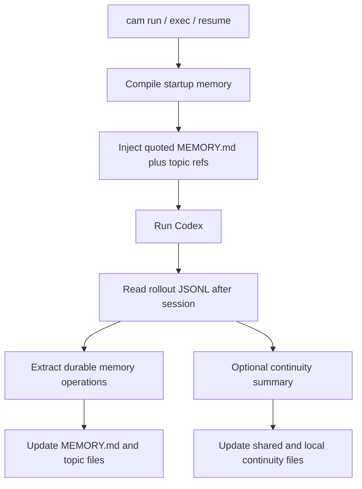

# Architecture

[简体中文](./architecture.md) | [English](./architecture.en.md)

> This document explains how `codex-auto-memory` combines durable memory, startup injection, and session continuity while staying local-first, Markdown-first, and companion-first.

## One-page overview

`codex-auto-memory` is built around three runtime paths:

1. startup path: compile and inject compact memory
2. post-session sync path: extract durable knowledge from rollout JSONL
3. optional continuity path: keep temporary working state separate

The shared goal is to keep memory auditable, editable, and migration-friendly instead of hiding state inside opaque caches.

## Design principles

- local-first and auditable
- Markdown files are the product surface
- startup indexes must remain concise
- topic files are the detail layer
- session continuity must remain separate from durable memory
- companion-first is the mainline; native migration is only a seam

## System overview



## 1. Startup path

Startup currently does the following:

1. resolve configuration
2. identify the current project and worktree
3. read `MEMORY.md` from three scopes
   - global
   - project
   - project-local
4. compile a line-budgeted startup payload
5. inject it through the wrapper path

Important implementation traits:

- each `MEMORY.md` is injected as quoted local data
- structured topic file refs are appended
- topic entry bodies are not eagerly loaded
- session continuity, when enabled, is injected as a separate block

## 2. Post-session sync path

The sync path turns session evidence into durable Markdown memory:

1. read the relevant rollout JSONL
2. parse user messages, tool calls, and tool outputs
3. let the extractor produce memory operations
4. apply upserts and deletes to the Markdown store
5. rebuild `MEMORY.md` for the affected scope

The extractor is expected to:

- keep stable, future-useful knowledge
- avoid transcript replay
- handle explicit corrections conservatively
- keep temporary next-step noise out of durable memory

## 3. Optional session continuity path

Session continuity is a separate companion layer, not part of the durable memory contract:

- shared continuity: project-wide working state shared across worktrees
- project-local continuity: worktree-specific working state

Its purpose is session recovery, not long-term memory.

### Why continuity is layered

Shared continuity is where repository-wide working state belongs:

- the current goal
- confirmed working approaches
- failed attempts worth remembering
- project-wide prerequisites

Project-local continuity is where worktree-specific state belongs:

- the exact next step
- local experiments
- local files, decisions, and environment notes

## 4. Storage model

### Durable memory

```text
~/.codex-auto-memory/
├── global/
│   ├── MEMORY.md
│   └── preferences.md
└── projects/<project-id>/
    ├── project/
    │   ├── MEMORY.md
    │   ├── commands.md
    │   └── architecture.md
    └── locals/<worktree-id>/
        ├── MEMORY.md
        └── workflow.md
```

### Session continuity

```text
~/.codex-auto-memory/projects/<project-id>/continuity/project/active.md
<project-root>/.codex-auto-memory/sessions/active.md
```

## 5. Scope boundaries

| Scope | Purpose | Typical examples |
| :-- | :-- | :-- |
| global | cross-project personal preferences | preferred package manager, review habits |
| project | repository-level durable knowledge | build/test commands, architecture constraints |
| project-local | worktree-local or machine-local knowledge | local workflow, worktree-specific notes |

These boundaries matter because otherwise:

- project memory gets polluted with local noise
- continuity leaks into durable memory
- worktree-sharing semantics become unpredictable

## 6. Markdown contract

Markdown is the product surface:

- `MEMORY.md`: compact startup index
- topic files: durable detail layer
- continuity files: temporary recovery layer

Lightweight bookkeeping is acceptable, but Markdown must stay readable and primary.

## 7. Injection strategy

Current public Codex surfaces still do not expose a Claude-equivalent native memory system, so startup injection must continue to satisfy these rules:

- do not mutate tracked repository files just to inject memory
- compile memory outside the user repository
- inject memory as quoted data rather than implicit policy
- keep continuity separate from durable memory at injection time

## 8. Native migration seam

The architecture keeps these replacement boundaries explicit:

- `SessionSource`
- `MemoryExtractor`
- `MemoryStore`
- `RuntimeInjector`

That allows future migration to replace the integration layer without rewriting the user mental model.

## 9. Validation priorities

This architecture should keep validating:

- config precedence
- project and worktree identity
- Markdown read/write behavior
- `MEMORY.md` startup budget behavior
- rollout parsing
- startup payload compilation
- session continuity layering
- CLI command surfaces
