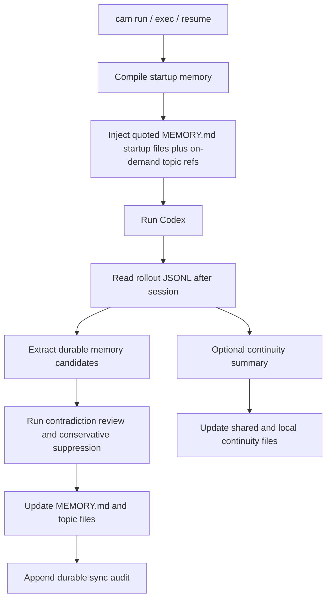

# Architecture

[简体中文](./architecture.md) | [English](./architecture.en.md)

> This document explains how `codex-auto-memory` combines durable memory, startup injection, and session continuity while staying local-first, Markdown-first, and companion-first.

## One-page overview

`codex-auto-memory` is built around three runtime paths:

1. startup path: compile and inject compact memory
2. post-session sync path: extract durable knowledge from rollout JSONL
3. optional continuity path: keep temporary working state separate

The shared goal is to keep memory auditable, editable, and migration-friendly instead of hiding state inside opaque caches.

The implementation also now follows an intentionally narrow code layout:

- `src/cli.ts`: wrapper fast path, version wiring, and Commander bootstrap only
- `src/lib/cli/register-commands.ts`: centralized command registration
- `src/lib/runtime/runtime-context.ts`: runtime composition, config-patch reload, and the shared reload helper used after memory enable/disable patches
- `src/lib/commands/session.ts`: provenance selection and action dispatch only
- `src/lib/commands/session-presenters.ts`: centralized text/json reviewer surfaces for `cam session`
- `src/lib/domain/session-continuity-persistence.ts`: shared continuity persistence spine used by both session commands and the wrapper flow
- `src/lib/domain/*`: core memory, continuity, audit, and rollout behavior
- `src/lib/util/*`: utility layer

The goal is not prettier abstraction for its own sake. The goal is a narrower entrypoint, thinner command files, and less duplicated orchestration.

## Design principles

- local-first and auditable
- Markdown files are the product surface
- startup indexes must remain concise
- topic files are the detail layer
- session continuity must remain separate from durable memory
- companion-first is the mainline; a compatibility seam remains explicit

## System overview



## 1. Startup path

Startup currently does the following:

1. resolve configuration
2. identify the current project and worktree
3. read `MEMORY.md` from three scopes
   - global
   - project
   - project-local
4. compile a line-budgeted startup payload
5. inject it through the wrapper path

Important implementation traits:

- each `MEMORY.md` is injected as quoted startup files
- structured topic file refs are appended as on-demand lookup pointers
- topic entry bodies are not eagerly loaded at startup
- session continuity, when enabled, is injected as a separate block

## 2. Post-session sync path

The sync path turns session evidence into durable Markdown memory:

1. read the relevant rollout JSONL
2. parse user messages, tool calls, and tool outputs
3. let the extractor produce candidate memory operations
4. run contradiction review so conflicting candidates can be conservatively suppressed while explicit corrections still win
5. apply the reviewed upserts and deletes to the Markdown store
6. rebuild `MEMORY.md` for the affected scope
7. append durable sync audit entries that keep suppressed conflict candidates reviewer-visible

The extractor is expected to:

- keep stable, future-useful knowledge
- avoid transcript replay
- handle explicit corrections conservatively
- prefer provable corrections over silent conflict merges
- keep temporary next-step noise out of durable memory

## 3. Optional session continuity path

Session continuity is a separate companion layer, not part of the durable memory contract:

- shared continuity: project-wide working state shared across worktrees
- project-local continuity: worktree-specific working state
- reviewer warnings and confidence remain audit-side metadata, not continuity-body content
- startup provenance only lists continuity files that were actually read for the injected block

Its purpose is session recovery, not long-term memory.

### Why continuity is layered

Shared continuity is where repository-wide working state belongs:

- the current goal
- confirmed working approaches
- failed attempts worth remembering
- project-wide prerequisites

Project-local continuity is where worktree-specific state belongs:

- the exact next step
- local experiments
- local files, decisions, and environment notes

## 4. Storage model

### Durable memory

```text
~/.codex-auto-memory/
├── global/
│   ├── MEMORY.md
│   └── preferences.md
└── projects/<project-id>/
    ├── project/
    │   ├── MEMORY.md
    │   ├── commands.md
    │   └── architecture.md
    └── locals/<worktree-id>/
        ├── MEMORY.md
        └── workflow.md
```

### Session continuity

```text
~/.codex-auto-memory/projects/<project-id>/continuity/project/active.md
<project-root>/.codex-auto-memory/sessions/active.md
```

## 5. Scope boundaries

| Scope | Purpose | Typical examples |
| :-- | :-- | :-- |
| global | cross-project personal preferences | preferred package manager, review habits |
| project | repository-level durable knowledge | build/test commands, architecture constraints |
| project-local | worktree-local or machine-local knowledge | local workflow, worktree-specific notes |

These boundaries matter because otherwise:

- project memory gets polluted with local noise
- continuity leaks into durable memory
- worktree-sharing semantics become unpredictable

## 6. Markdown contract

Markdown is the product surface:

- `MEMORY.md`: compact startup index
- topic files: durable detail layer
- continuity files: temporary recovery layer

Lightweight bookkeeping is acceptable, but Markdown must stay readable and primary.

## 7. Injection strategy

Current public Codex surfaces still do not expose a Claude-equivalent native memory system, so startup injection must continue to satisfy these rules:

- do not mutate tracked repository files just to inject memory
- compile memory outside the user repository
- inject memory as quoted startup files rather than implicit policy
- keep continuity separate from durable memory at injection time

## 8. Compatibility seam

The architecture keeps these replacement boundaries explicit:

- `SessionSource`
- `MemoryExtractor`
- `MemoryStore`
- `RuntimeInjector`

The current code layout tries to keep those seams visible in practice:

- CLI registration is separated from wrapper fast-path bootstrap
- command orchestration is separated from domain persistence
- shared continuity persistence is separated from rollout provenance selection

That keeps the integration layer replaceable without rewriting the user mental model.

## 9. Validation priorities

This architecture should keep validating:

- config precedence
- project and worktree identity
- Markdown read/write behavior
- `MEMORY.md` startup budget behavior
- rollout parsing
- startup payload compilation
- session continuity layering
- CLI command surfaces
