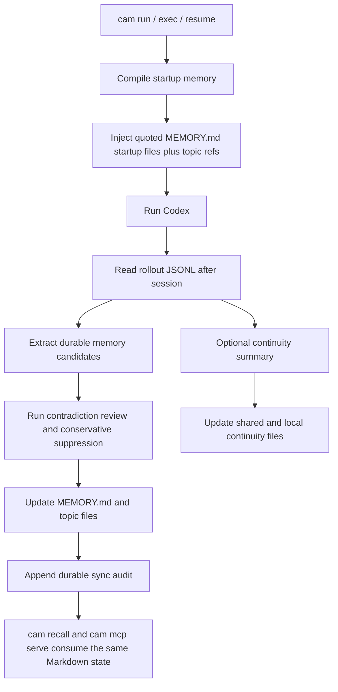

# Architecture

[简体中文](./architecture.md) | [English](./architecture.en.md)

> This document explains how `codex-auto-memory` combines durable memory, startup recall, and session continuity while staying local-first and Markdown-first. The repository is now best understood as a **Codex-first Hybrid** architecture: wrapper-first today, but intentionally evolving toward hook, skill, and MCP-aware integration surfaces that preserve the same Markdown memory contract.

## One-page overview

`codex-auto-memory` currently has three active runtime paths:

1. startup path: compile and inject compact memory into Codex
2. post-session sync path: extract durable knowledge from rollout JSONL
3. continuity path: keep temporary working state separate from durable memory

Those paths continue to define the implemented system today.

At the same time, the architecture now formally recognizes a fourth direction:

4. integration surfaces: expose the same memory contract through hooks, skills, and MCP-friendly retrieval without replacing Markdown as the source of truth

The design goal is not to become database-first or host-generic overnight. The goal is to keep the current Codex implementation stable while making future integrations decision-ready.

## Design principles

- local-first and auditable
- Markdown files are the product surface
- Codex-first hybrid runtime
- startup indexes must remain concise
- topic files remain the durable detail layer
- durable memory and session continuity stay separate
- current wrapper flow is the strongest path today
- future hook / skill / MCP surfaces must preserve the same memory contract

## System overview



## 1. Current implemented runtime

### Startup path

Startup currently does the following:

1. resolve configuration
2. identify the current project and worktree
3. read scoped `MEMORY.md` files
4. compile a line-budgeted startup payload
5. inject it through the wrapper path

Important traits:

- `MEMORY.md` files are injected as quoted startup files
- a few active-only content highlights are injected to improve startup recall without dumping topic bodies
- topic files are represented as on-demand lookup refs
- topic entry bodies are not eagerly loaded at startup
- session continuity, when enabled, is injected as a separate block

### Post-session sync path

The sync path turns rollout evidence into durable Markdown memory:

1. read the relevant rollout JSONL
2. parse user messages, tool calls, and tool outputs
3. let the extractor produce candidate memory operations
4. run contradiction review so conflicting candidates can be conservatively suppressed while explicit corrections still win
5. apply the reviewed upserts and deletes to the Markdown store
6. rebuild `MEMORY.md` for the affected scope
7. append durable sync audit entries that keep suppressed conflict candidates reviewer-visible
8. record lifecycle history sidecars that power `cam recall timeline` and archive-aware retrieval

This is where the repository currently handles:

- automatic extraction
- automatic durable recall preparation
- update / delete / overwrite behavior
- dedupe and conflict suppression

### Session continuity path

Session continuity remains a separate layer, not part of the durable memory contract:

- shared continuity: project-wide working state shared across worktrees
- project-local continuity: worktree-specific working state
- reviewer warnings and confidence remain audit-side metadata
- continuity startup provenance only lists files actually used

Its purpose is session recovery, not long-term memory.

## 2. Product contract that must stay stable

The following rules should remain stable even as the integration surfaces expand:

- Markdown stays canonical
- `MEMORY.md` stays the compact startup entrypoint
- topic files stay the durable detail layer
- project memory remains worktree-aware
- durable memory and continuity remain separate
- reviewer-visible audit and correction remain part of the workflow

This means future hook / skill / MCP paths are integration layers, not replacements for the Markdown contract.

## 3. Integration-aware evolution

The repository now treats the following as first-class evolution targets rather than distant compatibility-only ideas:

### Hook-aware surfaces

- startup and post-session behavior may eventually be reachable through stronger host hook surfaces
- current `cam hooks` assets remain local bridge assets, but they now ship as a concrete recall bridge bundle (`memory-recall.sh`, compatibility wrappers, and `recall-bridge.md`) instead of unrelated helper fragments or an official Codex hook surface

### Skill-aware surfaces

- compact retrieval or correction workflows should eventually be expressible as reusable skill content
- skill-based usage should not require abandoning the current file layout or reviewer surfaces
- `cam skills install` now provides a concrete Codex-facing skill surface that teaches the same `MCP -> local bridge -> resolved CLI` progressive durable-memory retrieval workflow

### MCP-aware surfaces

- retrieval should move toward a progressive-disclosure shape instead of relying only on startup injection
- future MCP tools should search indexes, inspect timelines, and load specific memory details from Markdown-backed state
- `cam recall search` now defaults to `state=auto, limit=8`, providing the active-first, archived-fallback read-only CLI retrieval path for the same contract
- `cam mcp serve` now provides the first read-only retrieval MCP path for that contract
- `cam mcp install --host codex` now writes the recommended project-scoped Codex wiring for that retrieval plane without touching the Markdown store; `claude`, `gemini`, and `generic` stay manual-only / snippet-first through `cam mcp print-config`
- `cam mcp print-config --host ...` now prints ready-to-paste host snippets so the same retrieval plane is easier to wire into existing MCP clients
- `cam mcp apply-guidance --host codex` now manages the repository-level `AGENTS.md` guidance block through the existing additive, marker-scoped, fail-closed flow
- `cam mcp doctor` now inspects the recommended project-scoped retrieval wiring, project pinning, and hook / skill fallback assets without mutating host config files
- `cam integrations install --host codex` now orchestrates project-scoped MCP wiring plus hook and skill assets without touching `AGENTS.md`
- `cam integrations apply --host codex` now adds the managed `AGENTS.md` guidance flow on top of install while preserving the same explicit, fail-closed boundary
- `cam integrations doctor --host codex` now provides the thin Codex-only readiness surface, including `workflowContract`, `applyReadiness`, and next-step guidance
- `cam skills install` still defaults to the runtime skill surface, but now also supports explicit `official-user` and `official-project` compatibility copies on `.agents/skills`

These surfaces must remain host-adapter concerns. The core memory semantics should not be rewritten around any one host’s lifecycle.

## 4. Recommended future internal abstractions

The implementation is not required to expose all of these immediately, but the architecture should now treat them as the intended stable vocabulary:

- `MemoryOperation`: add, update, delete, noop, archive
- `MemoryRecord`: canonical durable memory unit rendered into Markdown
- `MemoryScope`: global, project, project-local
- `ExtractionPolicy`: what is worth remembering, redacting, or ignoring
- `ConflictResolver`: contradiction, dedupe, overwrite, archive decisions
- `NoopResult`: explicit reviewer-visible no-op outcomes for unchanged active writes or delete/archive requests that do not hit an active record
- `RetrievalIndex`: sidecar search/index layer derived from Markdown
- `HostIntegrationSurface`: host-specific startup / hook / MCP / skill entrypoint

## 5. Storage model

### Durable memory

```text
~/.codex-auto-memory/
├── global/
│   ├── MEMORY.md
│   ├── preferences.md
│   ├── memory-history.jsonl
│   └── archive/
│       ├── ARCHIVE.md
│       └── preferences.md
└── projects/<project-id>/
    ├── project/
    │   ├── MEMORY.md
    │   ├── commands.md
    │   ├── architecture.md
    │   ├── reference.md
    │   ├── memory-history.jsonl
    │   └── archive/
    │       ├── ARCHIVE.md
    │       └── workflow.md
    └── locals/<worktree-id>/
        ├── MEMORY.md
        ├── workflow.md
        ├── memory-history.jsonl
        └── archive/
            └── ARCHIVE.md
```

### Session continuity

```text
~/.codex-auto-memory/projects/<project-id>/continuity/project/active.md
<project-root>/.codex-auto-memory/sessions/active.md
```

### Future retrieval/index sidecars

The architecture now allows sidecar retrieval indexes, but they must remain rebuildable from Markdown and audit state. The repository is not moving to database-first canonical storage.

- `cam recall` is part of the read-only retrieval plane, not a second source of truth.
- `cam mcp serve` is part of the retrieval plane, not a second source of truth.
- Future SQLite / FTS / vector / graph layers remain sidecars only.

## 6. Scope boundaries

| Scope | Purpose | Typical examples |
| :-- | :-- | :-- |
| global | cross-project personal preferences | preferred package manager, review habits |
| project | repository-level durable knowledge | build/test commands, architecture constraints, external dashboard / issue-tracker / runbook pointers |
| project-local | worktree-local or machine-local knowledge | local workflow, worktree notes |

These boundaries matter because otherwise:

- project memory gets polluted with local noise
- continuity leaks into durable memory
- worktree-sharing semantics become unpredictable

## 7. Why the current architecture does not jump to a plugin-native rewrite

The repository still targets Codex first, and public Codex surfaces are not yet symmetric with several adjacent tool ecosystems in terms of hooks and packaged integrations.

That means:

- the wrapper path remains the most reliable entrypoint
- startup injection remains necessary
- rollout JSONL remains the strongest durable evidence source
- new integration work should be additive around the current system, not a rewrite of the current system

## 8. Validation priorities

This architecture should keep validating:

- config precedence
- project and worktree identity
- Markdown read/write behavior
- `MEMORY.md` startup budget behavior
- rollout parsing
- startup payload compilation
- session continuity layering
- contradiction and correction handling
- future retrieval surfaces against the same canonical memory state
- CLI and integration surfaces without drifting from the same memory contract
