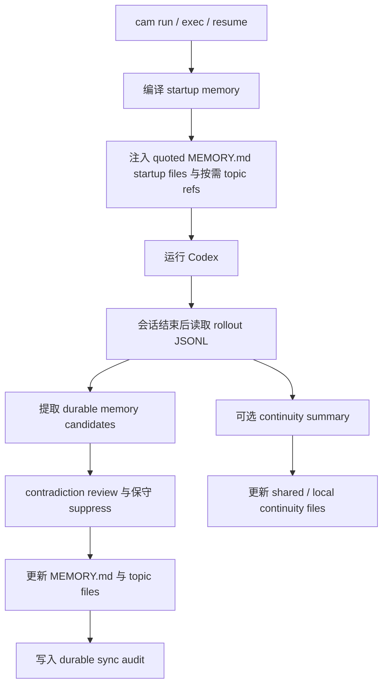

# 架构设计

[简体中文](./architecture.md) | [English](./architecture.en.md)

> 本文解释 `codex-auto-memory` 如何在保持 local-first、Markdown-first、companion-first 的前提下，把 durable memory、startup injection 和 session continuity 组合起来。

## 一页概览

`codex-auto-memory` 主要由 3 条运行路径组成：

1. startup path：编译并注入紧凑 memory
2. post-session sync path：从 rollout JSONL 提取 durable memory
3. optional continuity path：单独处理临时 working state

它们的共同目标是：让 memory 保持可审计、可编辑、可迁移，而不是把复杂状态藏进 opaque cache。

当前实现也刻意保持一个“窄入口 + 清晰分层”的代码组织：

- `src/cli.ts`：只负责 wrapper fast path、版本与 Commander 启动
- `src/lib/cli/register-commands.ts`：集中做命令注册
- `src/lib/runtime/runtime-context.ts`：集中做 runtime composition、config patch 后的 reload，以及 memory enable/disable 的统一 reload helper
- `src/lib/commands/session.ts`：只保留 provenance 选择与 action dispatch
- `src/lib/commands/session-presenters.ts`：集中组装 `cam session` 的 text/json reviewer surface
- `src/lib/domain/session-continuity-persistence.ts`：承载 session / wrapper 共享的 continuity persistence 主干
- `src/lib/domain/*`：memory / continuity / audit / rollout 的核心语义与存储行为
- `src/lib/util/*`：纯工具层

这样做的目标不是“架构更花”，而是让入口更窄、命令层更薄、shared orchestration 不在多个命令文件里重复扩散。

## 设计原则

- local-first and auditable
- Markdown files are the product surface
- startup index must stay concise
- topic files are the detail layer
- session continuity must remain separate from durable memory
- companion-first is the mainline; a compatibility seam remains explicit

## 系统总览



## 1. Startup path

启动阶段会做以下事情：

1. 解析配置
2. 识别当前 project 与 worktree
3. 读取三个 scope 的 `MEMORY.md`
   - global
   - project
   - project-local
4. 编译受 line budget 约束的 startup payload
5. 通过 wrapper 把它注入到 Codex

当前实现中，startup injection 的特征是：

- 各 scope 的 `MEMORY.md` 以 quoted startup files 注入
- 额外附带结构化 topic file refs，作为按需定位信息
- startup 不 eager 读取 topic entry bodies
- 允许 session continuity 作为单独 block 注入

## 2. Post-session sync path

sync path 的职责是把“值得长期保存的信息”写回 durable memory：

1. 读取相关 rollout JSONL
2. 解析 user messages、tool calls、tool outputs
3. 由 extractor 生成 candidate memory operations
4. 经过 contradiction review，对冲突 candidate 做保守 suppress，并优先保留明确更正
5. 将审查后的 upsert / delete 应用到 Markdown store
6. 重建对应 scope 的 `MEMORY.md`
7. 追加 durable sync audit，显式暴露 suppressed conflict candidates 供 reviewer 审查

当前 extractor 的设计目标是：

- 保存稳定、未来有用的信息
- 避免保存原始会话回放
- 对显式 correction 做保守替换
- 冲突场景下优先保留可证明的更正，而不是静默 merge
- 避免把临时 next step / local edit noise 写进 durable memory

## 3. Optional session continuity path

session continuity 是独立 companion layer，不属于 durable memory 契约：

- shared continuity：跨 worktree 共享的项目级 working state
- project-local continuity：当前 worktree 的本地 working state
- reviewer warning / confidence 属于 audit side metadata，不属于 continuity body
- startup provenance 只列出这次注入时真实读取到的 continuity 文件

它的存在是为了帮助会话恢复，而不是替代 memory。

### 为什么要分层

shared continuity 适合放：

- 当前主目标
- 已验证可行的做法
- 已尝试且失败的路径
- 对整个仓库都成立的前提

project-local continuity 适合放：

- 当前 worktree 的精确 next step
- 本地实验记录
- local-only files / decisions / environment notes

## 4. 存储模型

### Durable memory

```text
~/.codex-auto-memory/
├── global/
│   ├── MEMORY.md
│   └── preferences.md
└── projects/<project-id>/
    ├── project/
    │   ├── MEMORY.md
    │   ├── commands.md
    │   └── architecture.md
    └── locals/<worktree-id>/
        ├── MEMORY.md
        └── workflow.md
```

### Session continuity

```text
~/.codex-auto-memory/projects/<project-id>/continuity/project/active.md
<project-root>/.codex-auto-memory/sessions/active.md
```

## 5. Scope 边界

| Scope | 作用 | 示例 |
| :-- | :-- | :-- |
| global | 跨项目个人偏好 | 常用包管理器、个人审查习惯 |
| project | 仓库级 durable knowledge | build/test commands、架构约束 |
| project-local | 当前 worktree 或本地环境知识 | 本地 workflow、worktree-specific note |

这条边界必须保持清楚，否则：

- project memory 会被本地噪音污染
- continuity 会混进 durable memory
- worktree 共享语义会变得不可预测

## 6. Markdown contract

本项目的产品表面是 Markdown，而不是内部数据库：

- `MEMORY.md`：紧凑启动索引
- topic files：细节层
- continuity files：临时恢复层

允许存在轻量 bookkeeping，但不能让 Markdown 退化成次要表示。

## 7. Injection strategy

当前 Codex 公开面还没有提供与 Claude Code 等价的 native auto memory surface，因此 startup path 必须继续满足：

- 不改动用户仓库里的 tracked files 来完成注入
- 由 companion runtime 在外部编译 memory
- 把 memory 作为 quoted startup files 注入，而不是隐式 prompt policy
- continuity block 与 durable memory block 明确分开

## 8. Compatibility seam

当前架构保留了几个关键替换点：

- `SessionSource`
- `MemoryExtractor`
- `MemoryStore`
- `RuntimeInjector`

在当前代码里，对应的实现分层也尽量保持显式：

- CLI registration 与 wrapper fast path 分开
- command orchestration 与 domain persistence 分开
- continuity 的 shared persistence 与 rollout provenance selection 分开

这样未来若需要重评接入方式，可以替换 integration layer，而不是推翻用户心智模型。

## 9. 验证重点

这套架构至少应持续验证：

- config precedence
- project / worktree identity
- Markdown read/write behavior
- `MEMORY.md` startup budget
- rollout parsing
- startup payload compilation
- session continuity layering
- CLI command surfaces
