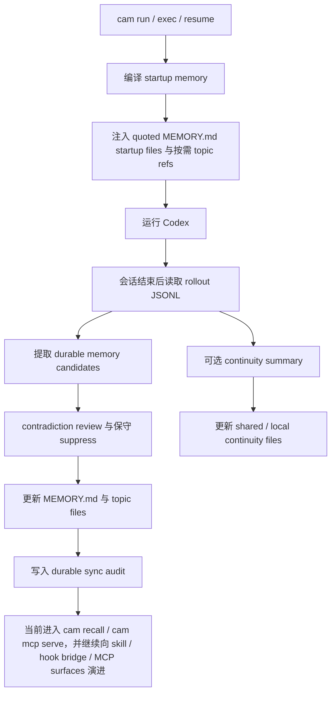

# 架构设计

[简体中文](./architecture.md) | [English](./architecture.en.md)

> 本文解释 `codex-auto-memory` 如何在保持 local-first、Markdown-first、companion-first 实现前提下，逐步演进为 **Codex-first Hybrid memory system**。

## 一页概览

当前仓库应从两个层面来理解：

1. **当前最稳实现**
   - `wrapper + startup injection + rollout parsing + Markdown store`
2. **正式演进方向**
   - 在不放弃 Markdown-first 与当前 CLI 主线的前提下，补 hooks、skills、MCP-aware retrieval 等 integration surfaces

这意味着本项目不是：

- 直接重写成 `claude-mem` 式的 DB-first / worker-first 系统
- 立即升级为多宿主统一平台
- 用未来原生能力替代现有稳定 companion path

这也意味着本项目是：

- **Codex-first**
- **Markdown-first**
- **companion-first implementation, hybrid product direction**

## 当前系统总览



## 1. 当前主路径

### Startup path

启动阶段当前会做以下事情：

1. 解析配置
2. 识别当前 project 与 worktree
3. 读取三个 scope 的 `MEMORY.md`
   - global
   - project
   - project-local
4. 编译受 line budget 约束的 startup payload
5. 通过 wrapper 把它注入到 Codex

当前 startup injection 的特点：

- 各 scope 的 `MEMORY.md` 以 quoted startup files 注入
- 附带结构化 topic file refs，作为按需定位信息
- startup 不 eager 读取 topic entry bodies
- 允许 session continuity 作为单独 block 注入

### Post-session sync path

sync path 的职责是把“值得长期保存的信息”写回 durable memory：

1. 读取相关 rollout JSONL
2. 解析 user messages、tool calls、tool outputs
3. 由 extractor 生成 candidate memory operations
4. 经过 contradiction review，对冲突 candidate 做保守 suppress
5. 将审查后的 operation 应用到 Markdown store
6. 重建对应 scope 的 `MEMORY.md`
7. 追加 durable sync audit，显式暴露 reviewer 信息
8. 记录 lifecycle history，为 `cam recall timeline` 与归档检索提供 sidecar 线索

当前 extractor 的目标：

- 保存稳定、未来有用的信息
- 避免保存原始会话回放
- 对显式 correction 做保守替换
- 冲突场景下优先保留可证明的更正
- 避免把临时 next step / local edit noise 写进 durable memory

### Optional session continuity path

session continuity 是独立 companion layer，不属于 durable memory 契约：

- shared continuity：跨 worktree 共享的项目级 working state
- project-local continuity：当前 worktree 的本地 working state
- reviewer warning / confidence 属于 audit side metadata，不属于 continuity body
- startup provenance 只列出真实读取到的 continuity 文件

它的存在是为了帮助会话恢复，而不是替代 memory。

## 2. 正式演进方向

从当前版本开始，架构文档需要承认并固定如下方向：

- hooks 不再只被视为 future bridge，而是正式入口之一
- skills 不再只被视为将来灵感，而是正式的使用面与分发面
- MCP 不再只被视为外部能力，而是未来 memory retrieval 与 automation surface 的核心候选

这些能力进入主线时，必须满足两个前提：

1. **不破坏 Markdown-first**
2. **不破坏当前 `cam` / wrapper 主路径**

因此，架构上应遵循：

- CLI / wrapper 是当前稳定主入口
- hook / skill / MCP 是并行入口
- 所有入口最终都汇入同一套 Markdown canonical store 与 audit semantics
- 当前 concrete integration assets 已包括：
  - `cam recall search` 默认采用 `state=auto`、`limit=8`，提供 active-first、archived-fallback 的只读 retrieval 搜索面
  - `cam hooks install` 生成本仓自带的 local bridge / fallback recall bundle（`memory-recall.sh`、兼容 wrappers、`recall-bridge.md`），而不是官方 Codex hook surface
  - `cam skills install` 默认安装 runtime Codex skill，同时支持显式 `--surface runtime|official-user|official-project`；三种 surface 都沿用同一套 MCP-first、CLI-fallback 的 `search -> timeline -> details` durable memory 工作流
  - `cam mcp serve` 暴露 read-only retrieval MCP plane，对齐 `search -> timeline -> details` 契约
  - `cam mcp install --host <codex|claude|gemini>` 显式写入推荐的 project-scoped 宿主配置；`generic` 仍保持 manual-only，只通过 `cam mcp print-config --host generic` 提供 ready-to-paste snippet
  - `cam mcp print-config --host ...` 打印 ready-to-paste 宿主接入片段；其中 `--host codex` 会额外附带推荐的 `AGENTS.md` snippet / guidance
  - `cam mcp apply-guidance --host codex` 以 additive、marker-scoped、fail-closed 的方式创建或更新仓库级 guidance block
  - `cam mcp doctor` 只读检查推荐的 project-scoped retrieval MCP 接线、project pinning 与 hook / skill fallback 资产，不改写宿主配置
  - `cam integrations install --host codex` 负责编排 project-scoped MCP wiring、hook bundle 与 skill assets，但不触碰 `AGENTS.md`
  - `cam integrations apply --host codex` 在 `install` 之上额外编排 managed `AGENTS.md` guidance block
  - `cam integrations doctor --host codex` 只读汇总当前 Codex stack readiness、推荐路由与下一步动作

## 3. 未来要冻结的核心语义

后续实现需要围绕统一 memory contract，而不是围绕某一种宿主形式。

建议在当前仓库内逐步固定以下核心语义：

- `MemoryOperation`
  - `add`
  - `update`
  - `delete`
  - `noop`
  - `archive`
- `MemoryRecord`
  - canonical Markdown block / topic entry
- `MemoryScope`
  - `global`
  - `project`
  - `project-local`
- `ExtractionPolicy`
  - 什么该记住、什么该忽略、什么要 redact
- `ConflictResolver`
  - dedupe、correction、overwrite、archive 的规则
- `NoopResult`
  - 对未改变 active memory 的重复写入，或命中不到 active target 的 delete/archive，显式返回 reviewer 可见 `noop`
- `RetrievalIndex`
  - sidecar index，而不是 source of truth

这里的关键点是：

- 统一的是 **memory semantics**
- 不是把 hooks、plugin manifest、session layout 硬统一成一套跨宿主格式

## 4. 存储模型

### Durable memory

```text
~/.codex-auto-memory/
├── global/
│   ├── MEMORY.md
│   ├── preferences.md
│   ├── memory-history.jsonl
│   └── archive/
│       ├── ARCHIVE.md
│       └── preferences.md
└── projects/<project-id>/
    ├── project/
    │   ├── MEMORY.md
    │   ├── commands.md
    │   ├── architecture.md
    │   ├── memory-history.jsonl
    │   └── archive/
    │       ├── ARCHIVE.md
    │       └── workflow.md
    └── locals/<worktree-id>/
        ├── MEMORY.md
        ├── workflow.md
        ├── memory-history.jsonl
        └── archive/
            └── ARCHIVE.md
```

### Session continuity

```text
~/.codex-auto-memory/projects/<project-id>/continuity/project/active.md
<project-root>/.codex-auto-memory/sessions/active.md
```

### Future retrieval/index plane

如果后续引入检索增强，应保持：

- Markdown 是 canonical source of truth
- 当前 `cam recall` 与 `cam mcp serve` 都只是 read-only retrieval plane，不是第二真相层
- 当前 `cam mcp serve` 只是 retrieval plane，不是第二真相层
- SQLite / FTS / vector / graph 只能作为 sidecar index
- sidecar index 必须可从 Markdown + audit 重建
- 归档层也必须保持可读、可 diff、可审计

## 5. Scope 边界

| Scope | 作用 | 示例 |
| :-- | :-- | :-- |
| global | 跨项目个人偏好 | 常用包管理器、个人审查习惯 |
| project | 仓库级 durable knowledge | build/test commands、架构约束 |
| project-local | 当前 worktree 或本地环境知识 | 本地 workflow、worktree-specific note |

必须继续保持这条边界，否则：

- project memory 会被本地噪音污染
- continuity 会混进 durable memory
- worktree 共享语义会变得不可预测
- 后续 skill / hook / MCP surfaces 会把错误语义放大到自动化路径里

## 6. Markdown contract

本项目的产品表面仍然是 Markdown，而不是内部数据库：

- `MEMORY.md`：紧凑启动索引
- topic files：细节层
- archive files：默认 recall 之外、但仍可检索与审计的历史层
- continuity files：临时恢复层
- audit logs：审计与 provenance 层

允许存在轻量 bookkeeping 与 sidecar index，但不能让 Markdown 退化成次要表示。

## 7. Injection and integration strategy

当前阶段，startup path 仍继续满足：

- 不改动用户仓库里的 tracked files 来完成注入
- 由 companion runtime 在外部编译 memory
- 把 memory 作为 quoted startup files 注入，而不是隐式 prompt policy
- continuity block 与 durable memory block 明确分开

后续 integration surfaces 引入时，应遵循：

- `hooks`
  - 负责生命周期捕获、自动触发 sync / retrieval / audit
- `skills`
  - 负责把 memory retrieval workflow 教给代理
- `MCP`
  - 负责低 token 的 search / timeline / detail retrieval

也就是说：

- hooks 解决“什么时候触发”
- skills 解决“模型怎么用”
- MCP 解决“模型能调用什么”

## 8. Compatibility seam

当前架构仍保留这些关键替换点：

- `SessionSource`
- `MemoryExtractor`
- `MemoryStore`
- `RuntimeInjector`

这些 seam 的职责从现在开始要扩大理解：

- 不只是为了 future native migration
- 也是为了未来 skill / hook / MCP surfaces 进入主线时，不推翻用户心智模型

## 9. 验证重点

这套架构至少应持续验证：

- config precedence
- project / worktree identity
- Markdown read/write behavior
- `MEMORY.md` startup budget
- rollout parsing
- startup payload compilation
- session continuity layering
- CLI command surfaces
- release-facing `--help` surfaces
- future integration surfaces 与 canonical Markdown store 的一致性

## 10. 当前架构不做什么

为了避免过早平台化，当前仓库在这一阶段不做以下事情：

- 不改成 DB-first 主存储
- 不把当前仓库直接定义成多宿主统一主仓
- 不把 plugin format 作为统一核心抽象
- 不把 native hooks / memories 直接升级成主路径
- 不为了对齐 `claude-mem` 而引入完整 worker/UI/daemon 产品栈

真正应该统一的是 memory contract，而不是宿主外壳。
